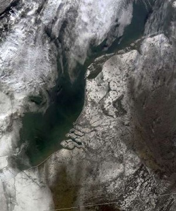
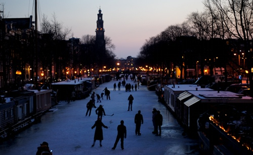

J'arrive un peu tard pour un billet sur l'arrivée du froid sur mon cher pays plat, mais vaut mieux tard que jamais. Alors voilà, comme partout en Europe, après un hiver particulièrement doux, les Pays-Bas ont connu une vague de froid surprenante. Les canaux ont commencé à geler et le pays tout entier s'est vêtu de blanc. La photo satellite de mardi dernier le montre bien.

{.center}

La Frise et la Hollande sont couverts de neige, seuls les dones du Hooge Veluwe et de l'Utrechtse Heuvelrug y échappent. Les lacs Markenmeer et IJsselmeer sont eux aussi recouverts de glace et de neige jusqu'à l'Afsluitdijk qui marque leur séparation avec la mer. Certains espèrent déjà pouvoir les traverser en voiture.

Les néerlandais ne réagissent pas comme tout le monde face à cette vague de froid. Eux aussi ont des transports publics en retard, des canalisation d'eau qui lachent et des rhumes qui couvent mais il y a très peu de gens qui se plaignent du froid. Ici plus qu'ailleurs, le vent fait chuter [la température ressentie](/la-temperature-ressentie). Ils ont toutes les raisons de se plaindre mais c'est la joie qui prime malgré tout. Ce pour une seule raison: le **patin à glace** (*Schaats*).

### Nouveau mot: Schaatsen

Rien n'a changé depuis les [peintures de Pieter Brueghel l'Ancien](http://fr.wikipedia.org/wiki/Fichier:Pieter_Bruegel_d._%C3%84._106.jpg), dès qu'il fait froid, les bataves montent sur leurs patins et glissent sur la glace[^1]. Depuis 6 ans que je suis ici, c'est la première fois que les canaux du centre ville d'Amsterdam sont assez gelés pour supporter les hordes glissantes. Patins ou non, tout le monde veut aller sur la glace et en profiter.

{.center}

Sur certain canaux, les bateaux passent régulièrement pour casser la glace et maintenir un passage alors la mairie a décidé de sécuriser quelques bras de canal en les [interdisant à la navigation](http://www.centrum.amsterdam.nl/@289081/pagina/) dès le 4 février. Plusieurs sondages ont été effectués et les passages dangereux sous les ponts ont été rubalisés. Tout le monde peut s'en donner à cœur joie. Il y a même un [programme officiel des réjoissances](http://www.amsterdam.nl/@506987/pagina/)[^2].

**Voir aussi:** [Les marronniers de l'hiver](/les-marronniers-de-l-hiver)
---
[^1]: [La papaye batave le décrit si bien](http://lapapayebatave.wordpress.com/2012/02/06/le-mot-de-la-semaine-schaatsen-ou-le-reve-neerlandais/#comment-49)
[^2]: Qui ne liste pas la teuf d'hier sur le Prinsengracht.
<!-- post notes:
http://www.dutchdailynews.com/amsterdam-prepares-for-legendary-keizer-ice-skating-race/
http://lapapayebatave.wordpress.com/ 
http://www.dutchnews.nl/news/archives/2012/02/no_11city_skating_race_ice_is.php
http://www.dutchdailynews.com/amsterdam-prepares-for-legendary-keizer-ice-skating-race/
--->
