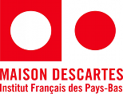

{.left} {.right} 
Annoncé l'été dernier, la **Maison Descartes**, centre culturel français d'Amsterdam change de nom pour devenir Institut Français. Derrière ce changement de nom, une décision qui vient d'en haut. Voici comment le changement était présenté en juillet dernier.

<!-- HTML -->

<!-- / HTML -->
A l'’image des British Council, Goethe Institut, Cervantès, etc. les centres et instituts culturels français à travers le monde ont adopté une identité internationale unique, celle d’Institut français. A Amsterdam comme dans toutes les villes du monde, vous trouverez désormais le logo qui nous rassemble tous et qui renforcera la lisibilité de nos missions autour de nos activités principales, la diffusion de la culture au sens large, de la création artistique française contemporaine et l'’enseignement de notre langue à des publics variés.
<!-- HTML -->

<!-- / HTML -->

<!--excerpt-->

La Maison Descartes devient ainsi l’**Institut Français des Pays-Bas**. Le logo rond et rouge devient rectangle bleu et en pratique rien d'autre ne change. J'ai pu le constater aux dernières portes ouvertes, il y a toujours une médiathèque, des cours de français et de néerlandais ainsi que quelques rendez-vous que l'on retrouve sur leur [brochure culturelle](http://www.institutfrancais.nl/fr/agenda_culturel/dans-nos-murs/programme-culturel-janvier-mars-2012.html).

Dans le cas présent, le changement d'image est une non-nouvelle[^1] Tout juste pourrais-je regretter l'originalité française de nommer ses institutions à l'étranger du nom d'une personne célèbre en lien avec les deux pays (Descartes a longtemps vécu à Amsterdam).

---
[^1]: Alors que [le changement de nom de la Poste néerlandaise](/le-nouveau-nom-de-la-poste-aux-pays-bas) est beaucoup plus lourd de sens.
<!-- post notes:
Il reste le [Lycée Van Gogh|http://blog.re/me-in-amsterdam/index.php/van-gogh-fete-ses-60-ans].

https://meinamsterdam.nl/van-gogh-fete-ses-60-ans/
--->
