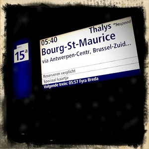
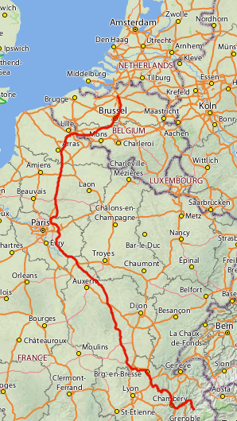
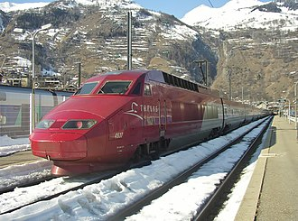
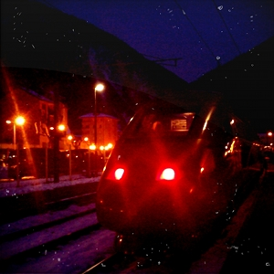

Cet hiver, comme beaucoup de néerlandais, je suis allé skier dans les Alpes. Comme certains d'entre eux, je me suis rendu dans les stations en prenant le train. Pas n'importe quel train, le train à grande vitesse qui va en France [dont j'ai beaucoup parlé](/tag/thalys/) sur ce blog: Le [Thalys](/tag/thalys/). 

Ce n'est pas un Thalys comme les autres que j'ai pris mais un **Thalys neige**.

{.center}

<!--excerpt-->

{.right}
Le Thalys neige est un service spécial de Thalys opérant les samedis en hiver, reliant Amsterdam à la vallée de la Tarentaise et Bourg-Saint-Maurice. Jusqu'à Bruxelles, le train s'arrête à toutes les gares habituelles du service. Seule l'heure anormalement tôt nous rappelle qu'ils s'agit d'un service spécial, le départ à Amsterdam s'effectue quand même à 5h30.

[{.left}](http://commons.wikimedia.org/wiki/File:Thalys_4537_%C3%A0_BSM.JPG)
Avant d'arriver à Paris, le Thalys se détourne sur Charles-de-Gaulle-TGV avant de poursuivre en direction du sud-est. La rame violette file sur les lignes à grande vitesse aménagées dans les années 90 pour les jeux olympiques d'Albertville. On arrive rapidement en Rhône-Alpes puis dans les vallées enneigées. Mon voyage aller s'est passé sans embuches et je n'ai pas vu le temps passé. Le trajet a comme prévu duré 10h00. 

À l'arrivé, un bus nous attendait pour nous emmener dans les stations alors je n'ai pas pris la fameuse rame dans le décors enneigé mais d'autres l'ont fait pour moi.

 - Chambéry Challes-les-Eaux  
 - Albertville  
 - Moûtiers Salins-Brides-les-Bains  
 - Aime-La Plagne  
 - Landry  
 - Bourg-Saint-Maurice  

Le **Thalys neige** est le premier service spécial de [l'histoire de Thalys](http://www.thalys.com/de/en/about-thalys/history). Il a été lancé le 19 décembre 1998. Son petit frère, le **Thalys soleil** a vu le jour à l'été 2000. Ces trains arrivent à faire le plein de passagers en combinant les passagers des Pays-Bas et de Belgique mais il ne sont pas très connus. Alors la direction de Thalys expérimente des campagnes pour faire connaitre le Thalys neige:

<!-- HTML -->

<iframe src="http://www.slideshare.net/slideshow/embed_code/2379571" width="425" height="355" frameborder="0" marginwidth="0" marginheight="0" scrolling="no"></iframe> 

<!-- / HTML -->

Les wagons sont plein mais ils ne sont pas que pleins de passagers. Les carrés voyageurs ne sont pas réservés aux voyageurs mais utilisés comme espaces bagages supplémentaires pour bagages. Quand des bataves partent en vacances pour une semaine, ils emmènent la moitié de la maison. Ajoutez les skis et chaussures et vous comprendrez que ces espaces bagages ne sont pas de trop.

## Le trajet retour

Après une [chouette semaine au ski](https://picasaweb.google.com/116245480960689634895/ValThorens), je me préparais déjà à écrire un article élogieux sur ce train grande vitesse reliant les polders aux stations. C'était oublier un peu vite comment le Thalys et ses équipes se préparent à l'hiver. La fin de la semaine a cohincidé avec l'arrivé de la vague de froid en Europe et Thalys n'aime pas le froid, [j'en parlais déjà en 2009](/le-thalys-a-moins-grande-vitesse). Ça n'a pas changé. Le train ayant accumulé plus d'une heure lors du voyage aller, il s'est retrouvé en gare pour le départ du retour avec le même délai. Il faisait déjà nuit et mon cliché du train avec les montagnes en arrière plan est un peu sombre. Les déboires se sont ensuite accumulés pour nous faire arriver, après un changement à Bruxelles, à Amsterdam à près de deux heures du mat.

{.center}

Heureusement, la SNCF avait prévu la vague de froid en préparant des milliers de cartons repas pour les pauvres passager. C'est toujours plus facile que de protéger les motrices, cours-circuiter les caténaires et dégager les rails comme ils savent faire si bien en Scandinavie. Tant que la SNCF et Thalys décidera de ne pas investir dans des moyens efficaces pour rouler par temps froid, les Thalys neige ne sera un plaisir que quand il n'y a pas de neige.

<!-- post notes:
http://www.slideshare.net/nbbdo/thalys-thalys-neige
--->
