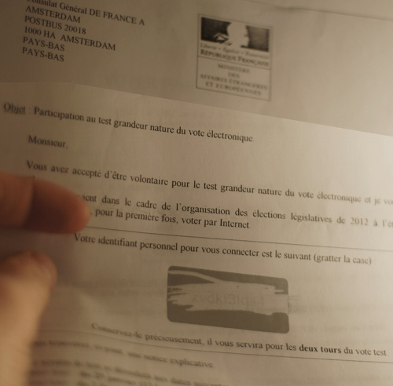
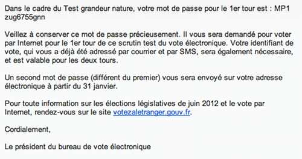
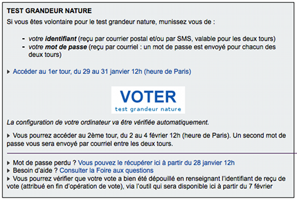
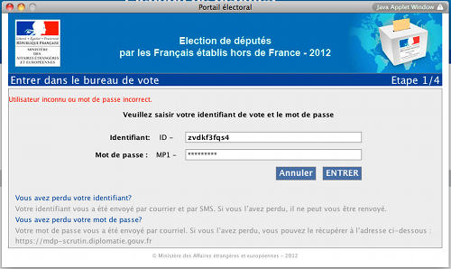
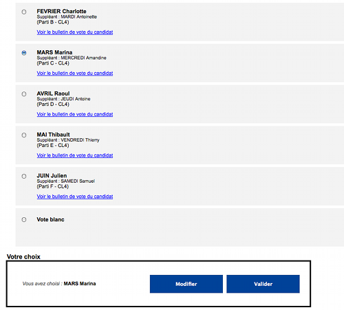
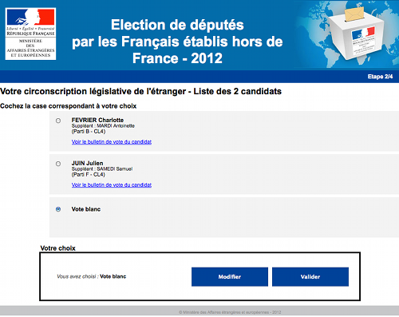
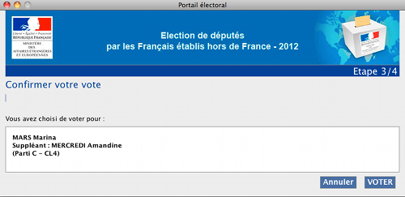
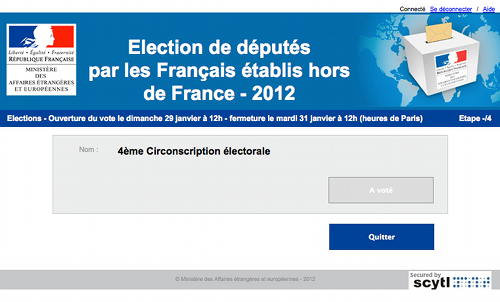
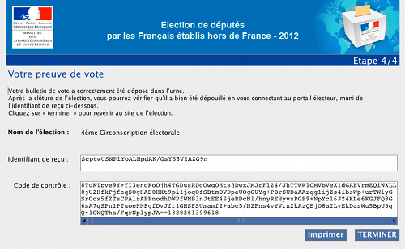

## Bientôt les élections (6)

Comme expliqué dans les épisodes précédents[^1], **les français de l'étranger iront voter pour les élections présidentielles ainsi que pour les législatives**. Ces derniers bénéficient d'une dérogation leur permettant de **voter par correspondance** ainsi que **par Internet** pour les législatives. 

**Ayant participé au test grandeur nature du vote par Internet, je vous en livre ici le compte rendu.**

## Inscription

Pour s'inscrire au vote par internet, il suffit de le signaler à son consulat ou via [le site monconsulat](/les-elections-mon-consulat). Pour ce qui est du test grandeur nature, j'ai répondu à un mail qui recherchait des volontaires. J'ai ensuite reçu une lettre avec mon identifiant confidentiel ainsi qu'un mail de **vote-internet@votezaletranger.gouv.fr** avec un mot de passe et m'expliquant à quelle adresse cela se passait. Si j'avais donné mon numéro de téléphone au consulat, j'aurais aussi reçu mon identifiant par SMS.

## Le courrier me donnant mon identifiant
{.center}
L'identifiant est bien protégé, il s'agit de ne pas se faire voler son droit de vote. Mais une fois gratté, il est difficile de le lire. J'imagine que pour avoir le droit de vote il faut voir clair (non).

<!--excerpt-->

## Le mail me donnant mon mot de passe
{.center}
Le mail qui m'envoie mon mot de passe, aussi compliqué que l'identifiant, est bien moins protégé, le mail n'est pas chiffré. Mais cela n'est pas grave parce que l'identifiant est gardé secret.

Le mail est très poli et signé par le *président du bureau de vote*. S'il y a bureau de vote, je ne vois ni isoloir ni assesseur. Qui vérifie le bon déroulement du scrutin ?

Les horaires du scrutin ont été donnés avec le courrier contenant l'identifiant pour le premier tour et dans un mail de rappel pour le second tour. Cette procédure s'adressant aux français de l'étranger, j'aurais ajouté l'heure en UTC et peut être [un lien](http://www.timeanddate.com/worldclock/city.html?n=1440) pour informer de ces horaires en fonction du fuseau horaire où se trouve l'électeur.

## Le jour du vote

Pour les deux tours le vote s'est bien déroulé, J'ai pu me rendre sur le site et effectuer ce qui m'était demandé. Les explications étaient suffisamment simples pour que je puisse comprendre comment faire mes choix.

## Invitation à voter
{.center}

Une fois sur le site indiqué, les explications sont claires, on sait où cliquer pour aller voter. Au besoin une FAQ et un service d'assistance permet de tout expliquer. Je n'ai pas eu à m'en servir.

## Fenêtre de login
{.center}

Il n'est pas possible de copier dans les champs du formulaire, c'est un peu dommage parce que les codes qui nous sont remis sont assez compliqués. J'ai du m'y reprendre à plusieurs reprises.

La fenêtre du navigateur n'affiche aucun cadenas pour vérifier si le site est sécurisé. C'est pourtant bien le cas. Mais le vote va se dérouler dans une fenêtre java qui ne permet pas de montrer le fameux cadenas qui valide un certain niveau de sécurité, comme sur les sites bancaires. Dommage.

## Liste des candidats
{.center}

La liste des candidats est claire, elle liste l'essentiel des informations dont on a besoin pour voter. On pourrait même imaginer avoir un lien vers la profession de foi du candidat, quand on vote par internet on peut prendre son temps à la maison, pas comme dans un isoloir quand les gens font la queue.

## Vote blanc
{.center}

Si aucun des candidats ne me convient, le vote blanc est une option possible. C'est rigolo parce que le vote blanc n'est pas reconnu par le code électoral. Ici il peut même être comptabilisé.

## Confirmation
{.center}

Il faut confirmer son vote. Un écran permet de vérifier si on a coché la bonne case.

## À voté !
{.center}

Une fois validé, pas possible de revenir en arrière, moi choix est enregistré (je pense), la fenêtre reprend les mots du président du bureau de vote: **à voté !** Normalement cette phrase est précédée de mon nom mais ce n'est pas le cas ici.

## Preuve de vote
{.center}

La fenêtre suivante m'indique que mon bulletin a été glissé dans l'urne. Quand le président du bureau me l'affirme je veux bien être d'accord avec lui parce que j'ai put voir tout ce que j'ai fait. Ici, je peux juste dire que j'ai coché des cases sur une page web et le système me répond que j'ai voté.

Une suite de caractères m'est remise comme preuve de vote. Un code de contrôle permet de valider cette suite de caractères mais je ne sais pas comment m'en servir. Il est possible d'imprimer cette preuve de vote mais pas de la copier/coller.

## Après le vote

À l'invitation à participer au scrutin du second tour, le Directeur des Français à l'étranger et de l'administration consulaire nous promettait de nous «informer en détail des résultats et des conclusions que nous tirerons de l’ensemble de ce test». L'information promise est arrivée 20 jours plus tard par email reproduit ci-dessous:

{.center}

> Le test mondial du vote par internet s’est achevé le 4 février. Vous avez été 4800 à voter pour le premier tour et 5200 pour le second (soit 31 et 33% de participation). Nous vous en remercions vivement. 

Moi qui pensait faire partie des *happy few* testeurs, il y a eu de nombreuses personnes inscrites pour ce test. Selon les chiffres annoncés, nous étions entre 15.483 (chiffres du premier tour) 15.757 (chiffres du second tour). J'aurais bien aimé connaitre les résultat de cette élection fictive mais ce n'était apparemment pas l'objet du test.

> Nous pouvons d’ores et déjà tirer un enseignement majeur de ce test : tous les bulletins que vous avez insérés dans l’urne électronique ont été correctement dépouillés. Les nombreux contrôles effectués ont montré que toutes les exigences de sécurité ont été respectées. 

**Voilà une bien belle connerie**, pour vérifier que tous les bulletins sont dépouillés il n'y a pas besoin de testeurs, il est tout à fait possible d'affirmer que tous les bulletins ont été correctement dépouillés, même **après un bourrage d'urne**. Pour vérifier le dépouillement correct d'un scrutin, on n'a pas besoin de 15.000 cobayes mais d'un processus qui entre un nombre de bulletins connus que l'on peut vérifier après. Je pensais véritablement que le temps que j'avais passé était utile, il ne sert à rien, ce n'est que de la poudre aux yeux. 

Quand à la phrase «Les nombreux contrôles effectués ont montré que toutes les exigences de sécurité ont été respectées.» elle ne dit rien tant qu'on ne sait pas quel est le niveau de sécurité exigé par le ministère des affaires étrangères. Ayant vu son budget fondre ces dernières années j'imagine qu'il ne doit pas être bien élevé. Pour exemple l'envoi d'un mot de passe dans un mail non chiffré dont je parlais plus haut.

## Quel contrôle contre la fraude ?

Plus important encore, qu'en est-il du contrôle citoyen qui est effectué au cours d'un scrutin normal ? En m'inscrivant pour ce test, j'aurais bien aimé me voir proposer un poste de scrutateur ou bien de participer au dépouillement. J'aurais aimé qu'on me dise comment consulter les listes d’émargement qui sont normalement publiques. Rien de tout cela.

Tout ce que je peut dire aujourd'hui c'est que j'ai cliqué sur un site web comme on m'a dit de le faire, puis j'ai reçu un mail signé par un directeur qui me dit que tout s'est bien passé. Je suis désolé cela ne m'inspire pas confiance, la procédure est à revoir.

## Conclusion

Lorsque j'affirme plus haut que ce test ne sert à rien, ce n'est pas forcément vrai, je pense qu'il a permis aux services du ministère de peaufiner ses messages pour expliquer au mieux le déroulement du scrutin. C'est une bonne chose. Mais c'est aussi un exercice qui ressemble beaucoup à une opération de communication pour faire croire que l'on pense à tout. Si le ministère veut montrer qu'il prend les choses au sérieux. J'ose espérer que mes interrogations sur les moyens de contrôle face aux risques de fraude trouveront une réponse. 

Monsieur François Saint-Paul, si vous lisez ces lignes, je vous invite à dissiper mes inquiétudes.

---
[^1]: * [Bientôt les élections (3) - tous les scrutins](/bientot-les-elections-3) * [Bientôt les élections (4) - monconsulat](/les-elections-mon-consulat) * [Bientôt les élections (5) - les modes de scrutin](/elections-5-les-modes-de-scrutin)
<!-- post notes:
!!!Questionnaire 
http://questionnaires.ministere-affaires-etrangeres.com/index.php?sid=29497 
http://www.scytl.com/en/shareholders-investors-relations-s-122.html
--->
