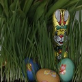
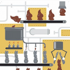

[{.right}](/public/images/photos/2012/paaskonijntje.jpg)
Beaucoup de choses ont changé depuis mon [premier week-end de pâques aux Pays-Bas](/paasdagen-in-amsterdam) Pour briser le silence d'avril, je vais vous en donner quelques nouvelles.

## Premiers jours fériés
J'ai expliqué que les néerlandais avait aussi un lundi de pâques férié. Ce que j'ai oublié de dire c'est que dans la plupart des entreprises, le vendredi Saint, lui aussi est aussi férié. Cette journée est surtout chômée dans le monde catholique. Le pays étant de [confession divisée](/catholiques-et-protestants) ce jour est laissé férié à l'appréciation de l'employeur. Mon [employeur](/mon-nouveau-boulot-3) ferme boutique ce jour là. ouais !

## Spécialités de pâques
[{.right}](/public/images/photos/2012/paasij.jpg)
Ce week end de pâques, j'ai encore joué avec les traditions locales. Bière de pâques (*paasij*) et le gâteau de pâques (*paasstol*). La [bière de pâques](/les-bieres-de-paques) est une variation de la [bière de printemps](/printemps-en-vrac-et-en-retard). La *paasstol* est un pain-gâteau allemand bourré de raisins secs et de noisettes et fourré à la pâte d'amande. On le mange en le tartinant de beurre. miam !

## La Paroisse francophone
Il y a cinq ans, je vous parlais de [la paroisse francophone pour pâques](/bonne-fete-pascales). Cinq ans après, la paroisse a beaucoup changé avec un dynamisme renouvelé. Les bancs sont bien plus remplis cette année que quand je suis arrivé, les caté et la chorale africaine sont toujours là mais il y a aussi un groupe de scouts, un groupe de partage de vie, un conseil pastoral assidu et une communauté très présente. Cette année pour la vigile pascale, le prêtre a baptisé deux adultes, signes de ce dynamisme. Cool !

## œufs, lapins et chocolats
[{.right}](http://www.ellustrations.nl/work_-_Boomerang.html)
En 2008 je racontaient comment [les cloches étaient à l'origine de la tradition des œufs en chocolat](/oeufs-en-chocolat). Mais en fait, il n'y a pas de cloches aux Pays-Bas, les cloches n'ont pas eu le contrat de livraison pour ce pays. Comme en Allemagne et en Lorraine, ce sont les lapins qui font de le boulot. C'est ce qui explique la prolifération des lapins en chocolat à l'approche de cette fête. En 2009, je vous montraient des [cartes de pâques](/zalig-pasen-vrolijk-pasen-prettige-paasdagen). Une de ces cartes, publiée cette année montre comment on recycle le chocolats de [Saint Nicolas](/?q=Saint+Nicolas) pour en faire des lapins.
---