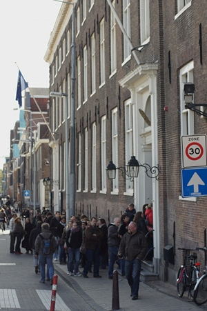
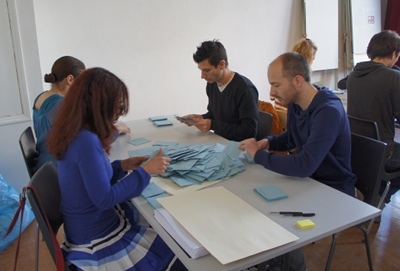

Au cas ou vous ne le sauriez pas, dimanche dernier, c'était le premier tour des élections présidentielles. Les français de l'étranger peuvent y participer et cette année j'en faisait partie. C'est surement pourquoi il y avait une file monstre pour poser mon bulletin dans l'urne. Selon les témoignages cette file d'attente commença juste avant mon arrivée et se résorba aussitôt que je m'en fûs allé.

<!--excerpt-->

{.center}
Image à comparer avec celle prise [au second tour il y a 5 ans](/encore-un-dimanche-d-elections).

Devant l'affluence, les assesseurs redoublaient d'attention pour faire les choses bien. Voyant le dévouement, lorsque je me suis vu demander si je pouvais **participer au dépouillement**, j'ai accepté. Je suis donc retourné au consulat à la fermeture du bureau de vote (18h) pour assurer ce **rôle de scrutateur**.

{.center}

Le décompte est ainsi assuré par les citoyens et citoyennes ce qui permet de constater ensemble les résultats et l'absence de fraude. Dans la salle, les assesseurs, mais aussi des délégués de partis ainsi que de simples curieux nous regardaient opérer pour s'assurer eux aussi de la régularité du décompte. 

C'est simple et bien que fastidieux, c'est à la portée de tout le monde[^1]. Un autre acte civique en période électorale.

---
[^1]: pas comme [le vote sur Internet](/voter-par-internet)