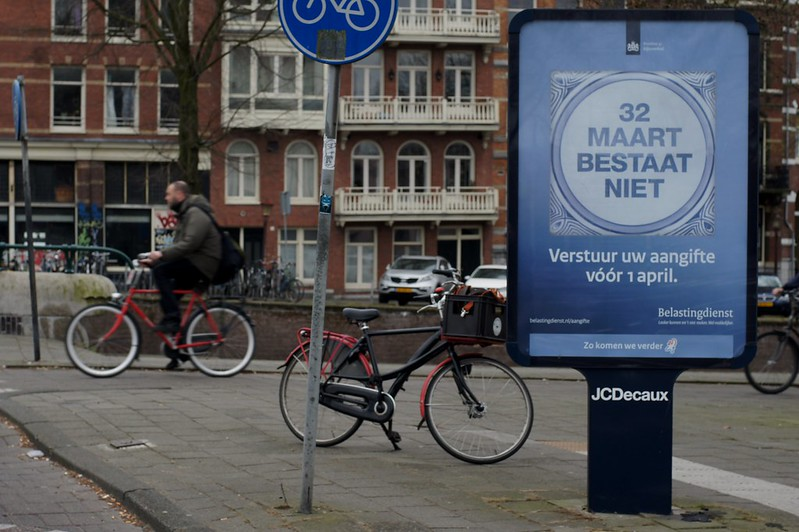

Le 32 mars n'existe pas, c'est le message tout ce qu'il y a de plus sérieux que le ministère des finances des Pays-Bas a diffusé sur des affiches dans les rues bataves. *32 maart bestaat niet*. Un message destiné à rappeler que la déclaration de revenus doit être envoyé à son administration fiscale avant le premier avril. Il est donc trop tard pour moi pour vous faire le même rappel.

[{.center}](http://www.flickr.com/photos/drooderfiets/7036195601/in/photostream)

### Nouveau mot: *bestaat niet*

Bestaat niet veut dire qui n'existe pas. Tout comme le 32 mars.

Aux Pays-Bas, les impôts sur le revenu sont prélevés à la source. La part des impôts est visible sur sa feuille de paye et il est donc courant que les contribuables ne déclarent pas leurs impôts. La première motivation pour remplir sa déclaration, est de récupérer un trop perçu en déclarant des mois non payés ou des charges offrant réductions d'impôt. Il est cependant recommandé de le faire aussi lorsque les prélèvement s'avèrent exacts. L'administration fiscale collecte aussi les informations sur les patrimoines des contribuables et ces derniers changent tous les ans.

Que du très sérieux en fin de compte, ce qui justifie que je poste cette histoire un premier avril.
