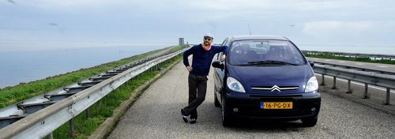

Je ne pensais pas faire un billet sur **l'achat d'une voiture aux Pays-Bas**, tant j'ai insisté sur la [difficulté de se garer à Amsterdam](/a-amsterdam-se-garer-coute-cher) et l'[usage facile de la bicyclette](http://drooderfiets.tumblr.com/). Mais voilà, les choses changent et me voilà l'heureux propriétaire d'un Picasso d'occasion[^1].

{.center}

Je ne suis pas vraiment calé en voiture alors je pense que, dans mon cas, il est préférable de passer par un professionnel. Le site [autotrack](http://www.autotrack.nl/tweedehands) recense toutes leurs offres ce qui permet une recherche rapide. Pour ceux qui veulent trouver la bonne aubaine de particulier à particulier, je recommanderais plutôt [tweedehands autos](http://www.tweedehands.nl/autos/).

Après vérification de la cote et de l'état du véhicule[^2], je me suis donc rendu [à vélo](/tag/vélo) chez le vendeur et lui ait acheté le tas de tôles comptant et content. L'enregistrement a eu lieu dans la foulée et c'est ce qui a motivé cet article: point d'attente à la préfecture, de certificat de non gage et autre paperasseries.

**Contrôle technique**: (*APK*) Il doit être fait tous les ans et est à la charge du vendeur, c'est l'un des document que l'on demande quand on achète un véhicule.

**Certificat d'immatriculation**: L'immatriculation étant nationale, le numéro du véhicule ne change pas avec le propriétaire, il suffit de changer le nom du propriétaire dans la base de donnée des carte grises. Un permis de conduire néerlandais permet de le faire directement chez le revendeur. N'ayant qu'un permis français, je suis allé **dans un bureau de poste**[^3] avec les anciens papiers, un certificat de domicile (*Uittreksel burgerlijke stand*) et une carte d'identité et le tour est joué. Bien plus rapide que les longues attentes que je me souviens avoir fait en préfecture en France.

**Assurance**: Tout comme en France, il existe aujourd'hui de nombreux sites comparatifs d'assurances (*autoverzekering*). Aucun revendeur n'a su m'en conseiller un mais [j'ai trouvé comme un grand](http://www.independer.nl/autoverzekering/intro.aspx?refer=autodirect). Les tarifs variant en fonction des catégories de véhicules, il suffit de donner le numéro d'immatriculation pour avoir une offre. Les mêmes type de contrat existent (au tiers, tout risque). N'ayant pas acheté une voiture toute neuve, j'ai opté pour un contrat au tiers + bris de glace. **Pas de carte verte ni de vignette**, une confirmation par email est suffisante pour prouver que l'on est couvert.

Le tout a été fait en deux jours avec une facilité qui m'a déconcerté. Le fait que j'ai tout fait en néerlandais m'a aussi surpris mais après six ans dans ce pays, même si je baragouine, c'est quand même la moindre des choses de m'exprimer dans la langue locale.

--- 
[^1]: J'ai choisi [la marque française la plus néerlandaise](/Citroen-marque-francaise-neerlandaise).
[^2]: Pour vérifier la cote d'occasion de cette voiture, je suis allé sur le site de l'argus mais certains modèles étant différents, il est possible de le vérifier sa cote néerlandaise sur le site de l'[ANWB](/Assistance-routiere-ANWB) dans le rubrique [Koerslijst](http://www.anwb.nl/auto/koerslijst#stap1).
[^3]: Comme vous le savez, [les bureaux de poste des Pays-Bas vont disparaitre](/la-fin-des-bureaux-de-poste) mais il sera possible de faire ces démarches dans les lieux qui reprendront ces services.
<!-- post notes:
https://www.google.nl/maps/dir/Suikerplein,+1013+CL+Amsterdam,+Nizozemsko/AUTO+TOTAAL+HAARLEM,+Zijlweg+294,+2015+CN+Haarlem,+Nizozemsko/@52.3864008,4.6763742,18057m/am=t/data=!3m2!1e3!4b1!4m19!4m18!1m10!1m1!1s0x47c6082cd02b08ef:0x3617f8aea81cf8e1!2m2!1d4.8810013!2d52.3890702!3m4!1m2!1d4.6441592!2d52.383494!3s0x47c5ef6f6f4e64c9:0xc6e0b0b3740ec983!1m5!1m1!1s0x47c5ef1c96ab2fe1:0xece0a85f411d4be!2m2!1d4.6118232!2d52.3869962!3e1
--->

## À lire aussi 

* [L'assistance automobile avec ANWB](/Assistance-routiere-ANWB)
* [Se garer à Amsterdam, ça coûte cher](/a-amsterdam-se-garer-coute-cher)
* [Les nouvelles plaques d'immatriculation](/les-nouvelles-plaques-d-immatriculation)
