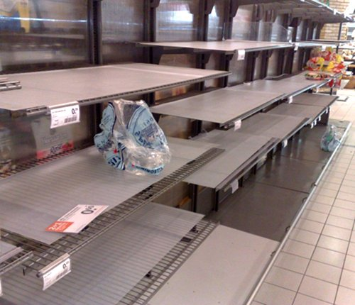

Une petit photo d'un ancien collègue m'indique que la canicule a enfin touché Amsterdam. Après s'être plaint d'un été pourri, les Amstelodamois vont enfin pouvoir se plaindre des nuits trop chaudes ; privilège, qu'ils ne veulent pas laisser aux français.

<!-- HTML -->

{.center}
*Le meilleur choix d'Albert Hein au rayon liquides*

<!-- / HTML -->
<!-- https://twitter.com/miklosjuhasz/status/237790511086333952 -->

Quand il fait chaud, il faut boire, c'est bien d'acheter de l'eau même mélangée à des cochoneries et même à la dernière minute. On touche ici, la limite du système Albert Hein: Petits supermarchés disséminés partout. À cause de leur petite surface, les supermarchés Albert Hein sont obligés de pratiquer le flux tendu. Pas de stock, mais des camions qui barre la rue régulièrement et des employés qui passent leur temps à recharger les étagères. Rappellez-vous [ce film](/l-horrible-moment-albert-hein) où l'on se plaint de les avoir toujours dans le chemin.

Les jours de festival ([gay pride](/gay-pride-2011-cru), [fête de la reine](/koninginnedag)...), tous les Albert Hein prévoient le coup en surapprovisionnant la bière. Les jours de canicule ne sont pas prévus au manuel du directeur d'Albert Hein ; fut-il en pleine zone touristique. Tant-pis.
