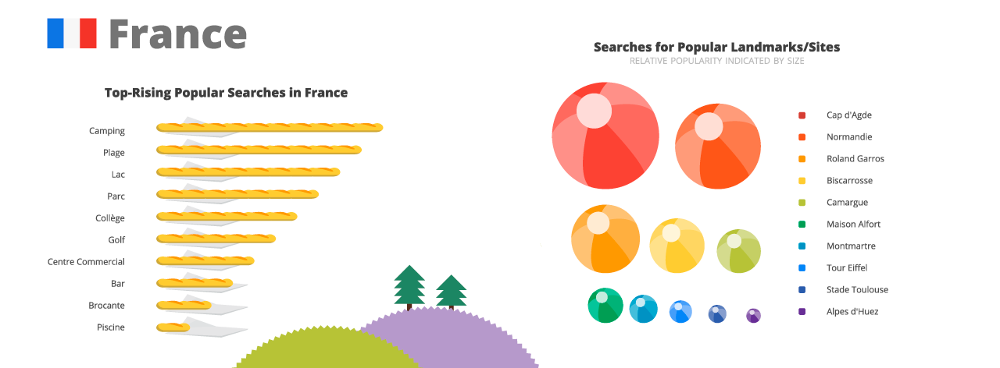
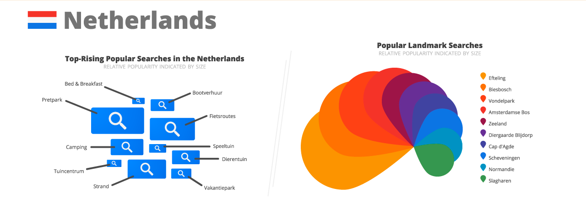

On sait que Google nous espionne sur internet et fait parfois d'étonnantes choses avec nos activités, comme des statistiques. Un article posté il y a quelques jours [sur le blog officiel de la compagnie](http://googleblog.blogspot.cz/2012/09/google-maps-shows-how-we-spent-summer.html) présentait une belle infographie sur les habitudes des internautes préparant leurs vacances. La France et es Pays-Bas font partie des rares pays sellectionnées. Les préjugés tombent.

<!--excerpt-->

On pourrait penser qu'avec une une offre concéquente de parcs à thème, du Futuroscope au Parc Astérix en passant par le plus grand d'Europe, Disneyland, les français aimaient aller dans les parcs d'attraction. Mais c'est le mot *camping* qui sort premier des recherches effectuées en France sur les cartes Google Maps. Suivent les mots *plage* puis *lac*. *Parc* n'arrive qu'en quatrième position, sans préciser s'il s'aggit d'un parc naturel ou d'un parc d'attraction. Les français seraient donc, selon Google, adeptes du camping.

{.center}

Avec leur réputation de venir en hordes dans les campings de France et d'Europe, les vélos sur le toit de la voiture et le coffre rempli de patates, les Néerlandais devraient surpasser les français dans ce googlescope. Mais là encore, ô surprise, c'est un autre mot qui sort en tête *Pretpark*, ce qui veut dire **parc à thème**. Le camping ne vient qu'en quatrième position, après *fietsroute* (**piste cyclable**) et *strand* (**plage**).

{.center}

Alors, est ce que Google maps a détectés de nouvelles habitudes montrant que les préjugés sont dépassés ? On pourait le croire, les reste des résultats semble cohérent. Voir les français s'interesser aux centre commerciaux et aux brocantes tandis que les néerlandais se préoccupent de pistes cyclables et de bateaux à louer (*Bootverhuur*) semble logique. Ces derniers placent en numéro un, le plus connu des parcs d'attraction du pays (*Elftelling*) ce qui colle avec le reste. Dans leur liste, les néerlandais placent aussi le cap d'Agde, en France, lieu qui arrive en première place chez les français. On peut se demander alors si les recherches des français sur cet endroit ne sont pas boustées par les néerlandais qui arrivent en France et cherchent ce haut lieu du naturisme. D'ailleurs il est probable que la recherche *camping* soit aussi boustée en France par les touristes hollandais.

Google n'indique pas comment sont collectées les données (on se doute que c'est dans notre dos) mais concernant les vacances, il est fort probable que les données collectées en France soient le fait des nombreux vacanciers étrangers perdus dans notre beau pays, première destination touristique du monde. Dès lors, on peut se demander si l'infographie est vraiment significative. D'ailleurs le choix du mot *collège* comme thème de vacances est lui aussi curieux, pourquoi ne pas avoir choisi *travail* ou *rentrée* tant qu'on y est, leur utilisation [est beaucoup plus significative](http://www.google.com/trends/?q=coll%C3%A8ge,+travail,+rentr%C3%A9e&ctab=0&geo=all&date=all&sort=0), mais est-ce encore les vacances ?

<!-- post notes:
http://googleblog.blogspot.cz/2012/09/google-maps-shows-how-we-spent-summer.html
--->
