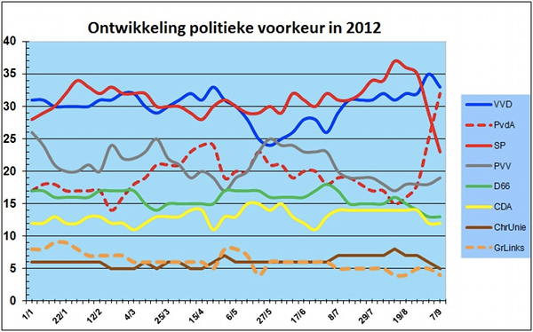

2012 Est une année électorale, **c'est au tour des néerlandais de voter**, demain, pour renouveler leur députés. Les élections générales ont été provoquées au printemps par la chute du gouvernement ayant eu lieu en avril dernier. Les pourparlés avaient commencé en mars 2012 pour boucler un budget 2013 de crise où il fallait décider de nouvelles coupes budgétaires pour trouver au moins 9 millards d'euros d'économies. Le parti de la liberté (PVV) de Gert Wilders, qui jusqu'alors soutenait le gouvernement sans y participer, n'a pas voulu soutenir les réductions de budget de la sécurité sociale sans contre-partie sur le droit d'immigration. Après d'âpres négociation, le premier ministre Rutte a constaté l'échec des discussions et a remis sa démission à la reine le 23 avril 2012.

## Tweede kamer Verkiezingen 2012

Des élections sont immédiatement convoquées mais puisque la période estivale y est peu propice, c'est la date du 12 septembre qui est retenue. Entre temps, le gouvernement reste en place pour expédier les affaires courantes. Pour tout le reste, nottamment pour approuver choix discutés avec les partenaires européens dans la crise de l'éuro, c'est la deuxième chambre qui est compétente. C'est d'ailleurs grâce aux députés que s'est finalisé l'[accord de budget 2013](http://www.ambafrance-nl.org/Presse-neerlandaise-du-vendredi-27,17019) pourtant sur plus de 12 miliard d'économies, à l'initiative des libéraux du **D66**, des verts de **Groenelinks** et des chrétiens de la **ChristenUnie**, partis qui étaient jusque là dans l'opposition.

## La campagne

La campagne, ayant eu lieu durant l'été, n'a pas passionné les foules. Il y a pourtant eu des évolutions intéresantes comme on peut voir en temps de crise. On a vu la montée du parti de gauche radicale **SP**, au détriment des autres partis de gauche et du parti d'extrème droite de Gert Wilders. Le coté sympatique de son leader, [Emile Roemer](http://fr.wikipedia.org/wiki/Emile_Roemer) y est peut-être pour quelque chose mais la crise économique doit aussi avoir influencé ce choix. La préocupation des néerlandais n'est plus l'immigration ou les limitations de vitesse mais l'emploi et le social. En ses temps de crise le clivage droite-gauche se fait plus pregnant et à droite, c'est le **VVD** du premier ministre sortant qui est favori. Le **CDA** est toujours en convalessence depuis le départ de Piet Balkenende et devrait perdre encore plusieurs sièges. À gauche, les travaillistes du **PvdA** étaient au gouvernement il y a deux ans et ont eu du mal à retrouver leur crédibilité. Leur nouvelle tête de liste, [Diederik Samsom](http://fr.wikipedia.org/wiki/Diederik_Samsom) semble gagner en popularité depuis les débats télévisés. Les [derniers sondages](http://www.ambafrance-nl.org/Presse-neerlandaise-du-lundi-10,17502) le donne au coude à coude avec le VVD de Mark Rutte. La progression récente du PvdA semble se faire au détriment du SP mais aussi des autres partis comme Groenelinks ou même les libéraux du D66.

[{.center}](https://n8.noties.nl/peil.nl/current.php)

Il faut rappeller que les sondages ne sont pas forcément le reflet de ce qui se passera dans les urnes. Les bons scores de la dernière heure sont souvent surévaluées (qui se souvient du troisième homme de 2007 ?) et le vote d'extrème droite est souvent sous-évalué (c'est valable pour Wilders comme pour le Pen). Enfin il reste une grand nombre d'électeurs indécis. 43% de l'électorat selon le Volkskrant de vendredi dernier, de quoi faire basculer un scutin.

## Nouveaux partis

Pour cette élection nombreux sont les petits partis qui tentent leur chance pour la première fois, espérant un siège ou plus à la chambre basse. Les plus crédibles sont **50plus**, un parti voulant défendre les intérêts des seniors et le **Piratenpartij**, le parti pirate des Pays-Bas. Il y a aussi le **Democratisch Politiek Keerpunt** conduit par Hero Brinkman, député sortant et discident du **PVV** de Gert Wilders qui en avait marre des sautes d'humeur de son chef. La [liste complète des listes en présence](http://www.kiesraad.nl/nieuws/kandidatenlijsten-bekend), mentionne aussi une liste libertaire, une autre anti-européenne, une liste LibDem, un parti des hommes et de l'esprit (MenS), un parti du futur et d'autres au noms plus funky comme NXD ou SOPN. Pas étonnant qu'il y ait tant d'indécis.

Il n'y a que 150 sièges à la deuxièmes chambre des Pays-Bas. On saura mercredi soir qui aura le droit de s'y assoir.
---