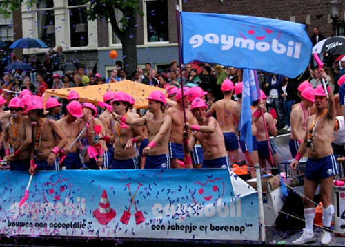

****Alors que la France discute de donner **les même droits que les autres aux couples de même sexe**, on peut tenter d'entrer dans le débat en indiquant que **les néerlandais ont fait ce choix en 2001**. À l'époque [le PACS](http://fr.wikipedia.org/wiki/Pacte_civil_de_solidarit%C3%A9) vient à peine d'être promulgué (au forceps) en France et on ne sait pas encore qu'il sera un succès.

{.center}

Les Néerlandais n'ont pas fait ce choix à la légère non plus, ils ont longuement débatu cette possibilité de ce qu'on appelle mariage gay. Curieusement, la reconnaissance des droits des homosexuels a été facilité, par des autorités religieuses.

En effet, les nérlandais sont encore sous l'influence de leur [organisation en piliers](/nouveau-mot-verzuiling) et les religieux on encore en charge de nombreux pans de la société (école, partis politiques, universités, hopitaux...). Par exemple, mon hopital à Amsterdam était l'OLVG (*Het Onze Lieve Vrouwe Gasthuis* ou **Notre Dame du bon secours** en Français) un hopital [catholique](/catholiques-et-protestants). 

Parce que les catholiques pensent qu'être pédé est une maladie et qu'ils disposent d'hopitaux, ils ont mis en place des programmes de recherche pour essayer de découvrir un moyen de guérir cette maladie. Rien de mal à cela, nombre d'homo chrétiens ont été volontaires pour ce programme. Ce dernier n'a pas duré parce que les médecins, après une période de recherches acharnées, sont retournés vers les auorités religieuses pour leur indiquer que tout ce qu'ils avaient pu trouver c'est qu'être pédé était un état qui ne pouvait pas se guérir.

Dans **le monde protestant**, les Luthériens ont commencé à débatre du statut des homos dès 1972. Ils ont aussi décrété lors d'un synode en 1995 qu'**aucun fondement theologique ne s'opposait aux bénédictions de couples non-mariés**. En effet, le mariage n'a pas la même valeur chez les protestants, il n'y a pas de sacrement et ils ne pratiquent qu'une bénédiction. Il pensent que l'union de deux personnes est déjà réalisée (devant Dieu qui est omniprésent) au moment où le couple fait sa demande. Dans les années 90 plusieurs églises protestantes ont béni des couples qui n'était pas mariés civilement. Et ce, quelquesoit leur orientation sexuelle.

Au sortir de la seconde guerre mondiale, Amsterdam qui s'était fait une spécialité d'acceuillir les minorités oprimées (juifs, hugenots...) ont fait perdurer la tradition en acceuillant les homosexuels. Le premier monument au monde, à la mémoire de leur masacre par les nazis, a été posé au pied de *Westerkerk*. De nombreux gays se sont effectivement installés à Amsterdam, très visibles, ils ont aussi su s'organiser pour revandiquer les droits que les autres avaient mais que eux, n'avaient pas. C'est tout naturellement que cette loi a été proposée et votée en 2001, **il y a 11 ans**.
---
<!-- post notes:
http://www.la-croix.com/Religion/Urbi-Orbi/Monde/Une-institution-catholique-des-Pays-Bas-accusee-d-avoir-castre-de-jeunes-garcons-pour-les-guerir-de-leur-homosexualite-_NP_-2012-03-19-779930
--->
