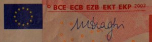
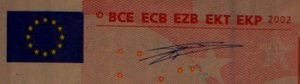
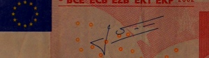

[{.right}|/public/images/photos/2012/billets-de-10-euros-500.jpg||billets de 10 euros] Voilà un sujet que je voulais traiter depuis longtemps. Un sujet qui touche presque tous les européens et même le quotidien de gens en dehors de l'Union Européenne : l'Euro. Je ne vais pas retracer l'histoire de la monnaie unique que vous pouvez retrouver ça et là, ni parler des déboires actuels que certains appellent « crise de l'euro » alors que c'est une « crise de la dette » auquels certains états doivent faire face.

Dans le cas de crise, la monnaie, comme les taux d'intérêts peuvent être des outils de régulation et c'est là que la banque centrale a un rôle à jouer. La marge de manoeuvre est étroite mais c'est sur ces points que Mario Draghi, nouveau président de la [banque centrale européene|http://fr.wikipedia.org/wiki/Banque_centrale_europ%C3%A9enne||Article de Wikipedia sur la BCE] (BCE) était attendu. Moi je l'attendais ailleurs.

Si vous me suivez sur ce blog, vous savez que [je collectionne les billets de banque en euro|/mon-premier-eurohit-pays-bas||mon article sur Eurobilltracker]. Je les collectionne tous et comme je n'ai pas assez de place pour les garder, j'enregistre juste leur numéro de série sur [Eurobilltracker|http://fr.eurobilltracker.eu/signup/?referer=31378||Inscrivez-vous sur Eurobilltracker]. Comme les autres collectionneurs de billets, j'attendais avec impatience les premiers billets signés du nouveau président Mario Draghi. C'est maintenant chose faite, grâce à un billet allemand de 10 euros.

{.left}

Il me faut donc profiter de l'occasion pour rappeller que les billets de banque en euros, étaient jusqu'à présent signé par **un hollandais et un français**, les deux précédent présidents de la BCE.  
  
Voyez donc les différences interessantes que vous avez tous en poche sans les remarquer.

{.left}

La première signature est celle de Wim Duisenberg, président de la BCE depuis sa création jusqu'en 2003. C'est [en prenant sa maison en photo|/incident-diplomatique||J'ai pris la maison de Gretta Duisenberg en photo et c'est pas bien.] que je me suis fais arrêter par la police en 2006. 

{.left}

La seconde est celle de Jean-Claude Trichet, second président de la banque centrale qu'on ne présente plus. Avant qu'un italien prenne sa succession, les nationalités des présidents de la BCE était celles abordées dans ce blog. Ça vaut bien un billet.
---
<!-- post notes:
http://www.euractiv.fr/draghi-inquiete-ecarts-competitivite-zone-euro-article
--->
