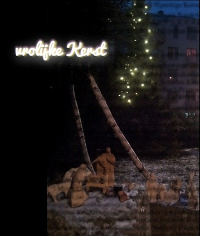

Je suis peut-être **loin des Pays-Bas** mais je suis **proche de vous** par la pensée. C'est encore plus vrai pour [les fêtes de Noël](/noel-des-pays-bas). Samedi dernier, en me promenant dans la neige, je suis passé par une station de bus appellée « Internationale ». Il y avait une crèche sur la place, avec plein de santons, vraisemblablement réalisés par les élèves du coin. C'est l'occasion de souhaiter mes vœux pour un très bon Noël dans plein de langues.

{.center}

Pour changer, je mets en valeur le flamand qui souhaite un **vrolijke Kerst**, **joyeux Noël**, en mettant l'accent sur l'évènement plutôt que sur les [deux à trois jours feriés](/noel-des-pays-bas).

Je vous invite à cliquer sur l'image ci-dessus pour voir mes vœux en plus grand et dans toutes les langues. Et aussi à relire les histoires de saison.

[Joyeux Noël 2011](/Joyeux-Noel-2011)  
[Joyeux Noël 2010](/joyeux-noel-2010)  
[Saint Nicolas ne concurence pas Noël](/saint-nicolas-ne-concurence-pas-noel)  
[Joyeux Noël 2009](/joyeux-noel-2009)  
[Cette année les vitrines de noël sont sexy](/vitrines-de-noel-sexy)  
[Joyeux Noël 2008](/joyeux-noel-2008)  
[La messe de Noël en français](/la-messe-de-noel-en-francais)  
[Ma carte de 2007](http://alix.guillard.fr/voeux/2007/joyeux-noel.php)  
[La chanson de Noël de 2006](/chanson-de-noel)  
[Joyeux Noël 2006](/meilleurs-voeux-pour-noel)  
[Douce nuit, Sainte nuit / Stille nacht, Heilige nacht](/douce-nuit-sainte-nuit-stille-nacht-heilige-nacht)  
[Les Noël des Pays-Bas](/noel-des-pays-bas)  
[Dweede kerstmis is boxing day ?](/dweede-kerstmis-is-boxing-day)  
[La tradition des vœux en 2008](/pour-les-voeux-c-est-fini)  
[Nouveau mot : Kerstpakket (cadeau de noël)](/dweede-kerstmis-is-boxing-day)  
[Les inondations de Noël](/les-inondations-de-noel)  
[Les maronniers de l'hiver](/les-marronniers-de-l-hiver)  
[La fin des sapins](/la-fin-des-sapins)  
---