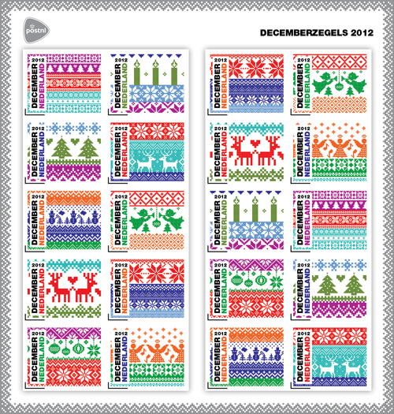
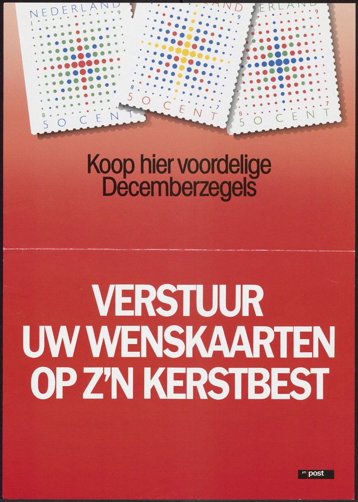

Je vous ai souvent parlé des timbres de décembre sur ce blog. Réservés à l'envoi de cartes, ils incitent les hollandais à écrire puisqu'ils coûtent moins cher (40 centimes au lieu de 44). Chaque année une nouvelle planche de ces timbres à découvrir avec un visuel de saison.

{.center}

<!--excerpt-->

Cet année, hiver hypster oblige, les motifs de pull de ski à la Joseph Marie Jacquard sont à l'honneur, dans un style graphique qui n'est pas sans rappeler [les timbres écolos de ces dernières années](/des-timbres-ecolos-en-france-et-aux-pays-bas). La planche coûte huit euros tout rond pour vingts timbres tout rectangles.

Si je vous en parle aujourd'hui c'est que les timbres de décembre (*decemberzegel*) on cette année 25 ans.

C'est en effet en 1987 que la poste des Pays bas a émis le premier carnet de timbres de noël (*Kerstzegels*) au prix de ƒ 0,50 (un demi florin). En 1987 en France les carnets de bienfaisance « Croix Rouge » sont déjà prisés des collectionneurs depuis des décennies. Mais là où les français payent leur timbres plus cher que le tarif normal, les néerlandais inaugurent la formule du timbre légalement moins cher que le tarif normal.

{.center}

C'est donc la 25ème série des timbres de décembre cette année. Depuis le carnet à ƒ 0,50 de 1987, beaucoup de choses ont changé, le prix du timbre a augmenté tout comme celui de nombreux autres produits, les prix sont d'ailleurs passés en euros et puis les cartes de vœux sont maintenant aussi envoyées par emails, sur le web ou sur les réseaux sociaux. Les timbres de décembre ont eux aussi évolués. D'un carnet de 10 timbres avec 5 visuels en 1987, nous sommes passés à une planche de 20 vignettes autocollantes où les 10 visuels différents ne semblent pas respecter un ordre précis. 

C'est **en 1995 que les premiers timbres autocollants néerlandais sont sortis**, c'étaient justement les timbres de décembre.

## Kerstzegels

Le mot *Kerstzegels* est souvent utilisé pour ces timbres de vœux de fin d'année mais l'appellation officielle est le politiquement correct *decemberzegel* puisqu'il est possible d'envoyer ses vœux de nouvelle année, Hanoukka ou de joyeux solstice avec ces même timbres. D'ailleurs, cette mention «December» fait maintenant partie du timbre puisque c'est le nom du tarif avantageux qui remplace le prix des frais d'envoi en chiffres depuis que les timbres néerlandais sont à [validité permanente](/timbres-nouvelle-numerotation/).

Pour les timbres de décembre, cette validité permanente est de courte durée. Puisque le 6 janvier, il n'est plus correct d'envoyer des cartes de vœux, le tarif préférentiel n'a plus lieu d'être et ces timbres ne seront donc plus valables. On vous aura prévenu.

<!-- post notes:
http://123weetjes.blogspot.cz/2012/08/kerst-zegels-2012.html 
http://ed-naab.plazilla.com/page/4295011831/gulden-zegel-mag-niet-als-decemberzegel-op-kerstkaart 
https://nl.wikipedia.org/wiki/Decemberzegel 

https://fr.wikipedia.org/wiki/Timbres_et_vignettes_de_No%C3%ABl <--NL missing
--->
