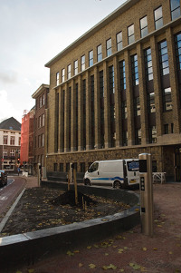

L'ambassade de France a déménagé officiellement en novembre sa nouvelle adresse est   
**Anna Paulownastraat 76**  
**2518BJ La Haye**

Bien qu'étant un des hauts lieux de la France aux Pays-Bas, pendant toute le temps que je suis resté aux Pays-Bas, je n'ai jamais eu à m'y rendre. En effet, le batiment du Smidsplein 1 n'hébergeait que les services diplomatiques et la délivrance des visas. Il n'y avait pas d'antenne consulaire à la Haye ce qui était pratique pour moi qui résidait à Amsterdam, ville ou se situe le consulat général de France. 

Les ''réceptions de l'Ambassadeur'' n'avaient pas lieu non plus au Smidsplein 1, bâtiment administratif mais à la résidence de France sur Tobias Asserlaan. Un joli bâtiment plus approprié aux galas.

Le 12 novembre dernier, l'Ambassadeur Pierre Ménat et la conseillère municipale Marjolein de Jong [ont symboliquement planté un arbre](http://fr.denhaag.nl/fr/residents/to/Plantation-dun-arbre-a-la-nouvelle-Ambassade-de-France.htm) devant le bâtiment qu'on appelait jusqu'alors *Kodakgebouw* au Anna Paulownastraat 76. Les service de l'ambassade y ont déménagé donnant une nouvelle adresse à la France aux Pays-Bas.

À la place de l'ancien batiment de l'ambassade de France, sera construit un nouveau qui habritera la cour suprême des Pays-Bas.

{.right}
## Mise à jour d'adresse.
Aujourd'hui, 1er décembre, lorsque j'écris cet article, il semble que tout le monde ne soit pas au courant de ce changement. **Une recherche dans Google me donne toujours l'ancienne adresse** avec la route pour m'y rendre et tout et tout. 

**Le consulat à Amsterdam non plus ne semble pas être au courant** puisque le site annonce toujours l'[ancienne adresse](http://www.consulfrance-amsterdam.org/Ambassade-de-France-a-La-Haye). Heureusement, on peut cliquer sur les liens offert par ces deux sites et retrouver la nouvelle adresse et des jolies photos [sur le site de l'Ambassade](http://www.ambafrance-nl.org/Nouvelle-adresse-pour-l-Ambassade).

On peut aussi aller sur Wikipedia, l'[ambassade de France y est référencée](http://fr.wikipedia.org/wiki/Ambassade_de_France_aux_Pays-Bas) avec sa nouvelle adresse. La modification y a été faite [le 22 novembre](http://fr.wikipedia.org/w/index.php?title=Ambassade_de_France_aux_Pays-Bas&diff=85641771&oldid=81685258) par [213.148.236.81](http://www.concepts.nl/). Du coup, je me demande quel est le fournisseur d'accès internet de l'Ambassade[^1].
---
[^1]: Si cette histoire vous rappelle [les éditions de la princesse](/editions-de-la-princesse), sachez qu'à moi aussi.
<!-- post notes:
http://www.skyscrapercity.com/showpost.php?p=97402317&postcount=255
--->
