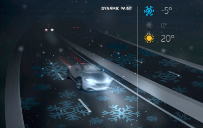

Avec leur réseau d'autoroutes dense, à fort trafic et réglées au millimètre, les Pays-Bas sont les champions des autoroutes. Il faut dire qu'il n'y a pas d'alternatives, pas de routes secondaires comme les nationales en France. Ici, tout le monde connait l'autoroute, tout le monde prend l'autoroute.

{.center}

Pas étonnant que les autoroutes du futur soient pensées aujourd'hui dans ce pays.

Le [Studio Roosegaarde](http://www.studioroosegaarde.net/) est un cabinet de design de réputation mondiale. Avec l'autoroute intelligente *Smart Highway* en anglais dans le texte, le cabinet propose plusieurs designs interactifs qui peuvent préfigurer les routes du futur. Il a fait équipe avec l'entreprise de BTP [Heijmans](http://www.heijmans.nl/) pour mettre au points des technologies permettant à la route, le revêtement, la signalisation, de s'adapter au temps et au trafic.

[Leur portfolio](http://www.studioroosegaarde.net/project/smart-highway/photo/#smart-highway), présente une peinture phosphorescente qui permet d'économiser sur l'éclairage, un revêtement qui indique la température du sol ou des bas-coté qui signalent la force du vent. L'ensemble de ces projets devraient utiliser au mieux les propriétés des matériaux pour ne pas être consommateurs d'énergie. Dans la même veine, le cabinet propose aussi de construire des pistes qui rechargent les véhicules électriques par induction.

Le cabinet s'enorgueilli d'avoir gagné le prix du *Best Future Concept* en 2012 mais c'est cette année 2013 qui devrait vraiment lancer le projet. Le gouvernement néerlandais a commandé les premiers kilomètres de chemin peints avec des lignes phosphorescentes. Et, comme pour confirmer les intentions «durables» du cabinet, les premiers chemins équipés seront des pistes à vélos comme le montre [ce reportage de la BBC](http://www.bbc.co.uk/news/world-europe-20942340). Pour les autoroutes, il faudra attendre.

Après tout, **les autoroutes du futur seront peut-être des autoroutes pour vélos**.

<!-- HTML -->

<a href="/plein-de-velos-hollandais" title="tout savoir sur la bicyclette aux Pays-Bas">
<!-- / HTML -->
**Plein de vélos hollandais**  
{.center}  
1) Les avantages  
<!-- HTML -->
</a>

<!-- / HTML -->

<!-- HTML -->

<a href="/plein-de-velos" title="tout savoir sur la bicyclette aux Pays-Bas">
<!-- / HTML -->
**Plein de vélos hollandais**  
{.center}  
2) Les styles
<!-- HTML -->
</a>

<!-- / HTML -->

<!-- HTML -->

<a href="/plein-de-velos-hollandais-3" title="tout savoir sur la bicyclette aux Pays-Bas">
<!-- / HTML -->
**Plein de vélos hollandais**  
{.center}  
3) Les marques
<!-- HTML -->
</a>

<!-- / HTML -->

<!-- HTML -->

<a href="/plein-de-velos-pas-hollandais-4" title="tout savoir sur la bicyclette aux Pays-Bas">
<!-- / HTML -->
**Plein de vélos hollandais**  
{.center}  
4) Les marques étrangères
<!-- HTML -->
</a>

<!-- / HTML -->

<!-- HTML -->

<a href="/une-heure-sans-velo" title="tout savoir sur la bicyclette aux Pays-Bas">
<!-- / HTML -->
**Plein de vélos hollandais**  
{.center}  
5) Parking à vélos
<!-- HTML -->
</a>

<!-- / HTML -->

<!-- HTML -->

<a href="/les-velos-de-location" title="tout savoir sur la bicyclette aux Pays-Bas">
<!-- / HTML -->
**Plein de vélos hollandais**  
{.center}  
6) Vélos de location
<!-- HTML -->
</a>

<!-- / HTML -->

<!-- HTML -->

<!-- / HTML -->
---