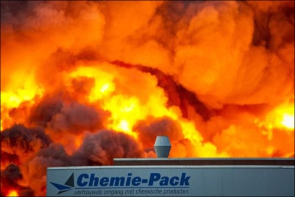

Le 5 janvier 2011, en début d'après-midi, à [Moerdijk](http://fr.wikipedia.org/wiki/Moerdijk), un incendie s'est déclaré dans les prémices de la société Chemie-Pack. Il se trouvait sur ce terrain, 23.500 litres de produits corrosifs, toxiques et inflamables. La chaleur a fait exploser leurs cuves et les produits ont pris feu, libérant un épais nuage de fumées noires que l'on pouvait voir à des kilomètres à la ronde jusque dans la nuit.

<!-- HTML -->

<object width="352" height="198"><param name="movie" value="http://s.nos.nl/swf/nos_video_embed.swf"></param><param name="allowfullscreen" value="true"></param><param name="allowscriptaccess" value="true"></param><param name="flashvars" value="tcmid=tcm-5-874660" /><embed src="http://s.nos.nl/swf/nos_video_embed.swf" type="application/x-shockwave-flash" width="352" height="198" allowscriptaccess="always" allowfullscreen="true" flashvars="tcmid=tcm-5-874660"></embed></object>

<!-- / HTML -->

Avec le vent, la fumée s'est répandue dans la région, nottement à Dordrecht et Rotterdam. Heureusement les études ont montré que la fumée n'était pas toxique pour la santé. Les dégats causés par l'incendie ont été estimés à 70 millions d'euros. Un [reportage de NOS](http://nos.nl/video/243351-reconstructie-van-de-brand-bij-chemiepack.html) montre comment l'incendie à été déclanché et comment il s'est propagé puis contenu par les pompiers.

## L'intimité avec des produits chimiques

Telle nouvelle a fait la une des journaux à il y  deux ans et puis les médias sont revenus sur le sujet à chaque fois que l'enquète progressait ou au moment où les argiculeurs de la région ont reçus des [compensation pour les dégats causés](http://www.bndestem.nl/regio/brabant/geld-voor-32-telers-na-brand-bij-chemie-pack-1.406061) dans les champs alentours. À [chaque](http://www.strijen.nl/actueel/nieuws_15/item/commissie-evalueert-moerdijkbrand_16477.html) [fois](http://www.strijen.nl/actueel/nieuws_15/item/commissie-evalueert-moerdijkbrand_16477.html), la photo illustrant les articles est la plus spéctaculaire: Le logo de la société devant un brasier ardent.

{.center}

Sur cette photo on voit aussi le slogan de la firme malchanceuse : *Vertrouwde omgang met chemische producten* ce qui signifie l'**intimité avec les produits chimiques**. Un slogan qu'on croirait choisit pour l'occasion de l'incendie.
---
<!-- post notes:
http://www.bndestem.nl/regio/moerdijk/10382663/College-Moerdijk-wil-achterstand-na-Chemie-Pack-wegwerken.ece
http://www.gelderlander.nl/voorpagina/arnhem/9199404/Minder-controle-op-risicos-bij-kleinschalige-chemische-opslag.ece 

http://www.dumpert.nl/mediabase/1283751/a182bc02/integriteit_chemie_pack_bevestigd.html
http://www.mobypicture.com/user/rogierbeckers/view/8422268 
http://www.bndestem.nl/regio/moerdijk/een-jaar-na-brand-bij-chemie-pack-is-het-nog-steeds-een-zooitje-1.283422
http://www.strijen.nl/actueel/nieuws_15/item/commissie-evalueert-moerdijkbrand_16477.html
http://www.dutchnews.nl/news/archives/2011/01/moerdijk_chemical_fire_put_out.php
http://www.bndestem.nl/regio/brabant/geld-voor-32-telers-na-brand-bij-chemie-pack-1.406061
http://nl.wikipedia.org/wiki/Brand_Moerdijk_5_januari_2011 
https://www.youtube.com/watch?v=eEE1ejx-IeM
--->
