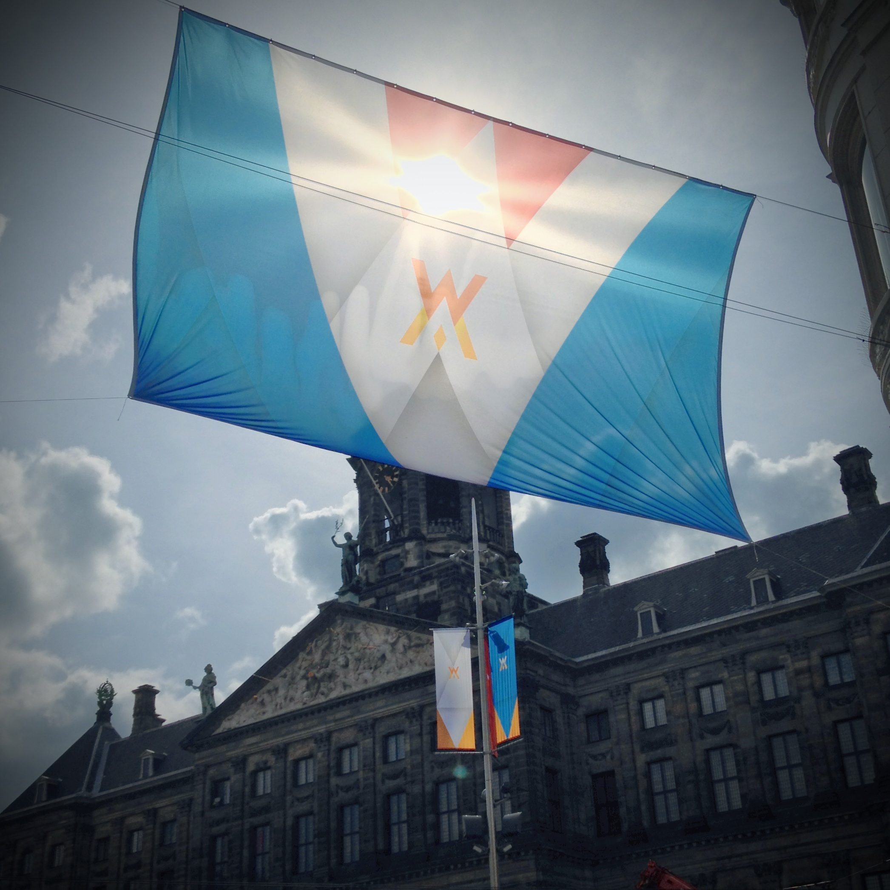
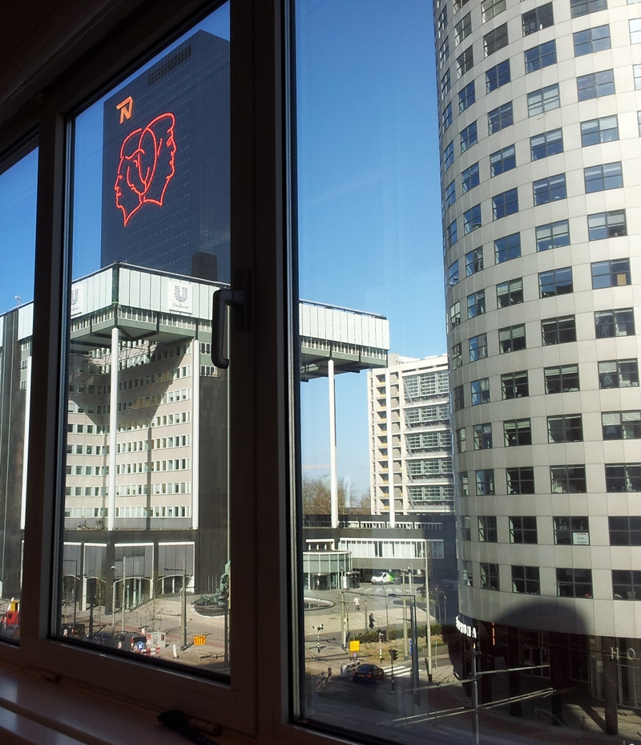
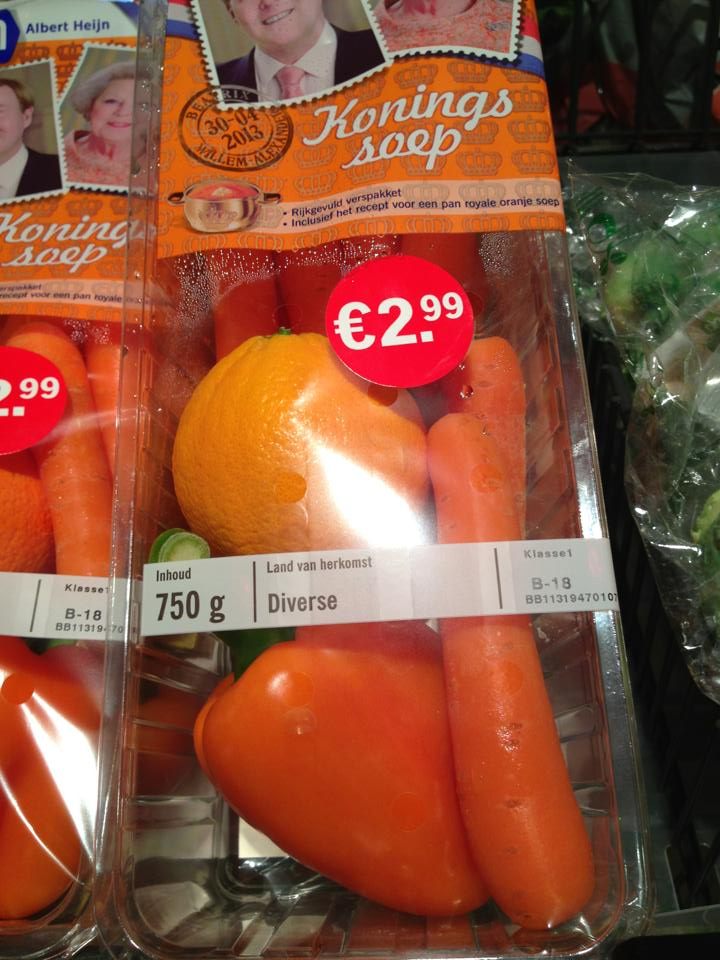

Les Néerlandais n'on pas eu de roi depuis le 23 novembre 1890, date de la mort de **Guillaume III**, le grand-père de l'actuelle Beatrix. 123 ans pendant lesquels les reines se sont succédées avec leur princes de maris. Le titre de reine étant moins élevé que celui de roi, il fallait que le mari est un titre inférieur de selui de la souveraine. À partir de demain, les néerlanadais auront un roi en la personne de **Guillaume-Alexandre** (*Koning Willem-Alexander*) et une reine en la personne de **Maximá**. On peut penser que c'est une raison suffisante pour faire la fête encore plus que d'habitude. Voici donc quelques photos pour en rendre compte.

{.center}
> Monograme Willem Alexander

Le monogramme royal est affiché partout en ville et sur le Dam juste devant le palais royal, sur la place où aura lieu l'installation du nouveau roi. Photo : [Ruben](http://www.flickr.com/photos/rubenvanstaveren/)

{.center}
> Portraits royaux sur la tour National Nederlander

Le monde des affaires est de la partie la tour de la National Nederlander affiche en grand les profils royaux. Photo : Christina

{.center}
> La soupe orange de Albert Hein

Coté populaire, on retrouve le orange même dans les soupes d'[Albert Hein](http://meinamsterdam.nl/?q=albert+hein), l'enseigne a poussé la surenchère orange encore plus loin qu'[en période de foot](http://meinamsterdam.nl/decorations-oranges-choisies). Photo : [ What's Up Amsterdam](https://www.facebook.com/photo.php?fbid=581983878502633&set=a.528047567229598.125494.521751881192500&type=1&theater) merci [Dana](http://danarozmarin.com/)

{.center}
> La boule orange

Même les républicains se mettent à l'orange mais c'est pour dénoncer ce folklore qui ne les fait plus rire. Leur mot d'ordre *[Weg met de monarchie](http://hetis2013.nl/)* veut en finir avec la monarchie. Il seront surement moins visibles à la télé que les hordes de fans en orange. Photo : [Meedogenloos](http://meedogenloos.nl/2013/03/30/zaterdagmiddagtirade-door-journeyman/)
---