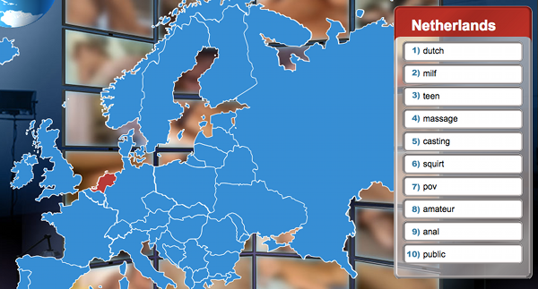
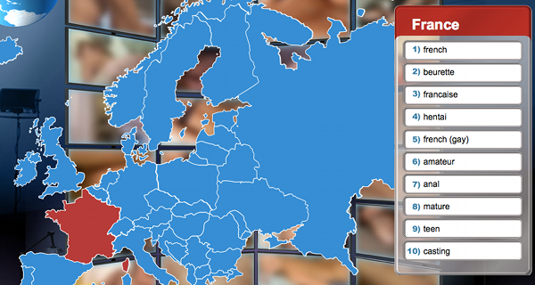

Encore une fois je vais comparer **la France** et **les Pays-Bas** dans les classements mondiaux. Encore une fois je vais prouver que les deux pays sont très différents et que tout deux sont les meilleurs dans leur catégorie[^1]. Une fois n'est pas coutûme, l'étude sera très légère sur un sujet qui intéresse bon nombre de nos contemporains, il s'aggit d'une compilation des recherches effectuées sur un moteur suisse de matériel pornographique. Les données ont été compilées par pays sur une base inconnue (les origines géographiques des adresses IP sont parfois difficiles à déterminer) et la quantité de données collectée n'est même pas donnée. C'est à douter du sérieux de l'étude. 

Donc voilà je vais vous en parler pour le fun (pour les *lulz*) et aussi pour augmenter l'audience de mon blog puisque je vais parler de sexe et de porn. L'étude est [encore en ligne](http://www.pornmd.com/sex-search) et est consultable au boulot sans risque. **Voici les Global Internet Porn Habits**.

{.center}
Pour les Pays-Bas, pas de surprise, les gens crânent en montrant qu'ils parlent anglais, Ils utilisent des accronymes comme MILF ou POV. La spécificité d'un pays très humide où les gens aiment la nature est visible par le «squirt» et le «public» que l'on ne retrouve pas dans les recherches d'autres pays.

{.center}
Pour la France non plus, pas de surprise, la faible maitrise de l'anglais fait arriver «française» en troisième position après d'autres choix typiquement locaux. L'attrait très français pour la culture nippone est visible grâce à «Hentai» qui veut dire pervers dans la langue du soleil levant. Enfin on note une recherche *gay* chez les français uniquement, sans doute parce qu'il est plus difficile qu'aux Pays-Bas de trouver des *gays* en dehors de l'écran.

---
[^1]: il doit y avoir environ une catégorie par pays