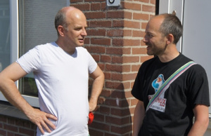

Certains des Français à l'étranger vont [à nouveau devoir voter](http://www.diplomatie.gouv.fr/fr/vivre-a-l-etranger/vivre-a-l-etranger-vos-droits-et/elections-legislatives-partielles/dates-et-modalites-de-vote/article/dates-de-scrutin-et-modalites-de) et ils vont à nouveau pouvoir le faire **via Internet**. Je recycle ici un article que j'ai écrit pour le candidat pirate il y a un an, au cours de la campagne des législatives. À l'époque je commençais juste à me rendre compte qu'il y avait un truc qui clochait dans le vote par Internet. J'ai voulut en savoir plus en découvrant l'expérience des Pays-Bas, lisez plutôt :

Suite aux inquiétudes dont les délégués nous ont fait part [au sujet du bureau de vote électronique|http://legislatives.partipirate.org/2012/2012/05/21/le-parti-pirate-denonce-lopacite-du-vote-par-internet-des-francais-a-letranger-et-labandon-du-controle-des-elections-a-des-societes-privees/||Sur le site du parti pirate], mon suppléant, **Alix Guillard**, a rencontré **Rop Gonggrijp**, tous deux habitant Amsterdam. Rop Gonggrijp est le fondateur de l’un des premier fournisseur d’accès aux Pays-Bas. Il s’est rendu célèbre en 2006 en exposant à la télévision une manière de truquer un vote avec en hackant une machine à voter. Sa démonstration a amené le gouvernement à supprimer les lois d’exception qui autorisait ces systèmes.

Mon suppléant lui a demandé de revenir sur cette histoire et de donner son avis sur le vote par Internet actuellement en cours en France. La discussion s’est prolongée dans un joli parc d’Amsterdam sous un grand soleil. Cédric Delorme, mon mandataire financier les accompagnait.

{.center}

Rop Gonggrijp a fondé l’association ''[Wij vertrouwen stemcomputers|http://www.wijvertrouwenstemcomputersniet.nl/English|en|We don't believe voting computers]* niet (nous ne faisons pas confiance aux machines à voter) au moment où les machines à voter commençaient à être installées à Amsterdam. Voulant voir comment cela fonctionnait, il s’est heurté à une résistance de l’administration et des prestataires. Mais comme il est pugnace, il a trouvé le moyen de racheter une machine [Nedap](http://fr.wikipedia.org/wiki/Nedap), utilisé précédemment dans plusieurs municipalités. Selon lui la machine, du niveau d’un vieil Atari, est facilement modifiable et qu’il était tout à fait possible de manipuler les résultats ([voir son rapport pdf](http://wijvertrouwenstemcomputersniet.nl/images/c/ce/ES3B_EVT07.pdf)). Après sa démonstration télévisé, il lui a fallu encore beaucoup de temps et de persuasion jusqu’à ce que les Pays-Bas décident de ne plus autoriser ces machines.

## Le vote par Internet

Rop Gonggrijp a expliqué que les Pays-Bas avait prévu d’organiser un scrutin sur Internet pour les Néerlandais de l’étranger et pour les [Offices des eaux](http://fr.wikipedia.org/wiki/Office_des_eaux_des_Pays-Bas) (*Waterschappen*). Ce système s’appelait RIES (*Rijnland Internet Election System''). Encore une fois, il a longtemps insisté pour avoir accès au code source du projet. Il y a décelé de nombreuses imperfections, de bugs et sources d’erreurs. Il a [publié ces découvertes](http://wijvertrouwenstemcomputersniet.nl/images/7/7f/RIES.pdf) et largement communiqué dessus, ce qui a contraint le gouvernement a annuler le vote par Internet quelques semaines avant le scrutin.

**Aujourd’hui les ordinateurs de vote et les scrutins par Internet sont interdits aux Pays-Bas.**

Rop Gonggrijp est devenu un expert dans les questions de vote électronique et il fait souvent des conférences sur le sujet.

## Sur le système français

À la question de savoir s’il connaissait un système de vote fiable, il répond que le meilleur système à ses yeux est celui qui permet à chaque électeur de pouvoir vérifier si son vote a été pris en compte grâce à un reçu de vote. Mais là encore il doute que ce système garantisse le secret, la sincérité et la transparence du vote. Il faudrait que le serveur de vote soit complètement sécurisé mais aussi l’ensemble des terminaux s’y connectant, c’est-à-dire tous les ordinateurs de tous les inscrits au scrutin. Impossible.

C’est pourtant ce système qui est actuellement utilisé en France pour les élections législatives des français établis à l’étranger. Chaque électeur se voit remettre un reçu de vote qu’il pourra utiliser pour voir si son bulletin électronique a été pris en compte et décompté. Pour Rob Gonggrijp c’est insuffisant, à partir du moment où l’électeur vote de manière électronique, les données manipulées par le serveur ne sont pas traçables et **il n’y a aucune certitude que le résultat du scrutin annoncé par la machine corresponde à la véritable expression des électeurs**.

**Il espère que, comme aux Pays-Bas, le France abandonnera les machines à voter et le vote par Internet.**
---