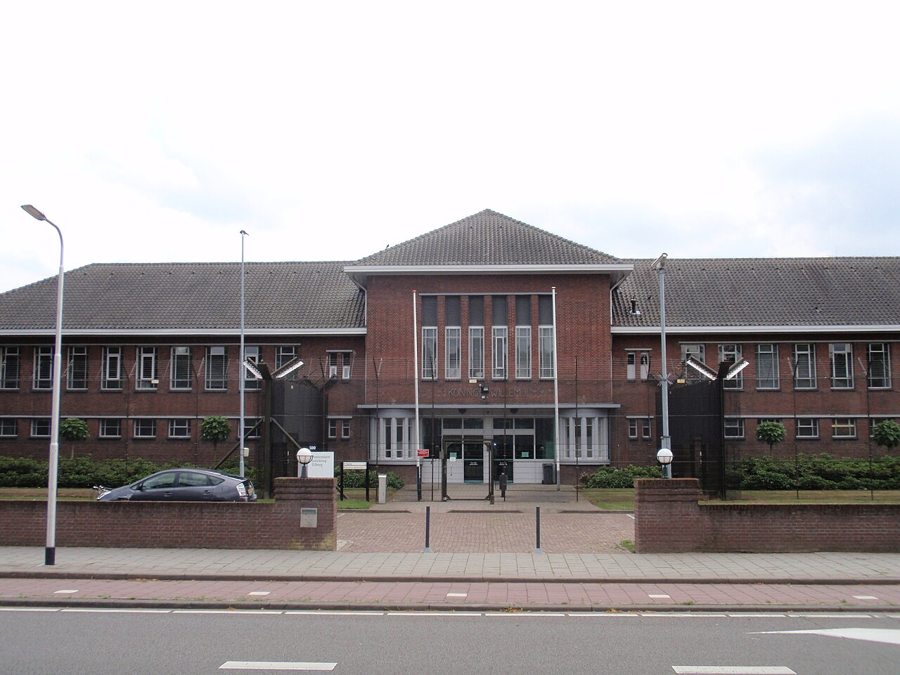

Voilà un sujet que je voulais aborder depuis quelques années, lorsque la baisse de la population carcérale du pays s'étalait dans les journaux locaux. Aujourd'hui, c'est la radio belge (RTBF) qui revient sur le sujet, car la Belgique est touchée par la fermeture des prisons annoncée cette année par le gouvernement.

## Baisse de la population carcérale

Depuis plusieurs années, la population carcérale baisxe aux Pays-Bas au point que le pays est l'un des rares dans le monde à avoir plus de places de prison que de détenus. Les journaux qui en parlent ne mettent pas en avant une baisxe de la délinquance. Ils soulignent surtout la réduction en durée des peines, mais aussi une meilleure prise en charge des détenus pour encourager la réinsertion. En effet, les peines plus courtes ne peuvent pas à elles seules vider les prisons si les délinquants récidivent après leur remise en liberté.

Cette politique a l'air de bien fonctionner puisque la population carcérale a chuté de 20 000 personnes incarcérées en 2004 à presque 13 000 personnes l'année dernière. Comme la population continue d'augmenter, le taux d'incarcération est en chute libre.

Du coup, les Néerlandais ont des places libres dans leurs prisons.

## Au secours de la Belgique

Vontrairement  son voisin du nord, la Belgique connaait une surpopulation carcérale comparable  celle de la France. Cette surpopulation dégradeait les conditions de détention et la tâche des surveillants.

{.center }
> prison de Tilburg

Pour soulager ses prisons, depuis 2009, la justice belge [loue 500 cellules](https://www.rtbf.be/article/la-belgique-louera-500-cellules-de-prison-aux-pays-bas-5437543) dans la prison néerlandaise de Tilburg, dans le Brabant Septentrional. Le ministère de la justice belge [précise que cette prison était vide](https://justice.belgium.be/fr/nouvelles/communiques_de_presse/les_premiers_detenus_belges_vont_quitter_la_prison_de_tilburg) et que 650 personnes y ont purgé leur peine depuis 2010.

## Fermeture des prisons

La politique judiciaire et carcérale menée aux Pays-Bas depuis 10 ans a tellement fait chuter le taux d'incarcération que le gouvernement envisage aujourd'hui de fermer 26 prisons d'ici à 2015. C'est un problème pour la Belgique [titre la RTBF](https://www.rtbf.be/article/les-pays-bas-ferment-26-prisons-un-probleme-pour-la-Belgique-7954198) parce que la prison de Tilburg figure sur la liste.

La Belgique a lancé un programme de construction de nouvelles prisons, avec 7 nouvelles maisons d'arrêt prévues pour 2016. D'ici là, la Belgique va encore devoir conserver des détenus à Tilburg le temps qu'une place se libère pour eux.

Une autre solution pourrait être de calquer sa politique judiciaire et carcérale sur celle des Pays-Bas, avec des peines de privation de liberté plus courtes et un programme de réinsertion efficace.

<!-- 

dhiffres:
https://www.prisonstudies.org/country/netherlands

poursuivre le sujet
2014 https://www.lesaviezvous.net/societe/droit/en-2013-les-pays-bas-ont-ferme-huit-prisons-en-raison-du-manque-de-detenus.html
2015 https://www.monde-diplomatique.fr/2015/11/DUCRE/54148
2016 https://oip.org/analyse/pays-bas-une-decroissance-carcerale-en-trompe-loeil/

studies
https://www.researchgate.net/publication/338752254_Explaining_the_collapse_of_the_prison_population_in_the_Netherlands_Testing_the_theories

https://wp.unil.ch/space/files/2018/12/Netherlands.pdf

-->