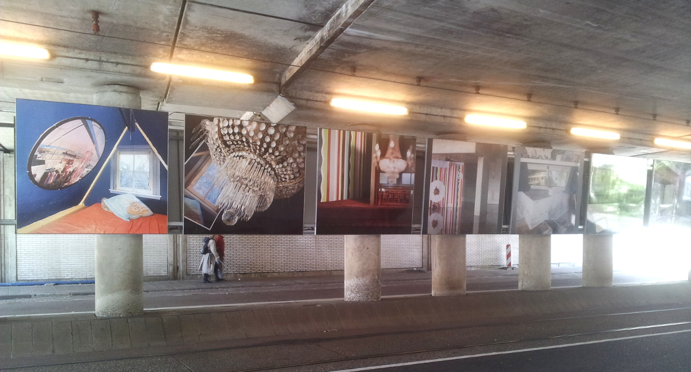
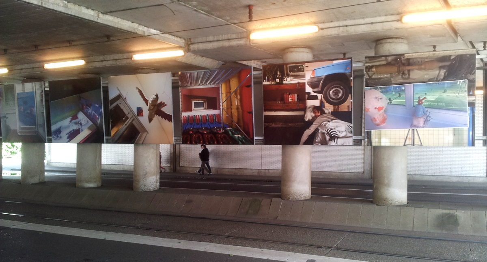
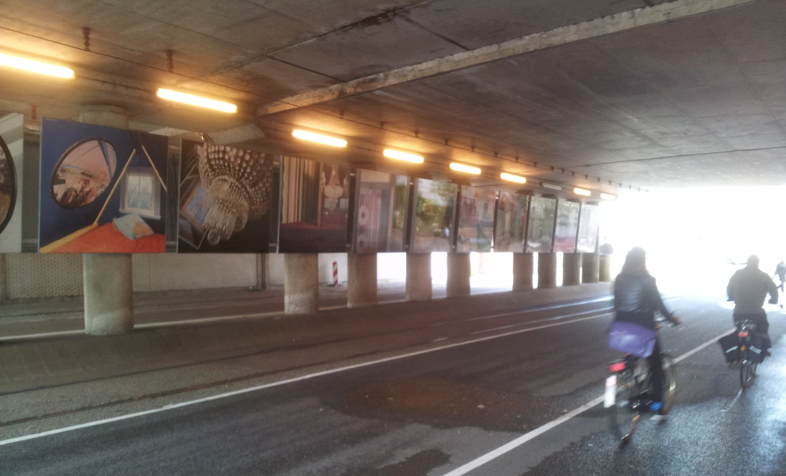

Je ne suis plus à Amsterdam mais quand j'y passe je fais des découvertes qui me semblent familières et nouvelles en même temps. 

**Familières** parce que l'exposition de photos en plein air est une habitude de la ville aux 1300 ponts que j'ai déjà relaté plusieurs fois dans ce blog. **Nouvelle** parce que chaque exposition est nouvelle et offre à découvrir un nouvel univers. 

L'autre nouveauté est aussi l'emplacement de cette exposition, sous le *Spaarndammerspoorbrug*, le pont rail sur lequel passent tous les trains reliant Amsterdam à Haarlem. Le passage sous ce pont, passage obligé entre le Quartier de *Spaarndammerbuurt* et *Westerpark*, est surtout emprunté par les vélos et les voitures. Il y a peu de piétons qui flânent sous ces rails. Idem pour moi, peu de temps pour flâner devant ces grands panneaux cette fois mais juste quelques minutes pour prendre des photos et les partager avec vous.

{.center}

{.center}

En fait chaque photo est un photo montage et la série n'a pas de fil conducteur sauf que les photos se suivent elles sont liées l'une à l'autre par un objet ou une couleur que l'on retrouve sur les deux images mais sous des angles différents. Cela donne une frise un peu (mais alors très peu) comme la presque Metamorphose de [M.C. Escher](/mauritz-cornelis-escher-in-het-paleis-van-den-haag) dont je vous ai parlé il y a quelques années.

{.center}

Comme à chaque expo en plein air, les gens passent et s'en foutent…

