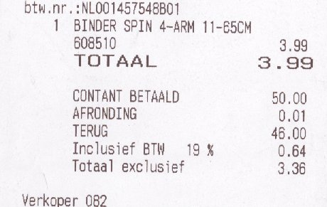
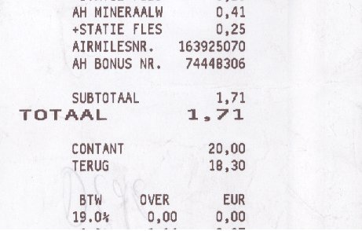
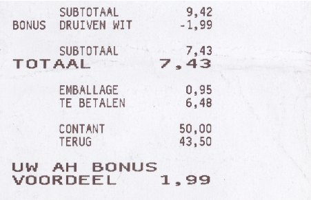

Avant même de venir m'installer aux Pays-Bas, j'aimais y faire mes courses et payer en liquide, dans la même monnaie qu'en France. L'euro est quand même bien pratique quand on vit à cheval entre deux pays. Pas de frais de change, pas de différence de taux ou de petite monnaie inutilisable qui traine au fond des porte-monnaie.

Avant même de venir m'installer aux Pays-Bas, j'ai aussi remarqué que, dans ce pays, les magasins n'aimaient pas les petites pièces. Pour éviter d'avoir des fonds de caisse trop lourds, les caissiers **arrondissent la somme à 5 centimes près** et ne s'embêtent pas avec les toutes petites pièces.

{.center}
*Dans ce magasin, l'arrondi (*afronding*) apparait comme une somme (positive ou négative) complétant le rendu de monnaie.*

### Nouveau mot: Afronding

<!--excerpt-->
Les arrondis respectent les règles aussi utilisées pour la vente de produits au poids. La somme à payer est la somme "ronde" la plus proche de la somme exacte à payer. Parfois le client «perd» deux centimes maximum, parfois, le commerçant les «perd». Dans l'ensemble, les magasins ne gagnent pas d'argent sur les arrondis mais font des économies sur la logistique autour des pièces et des fonds de caisse. La première enseigne a avoir lancé le mouvement est, il me semble, [Albert Hein](http://meinamsterdam.nl/albert-hein-et-compagnie) mais nombre de magasins et boutiques ont suivit le mouvement.

  

{.left}
*Ticket avec arrondis gagnant*

  

  

{.right}
*Ticket avec arrondis perdant*

  

### La disparition des centimes d'euro

Vous imaginez mon désarroi, moi, [collectionnant les pièces en euro](http://meinamsterdam.nl/2006-nouveau-millesime) dans un pays qui ne les fait pas circuler. Au début, je pouvais encore récolter des petites pièces en cuivre dans les magasins qui ne pratiquaient pas encore les arrondis : La poste et les enseignes hard discount ou les prix sont au plus juste. Mais après quelques années même le Aldi du coin pratique les arrondis. Quand aux postes, [elles ont fermé](http://meinamsterdam.nl/la-fin-des-bureaux-de-poste). Il était vraiment temps que le quitte le pays.
