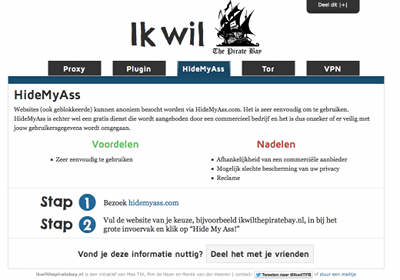

Je vous ai parlé en janvier 2012, du [jugement concernant la censure de The Pirate Bay](http://meinamsterdam.nl/censure-de-l-internet-aux-pays-bas) pour deux fournisseur d'accès (**Ziggo** et **XS4ALL**) à la demande de **BREIN**, l'organisme représentant les ayants (trop de) droits des maisons d'éditions de musique et de cinéma. Les fournisseurs d'accès ont fait appel mais le tribunal ne statuera le 19 septembre 2013. En attendant le jugement est exécutoire et les deux sociétés ont dut s’exécuter donnant quelques heures supplémentaires à leurs ingénieurs pour mettre le blocage en place.

En mai de cette année, un tribunal a ordonné, toujours sur requête de **BREIN** la même chose contre les grands fournisseurs d'accès restant. **UPC**, **KPN**, **T-Mobile** et **TELE2** ont dut s’exécuter aussi en bloquer l'accès à plusieurs adresses pointant vers le site au bateau pirate. Contrairement au jugement précédent, le juge ne donne pas au demandeur le pouvoir de mettre les listes à jour lui même. Les fournisseurs d'accès ont malgré tout fait appel de la décision.

### The Pirate Baywatch

Avec ces nouveaux cas de censure, la situation était suffisamment intéressante pour que des universitaires d'Amsterdam s'y penchent de plus près. Ils ont publié une étude le 22 août dernier pour expliquer l'inefficacité des blocages. L'étude s'appelle [Baywatch: two Approaches to Measure the Effects of Blocking Access to ThePirate Bay](http://www.ivir.nl/publications/poort/Baywatch.pdf) (PDF).

En effectuant deux sondages en mai et décembre 2012, les chercheur on essayé de cerner le comportement des internautes en fonction de leur fournisseur d'accès censuré (pour Ziggo et XS4ALL) et non censuré (pour les autres). Ils ont doublé ces sondages en étudiant les clients (essaims) qui étaient présents dans les fichiers partagés en BIttorrent à destination du public néerlandais et ont regardé de quel fournisseur ils venaient. Les chercheurs ont réalisé que le blocage de *The Pirate Bay* n'avait pas d'influence sur le comportement des internautes, ces derniers ont continué à télécharger des musiques et des films diffusés illégalement. Il a même été constaté une augmentation de cette pratique chez les abonnés de Ziggo et XS4ALL.

### Je veux mon Pirate Bay !

Avec maintenant 6 fournisseurs d'accès qui bloquent le site de référencement de torrent *The Pirate Bay*, un nouveau besoin est né de contourner ces blocages. Un site répond à cette demande en expliquant quels sont les moyens qui s'offrent aux internautes pour le faire. *Ik wil the Pirate Bay*, pour **Je veux the Pirate Bay** ([ikwilthepiratebay.nl](http://www.ikwilthepiratebay.nl)) passent en revue les différents moyens : proxys, systèmes anonymiseurs, réseau Tor et même les VPN. Si vous ne connaissez pas tous ces noms techniques bizarres, le site les passe en revue et pèse le pour et le contre de chacun pour vous. Il ne vous reste plus qu'à faire votre choix.

{.center}

Ces techniques sont légales, elles sont pour certaines utilisées par des entreprises assurer la confidentialité de leurs communication, elles existaient avant le blocage et il était évident que les Néerlandais allaient apprendre à s'en servir. Mais BREIN a préféré obliger les fournisseur d'accès à opérer leur blocages inutiles.

### Tu n'auras pas ton Pirate Bay

En réponse à cette étude, [bruna/stemra](http://meinamsterdam.nl/buma-stemra), la tristement célèbre SACEM néerlandaise, [a affirmé](http://www.totaaltv.nl/nieuws/13690/blokkade-pirate-bay-geen-succes:-brein-wil-meer-blokkades.html) que les visites sur le site bloqué avait baissé de 80% et que ce blocage était une bonne chose parce qu'il allait permettre de bloquer d'autres sites. BREIN aimerait bloquer une douzaine d'autres sites.

### À lire aussi

!### Résumé des épisodes précédents
* [Censure de l'Internet aux Pays-Bas](/censure-de-l-internet-aux-pays-bas)  
* [La neutralité d'Internet à la sauce hollandaise](/La-neutralite-Internet-sauce-hollandaise)  

!### Épilogue
* [The Pirate Bay n'est plus bloqué aux Pays-Bas](/The-Pirate-Bay-n-est-plus-bloque-aux-Pays-Bas)  
---