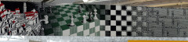
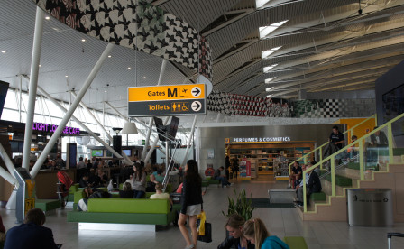

Je vous ai partagé ma visite du musée de *[Mauritz Cornelis Escher in het Paleis van Den Haag](/mauritz-cornelis-escher-in-het-paleis-van-den-haag)* et je vous ai même parlé d'une de ses œuvres les plus connues appelée [Metamorphosis I, II et III](https://www.escherinhetpaleis.nl/story-of-escher/metamorphosis-i-ii-iii/). Je vous disais même que cette œuvre était visible à la poste centrale de la Haye. Ce n'est pas vraiment vrai, la fresque de la poste de la Haye est une copie.

En fait, **c'est la poste de la Haye qui a provoqué la création de Metamorphosis III** l'idée était de rallonger Metamorphosis II (4 mètres de long) de 3 m. Le résultat est un œuvre de 7 mètres sur bois qui est aujourd'hui dans le musée M. C. Escher de la Haye avec les autres métamorphoses. Parmi les nouveaux motifs rajoutés on peut y voir des enveloppes ailées, symbole du courrier qui voyage, hommage certain au commanditaire de l'œuvre. Cette nouvelle composition a ensuite été reproduite en 7 fois plus grand sur toile par l'étudiant en beaux arts **Huug Vooys** sous la supervision du maître Escher lui même. C'est du moins ce qu'affirme [la page du musée qui parle de cette toile](https://www.escherinhetpaleis.nl/escher-today/metamorphosis-iii-revealed-hague-1969/). Elle précise en outre, que la toile a été présentée au public en novembre 1969 et ce dernier a pu l'admirer jusqu'en 2008.

[{.left}](/public/images/photos/2014/Metamorphose-III-1er.jpg) 
[{.left}|/public/images/photos/2014/Metamorphose-III-2eme.jpg] [{.left}|/public/images/photos/2014/Metamorphose-III-3eme.jpg] [{.left}|/public/images/photos/2014/Metamorphose-III-4eme.jpg] [{.left}](/public/images/photos/2014/Metamorphose-III-5eme.jpg)

<!-- HTML -->

<!-- / HTML -->

Quand deux ans plus tard j'annonçais que les bureaux de poste allaient fermer, [à commencer par le mien](/la-fin-des-bureaux-de-poste), je ne me doutais pas que le bureau de poste central de la Haye, celui là même qui était décoré de la longue frise était déjà fermé depuis plus d'un an. Cette fermeture est complètement passée sous mon radar (et sous le votre aussi je suis certain) et ce n'est que bien plus tard que je me suis demandé ce qu'est devenu la toile de 48m de long signée MCE (M. C. Escher) qui décorait jadis ce bureau de poste.

[{.center}|/public/images/photos/2014/frise-Metamorphosis-III-Schiphol.jpg||frise-Metamorphosis-III-Schiphol.jpg]

Ce n'est qu'au hasard de mes déplacements que je me suis retrouvé au pied de cette œuvre dans un hall de l'aéroport de Schiphol. C'est donc près d'Amsterdam qu'elle a échoué alors que l'aéroport de Rotterdam-la Haye était pourtant bien plus près. Il me semble qu'à l'époque c'était le hall G, réservés aux vols bons marché et aux charters mais j'ai constaté que le hall a été renommée **Hall M**. Peut-être est-ce à cause de la frise **Metamorphose**. Quelqu'un a décidé de donner à la porte la première lettre de la frise qui y est exposée. 

[{.center}|/public/images/photos/2014/Schipho-Gates-M-Metamorphosis-III.jpg||Schipho-Gates-M-Metamorphosis-III.jpg]

Ce n'est hélas pas suffisant pour intéresser les voyageurs. Les yeux rivés sur leur billet ou leur téléphone, ils ne lèvent la tête que pour regarder le panneau des départs voir si la porte de leur vol est annoncée. Ce sera la porte M-quelque chose, **M comme Métamorphose**.

<!-- HTML -->

<h4 style="margin:0.5em 0 0 0;">Schiphol</h4>
<ul style="margin:0 0 1em">
<li><a href="/schiphol-l-aeroport-de-la-terreur">Schiphol, l'aéroport de la terreur</a>
<li><a href="/vliegtuigspotters">Les Vliegtuigspotters de Schiphol</a>
<li><a href="/un-voyage-avec-transavia">Un voyage avec Transavia</a> - <a href="/voyage-klm-retour">Voyage retour, voyage KLM</a>
<li><a href="Dernier-Fokker/">Le dernier Fokker des Pays bas</a> - <a href="/pas-hier-pas-en-fokker">Pas hier, pas en Fokker</a>
</ul>

<!-- / HTML -->

<!-- HTML -->

<h4 style="margin:0.4em;">MC Escher</h4>
<ul style="margin:0 0 1em">
<li><a href="/mauritz-cornelis-escher-in-het-paleis-van-den-haag">Mauritz Cornelis Escher in het Paleis van Den Haag</a>
<li><a href="/expo-photos-en-plein-air-7">Expo photos en plein air (7)</a>
<li><a href="/demenager-une-toile-de-48m">Comment déménager une toile de 48m de long</a>

<!-- / HTML -->
---
<!-- post notes:
https://mcescher.com/wp-content/uploads/2019/09/LW446geel2.jpg 
https://en.wikipedia.org/wiki/Metamorphosis_III 
https://vimeo.com/59554543
--->
