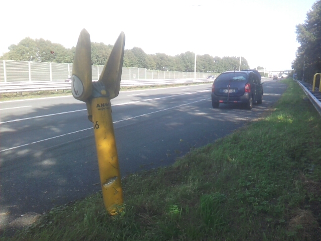
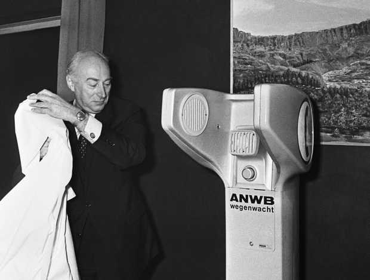
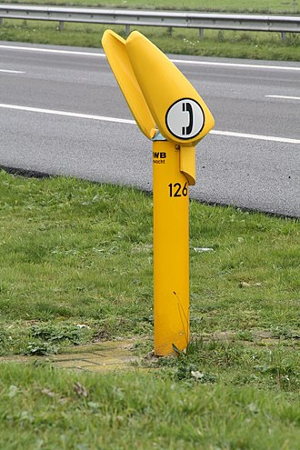

Nombreuses sont les personnes qui m'ont fait remarquer le design biscornu des bornes de secours au bord des routes hollandaises. Alors que dans presque tous les pays elles sont oranges, ici, elles sont jaunes avec des pointes effilées en tête.

{.center}

Pour répondre à vos interrogations, **j'ai décidé de tomber en panne sur l'autoroute**, afin de vous faire profiter de mon expérience avec l´une de ces bornes et de l'assistance qu'elle est sensée apporter.

## Nouveau mot: Praatpaal

À première lecture, le mot *praatpaal* qui qualifie ces sculptures jaunes pourrait se traduire comme poteau (paal : poteau) à parole (praat : parler) mais c'est un contresens. Paal signifie aussi borne[^1], et une bornes ou l'on parle est donc une **borne d'appel**. 

La couleur jaune de ces bornes est ancienne, elle vient de la couleur de l'association royale[^2] des automobilistes néerlandais. plus connue sous le nom d'ANWB. ANWB signifie *Algemene Nederlandse Wegenwacht Bond*, l'association générale néerlandaise d'assistance routière mais aujourd'hui l'association se nomme officiellement *Koninklijke Nederlandse Toeristenbond ANWB* ce qui est un appellation à tiroire qui signifie **Association royale touristique ANWB**. Cette association qui met en retrait le mot assistance de son nom est en fait le gestionnaire des appels de secours en bord de route. Elle a reçu cette délégation du gouvernement dès la mise en place des premières bornes d'appel.

<!-- HTML -->

**AJOUT** : On me signale en commentaire que l'association est née en 1893 et qu'à l'origine c'était une association cycliste donc l'acronyme signifiait. *Algemene Nederlandse Wielrijders Bond* qui veut dire association générale néerlandaise des cyclistes. Le Wegenwacht est arrivé plus tard, quand les automobilistes ont été admis dans l'association.

<!-- / HTML -->

Les deux pointes qui dardent vers le ciel sont en fait des panneaux fait pour arrêter le bruit des voitures et permettre de mieux dialoguer avec son correspondant de l'assistance. Il faut se pencher très près du micro pour que ce soit un petit peu efficace. Les Pays-bas sont le seul pays à avoir pensé que le passage des voitures peuvent être une nuisance pour la personne en demande de secours au bord de la route. Cette solution aux grandes oreilles a été mise en place dès 1970. 

<!-- HTML -->

{.center}

M. Bakker, ministre des transports et des voies navigables des Pays-bas, dévoile au public la nouvelle borne d'appel ANWB en décembre 1970. [cc-by-nc-sa Cor Out](http://www.anp-archief.nl/page/2249049/nl)

<!-- / HTML -->

Le modèle que l'on voit aujourd'hui au bord des routes, avec ces grandes oreilles pointues date de 1994. Il a été dessiné par l’ingénieur C.M. Gerrits.

<!-- HTML -->

[{.center}](https://commons.wikimedia.org/wiki/File:Praatpaal_3.JPG)

La borne d'appel n°126 qui illustre l'article  <a href="https://nl.wikipedia.org/wiki/ANWB">ANWB</a> de Wikipedia est une anagramme de la n°216 que j'ai décidé d'utiliser après être tombé en panne à Terschuur

<!-- / HTML -->

À partir de ces bornes, 193.000 appels ont été passés en 1987 et 39.655 appels en 2012. L'entretien de ces poteaux coute cher[^3] et le gouvernement prévoit de supprimer le service en 2017 ou 2018 présumant que tout le monde dispose d'un téléphone mobile. Le contrat du gouvernement avec ANWB se termine en 2017 et ne devrait pas être renouvelé. Tant pis pour les 30.000 personnes qui comptent encore dessus.

## Nouveau mot: Wegenwacht

Comme indiqué plus haut *wegenwacht* qui signifie littéralement **surveillance des chemins** est le mot néerlandais pour **assistance automobile**. Cette assistance est offerte gratuitement aux membres d'ANWB sur simple appel depuis l'une de ces bornes, au 088 2692 888 ou à l'aide de [l'app dédiée](http://www.anwb.nl/mobiel/wegenwacht). Pour les personnes qui ne sont pas membres comme moi, le déplacement du technicien avec sa dépanneuse coute 150€, somme qu'il faut accepter de payer après avoir exprimé sa détresse au micro du *praatpaal*.

[Être membre de l'ANWB](http://www.anwb.nl/lidmaatschap) coute 15 euros par an. Mais attention, cette adhésion ne couvre pas les pannes (* géén pechhulp*), pour profiter de l'assistance, il vous faudra débourser 55 euros par an. Si vous vivez aux Pays-Bas c'est un moyen sûr de ne pas dépenser au moins trois fois plus en cas d'incident. Pour les autres, l'ANWB prend aussi en charge les personnes couvertes par une assistance partenaire d'un autre pays européen et même les nationaux (Néerlandais) qui vivent à l'étranger à condition qu'ils soient membres.

Pour les distraits comme moi qui n'ont pas de couverture l'assistance ponctuelle ponctionne 150 euros mais le service est le même, la personne arrive, remorque la voiture hors de l'autoroute où un diagnostic est dressé par un collègue du dépanneur. Si une réparation est possible sur place, elle est à nouveau proposée avec, je suppose, son prix, si elle n'est pas possible sur place, le rôle de l'assistance pour les non membres s'arrête là. Le dépanneur et son collègue sont donc partis en me souhaitant bonne chance.

<!-- HTML -->

**AJOUT** : Si vous êtes curieux et voulez connaitre la suite de mes déboires, lisez [leur récit en commentaire ci-dessous](#c2002).

<!-- / HTML -->

#### À lire aussi

* [Acheter une voiture aux Pays-Bas](/acheter-une-voiture-aux-pays-bas)

* [Se garer à Amsterdam, ça coûte cher](/a-amsterdam-se-garer-coute-cher)

* [Les nouvelles plaques d'immatriculation](/les-nouvelles-plaques-d-immatriculation)

---
[^1]: Comme les bornes frontalières que je vous ai montré [au bord de la Belgique](/au-bord-de-la-belgique) et qui sont allongées comme des poteaux
[^2]: L'association utilise son [prédicat royal/koninklijk-le-predicat-royal|].
[^3]: Il faut changer les batteries de ces 3.323 bornes tous les cinq ans et ça coute dans les 300.000 euros et il y a aussi un contrat avec [KPN](/les-bonnes-blagues-de-kpn/) pour les communications.
<!-- post notes:
http://wiki.roncalli.nu/images/2/20/Anwb-auto.jpg 

http://www.wegenwiki.nl/Praatpaal 
musique : http://www.peterkoelewijn.nl/discografie/single/singles60/singles60_027.html 

Le premier poteau pour parler dévoilé par le ministre 
http://www.anp-archief.nl/page/2249049/nl
http://www.anp-archief.nl/page/2146610/nl 
Chatroulette
http://pickle-factory.pr.co/5421-chatroulette-op-een-anwb-praatpaal 
 
De praatpaal is nog een blijvertje
http://www.autoblog.nl/nieuws/de-dagen-van-de-praatpaal-zijn-geteld-59517
De dagen van de praatpaal zijn geteld
http://www.autoblog.nl/nieuws/de-dagen-van-de-praatpaal-zijn-geteld-59517 
http://www.wijzigjepolis.nl/2012/02/anwb-10-voordelen-waarom-jij-lid-zou-moeten-worden/
--->
