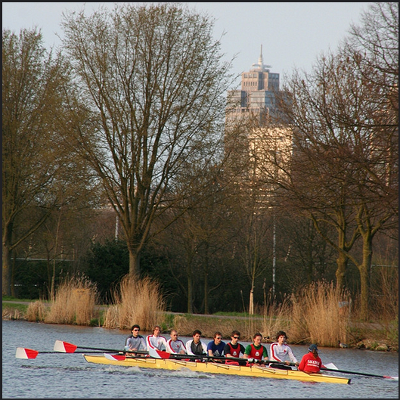
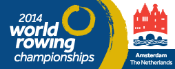

Pour ce qui est du sport, je vous ai déjà parlé en long en large et en travers du football, le principal sport national et un petit peu de hockey, un autre sport très en vue aux Pays-Bas. Je vous ai notamment parlé de filles qui sont plusieurs fois de suite championnes d'Europe (comme en [2009 à Amsterdam](/elles-ont-encore-gagne)), du monde (comme [en 2006](/oranje-wereldkampioen), année du début de ce blog) et olympiques.

## Nouveau mot : Roeien

Un autre sport semble être en vue à Amsterdam c'est **l'aviron** (*roeien*). Un pays avec autant de canaux se prête bien évidement à la pratique des sports d'eau. Il n'est pas rare lors de mes promenades à vélo **le long de la rivière Amstel**, de croiser des rameurs en plein effort comme le montre cette photo :

[{.center}](https://www.flickr.com/photos/13274211@N00/3571489686/)

Les compétitions d'aviron sont nées en Grande Bretagne et ce pays est encore aujourd'hui à la pointe de ce sport, grand pourvoyeur de champions. Mais les Pays-Bas se sont mis très tôt à ce sport et comptent aussi leur lot de champions. Amsterdam a déjà hébergé la coupe du monde d'aviron en 1921 comme le témoigne cette vidéo archivée sur Wikipedia :

<!-- HTML -->

<video width="400px" controls style="margin:0 auto;">
  <source src="https://upload.wikimedia.org/wikipedia/commons/transcoded/e/e7/Europese_kampioenschappen_roeien_op_de_Amstel-European_championships_rowing_on_the_Amstel-507680.ogv/Europese_kampioenschappen_roeien_op_de_Amstel-European_championships_rowing_on_the_Amstel-507680.ogv.240p.vp9.webm" type="video/webm">
  <source src="https://upload.wikimedia.org/wikipedia/commons/transcoded/e/e7/Europese_kampioenschappen_roeien_op_de_Amstel-European_championships_rowing_on_the_Amstel-507680.ogv/Europese_kampioenschappen_roeien_op_de_Amstel-European_championships_rowing_on_the_Amstel-507680.ogv.360p.webm" type="video/webm">
</video>

<!-- / HTML -->

## Championnats du monde 2014
{.left}
Bien équipée pour recevoir les visiteurs du monde entier, **Amsterdam pouvait donc être l'hôte de cette coupe du monde d'aviron 2014** ayant eu lien un peu plus tôt en ce mois de septembre. Comme [pour le hockey](/elles-ont-encore-gagne), les compétitions ont lieu loin du centre ville dans le bois d'Amsterdam (*Amsterdamse bos*). La piste de compétition s'appelle *Bosbaan*, (la piste du bois), **un bassin aménagé pour l'aviron en 1934** possède une vigie[^1] et de larges étendues sur les cotés pour l'installation de tribunes.

**En temps normal, Bosbaan est moins utilisé que la rivière Amstel** mais ses bas-cotés sont une des routes pour traverser le bois d'Amsterdam à vélo. Pendant presque deux semaines c'était le point de ralliement de sportifs et supporters venus du monde entier.

### Les résultats
En terme de résultats, les néerlandais n'ont pas brillé devant leur public[^2]. **Une seule médaille d'or remportée par le quadruple skull féminin local** avec Mirte Kraaijkamp, Lisa Wörner, Maaike Head et lse Paulis au bout des rames. Au [tableau des médailles](http://www.worldrowing.com/events/2014-world-rowing-championships/medals), les nations de l'aviron (Australie, Grande Bretagne et surtout Nouvelle Zélande) pointent encore aux premières places. 

Malgré le succès de ce sport à Amsterdam, l'aviron offre moins de victoires à son pays que le foot ou le hockey[^3]. Qu'à cela ne tienne, une compétition sportive est un grand moment d'échanges et de dépassements en bonne entente entre nations. Pour preuve un tweet image qui n'a pas assez fait parler de lui :

<!-- HTML -->

<blockquote class="twitter-tweet" lang="en">
Peaceful rowing against each other is something beautiful. <a href="https://twitter.com/hashtag/WRChamps?src=hash">#WRChamps</a> <a href="https://twitter.com/hashtag/Ukraine?src=hash">#Ukraine</a> <a href="https://twitter.com/hashtag/Russia?src=hash">#Russia</a> via <a href="https://twitter.com/ruderfieber">@ruderfieber</a> <a href="http://t.co/VN6ZEoNPoP">pic.twitter.com/VN6ZEoNPoP</a>
&mdash; rudern.de (@rudern) <a href="https://twitter.com/rudern/status/506800872673001472">September 2, 2014</a></blockquote>

<!-- / HTML -->

---
[^1]: avec un bar restaurant où il faut bon faire une pause en terrasse
[^2]: Le 30 août, [le site de la compétition titrait](http://www.amsterdamrowing.com/nl/news/121/nederlandse-boten-buiten-de-medailles.html) que les rameurs hollandais ont fait beaucoup de finales mais sont resté à coté du podium.
[^3]: Malgré la sonorité de leur nom de famille, les célèbres *jumeaux Winklevoss* ne sont pas Hollandais mais Américains, autre pays habitué à avoir des podiums.