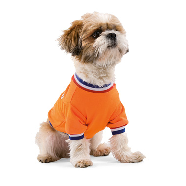
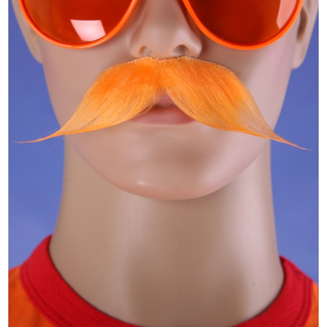
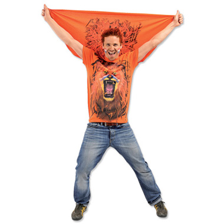
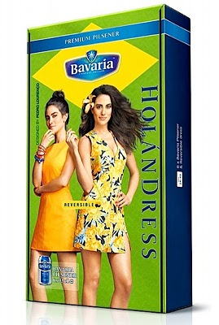

{.center}

J'ai [déjà souligné](http://meinamsterdam.nl/decorations-oranges-choisies) **la folie orange** qui s’empare de toute la Hollande (*Hup hup Holland*) quand vient le moment des grandes compétitions de foot[^1]. J'ai donc fait appel à twitter pour avoir les meilleurs plans orange de l'année mais depuis que la couronne s'est masculinisé, il semble que la testostérone soit un peu retombée. C'est surement pour cela que l'on m'a suggéré [la moustache orange](https://twitter.com/Do_56/status/476670606063448064) (*De oranje snor*).

<!--excerpt-->

{.center}

Cette dernière est vendue sur un site de fournitures festives aux cotés d'un [masque de Guy Fawkes couleur citrouille](http://www.oranjeshopper.nl/product/10033986/oranje-v-for-vendetta-maskers-oranjeshopper.html).

Sinon il semble que nous avons fait le tour avec les trucs oranges puisqu'une visite sur ces sites de fête nous montre des balais à chiottes de des cure-dents couleur carotte ce qui ne laisse pas beaucoup de place pour des nouveautés. Les magasins **blokker** qui sont une valeur sure en gadgets de ce genre capitalisent sur leur trouvaille des années passées avec [le t-shirt qui rugit](http://meinamsterdam.nl/qu-allons-nous-faire-de-nos-welpies). Cette année la marque orange (*Blokker* est écrit en orange sur les boutiques) présente le t-shirt avec cape-crinière mais qui ne rugit pas.

{.center}

Tous les deux ans (*EK* et *WK*), les brasseurs néerlandais sortent un nouveau gadget orange pour célébrer les soirées que les supporters passent devant une télé avec un verre de bière à la main. Évidement ils soulignent [le coté culturel](http://meinamsterdam.nl/coupe-du-monde-parentese-culturelle) de l’événement en nous faisant découvrir le pays hôte. Cette année Heineken joue sur le thème de la samba. La marque amstelodamoise n'a pas osé le string qui ne serait pas très porté dans les stades et propose donc un [sambashirt](http://www.heineken.com/nl/heineken-sambashirt.aspx). On les a connu plus imaginatifs.

Chez Bavaria, on ne change pas un produit qui marche. Après avoir cassé la baraque et énervé la FIFA en sortant la *Dutch Dress* [en 2010](http://meinamsterdam.nl/surenchere-de-orange). la marque de bière renouvelle l'opération avec une robe au goût brésilien d'un coté et orangé de l'autre : la _Holandress** présentée par l'actrice brésilenne **Luisa Moraes__.

{.center}

Et la pub télé tout en finesse :

<!-- HTML -->

<iframe src="//player.vimeo.com/video/96948295" width="500" height="281" frameborder="0" webkitallowfullscreen mozallowfullscreen allowfullscreen></iframe>

<!-- / HTML -->

Ce n'est pas sans rappeler l’opération Heineken de 2006, avec leur chapeau allemand qui devenait un porte-voix orange, délicieusement promu par Marco et Marko, [les faux supporters de votre équipe](http://meinamsterdam.nl/la-hollande-pour-la-france) qui avait déjà fait crépiter des électrons à l'époque...

### Voir aussi :
* [Tous derrière la balle](/tous-derriere-la-balle)
* [Marie Heineken est fan de l'Olympique de Marseille](/marie-heineken-est-fan-de-l-om)

---
[^1]: voir rappels ci-dessous
<!-- post notes:
http://meinamsterdam.nl/qu-allons-nous-faire-de-nos-wuppies 
http://blog.han.nl/minorpr/wuppie-beesie-wat-dit-jaar/ <-- à rajouter dans les wupies 
http://www.bavaria.com/holandress/ 
http://meinamsterdam.nl/football-tous-en-orange 
http://meinamsterdam.nl/surenchere-de-orange 
 
http://www.bavaria.com/holandress/
http://greetingsfromholland.blogspot.com.br/2014/06/holandress.html
--->
