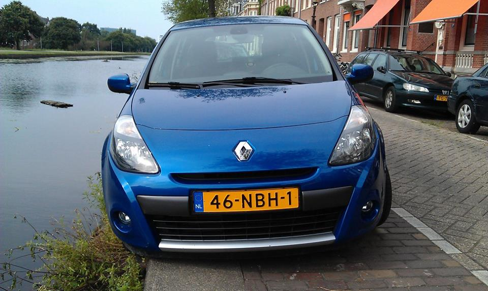
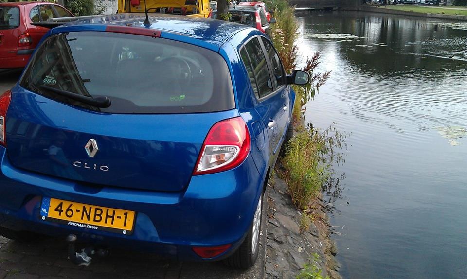
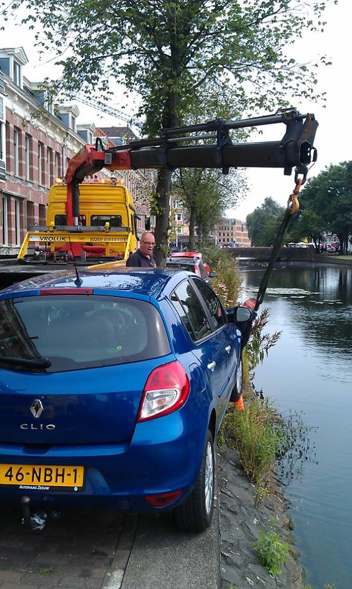

**Cela fait longtemps que je n'avait pas parlé de [la difficulté de garer sa voiture à Amsterdam](/a-amsterdam-se-garer-coute-cher)**. Les places de parking sont rares et chères et même les résidents doivent attendre parfois plusieurs années avant d'obtenir un permis de stationnement résidentiel. 

Une fois la place trouvée, il faut faire face à une nouvelle difficulté : celle de la remplir sans dépasser. En effet, les places le long des canaux sont très étroites et comme elles sont le long des canaux, sortir de l'emplacement indiqué peut  être fatal pour votre véhicule. 

{.center}

C'est ce qui est arrivé l'été dernier à **Niels Huijbregts**[^1] dans son quartier d'Amsterdam Oost.

<!--excerpt-->
{.center}

Heureusement, une dépanneuse est arrivée pour le sortir de ce mauvais pas.

{.center}

{.center}

Niels m'a même indiqué que l'assurance avait pris en charge le déplacement de la dépanneuse. Tout est donc bien qui fini bien pour lui qui ne garde de cette aventure que le souvenir d'une grosse frayeur. Ce n'est hélas pas le cas de tout le monde et il arrive que des autos tombent complètement dans les canaux. Plouf !

## Combien de voitures se noient ?

Sur les bateaux de touristes qui circulent sur les canaux du centre ville, une jolie voix explique en plusieurs langues que la mairie a installé des rails le long des principaux canaux dans les années 60 pour éviter ce genre d'accident mais que malgré cela, une moyenne d'une auto par semaine se retrouverait noyée dans un canal.

**52 véhicules par an dans l'eau boueuse des canaux ?** Un chiffre bien alarmant pour touristes mais qu'en est-il en réalité ? À Amsterdam, une équipe de plongeurs est employée par la mairie pour venir au secours de personnes qui tombent dans les canaux et aussi des biens comme les voitures qui y tombent. Ils déclarent en moyenne **repêcher 100 personnes et 35 voitures par an**. Ça fait encore beaucoup. Niels n'entre pas dans cette statistique, il l'a échappé belle !

### À lire aussi :

[Se garer à Amsterdam, ça coûte cher](/a-amsterdam-se-garer-coute-cher)

[Le parking résidentiel](/la-parking-residentiel)

[Parking pour ceux qui viennent nous voir en voiture](/pour-ceux-qui-viennent-nous-voir-en-voiture)

[Le dimanche sans voiture](http://meinamsterdam.nl/le-pijp-en-fete)

---
[^1]: Le porte parole de mon fournisseur d'accès Internet dont j'ai déjà diffusé la photo [à l'occasion d'un célèbre procès anti Pirate Bay](/The-Pirate-Bay-n-est-plus-bloque-aux-Pays-Bas). Il m'autorise à publier les photos de ses déboires.

<!-- post notes:
 [ses déboires](https://www.facebook.com/njahuijbregts/posts/623447001011098?stream_ref=10)

https://www.facebook.com/njahuijbregts/posts/623447001011098?stream_ref=10
https://www.facebook.com/njahuijbregts/posts/623475997674865?stream_ref=10 
http://www.rtvnh.nl/nieuws/77880/Fiat+500+de+gracht+ingeduwd
http://www.amsterdamcentraal.nl/archief/2014/08/09/dwars-parkeren-op-de-brouwersgracht?weblogmessage=Je+reactie+is+opgeslagen.#message 
http://www.dutchamsterdam.nl/2290-how-many-bicycles-and-cars-end-up-in-amsterdams-canals
--->
