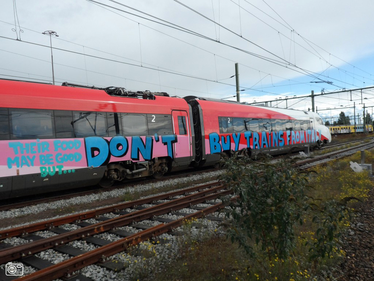

C'est l'épilogue d'un fiasco qui remonte à plusieurs années. Le train à grande vitesse aux Pays-Bas n'a décidément pas bonne fortune. Après [les déboires du Thalys](/le-thalys-a-moins-grande-vitesse), la faillite du Fyra, le service à grande vitesse reliant Amsterdam à Bruxelles. Les ennuis techniques et les retards à répétition ont mis fin à la courte vie de ces trains au bec de canard. La SNCB vient de remettre en service la ligne « Benelux » qui reliait Bruxelles à Amsterdam en desservant bien plus de gares. Au revoir Fyra.

Lors du lancement de Fyra en 2009, les problèmes de la HSL (la nouvelle ligne à grande vitesse entre Amsterdam et Anvers) n'étais pas encore vraiment réglés et les problemes du Thalys en sont la preuve. Mais la Hi Speed alliance n'en a cure parce que la nouvelle ligne Fyra n'est pas encore prète. Pour cause, les locomotives à grande vitesse V250 qui devraient être livrées par le constructeur italien Ansaldo-Breda ne sont pas encore arrivées, elles souffrent de problèmes techniques qui vont mettre des années à être réglés (ou pas). Qu'à cela ne tienne le train Fyra en fait, une rame NS intercity repeinte, va commencer à circuler entre Amsterdam et Rotterdam avec un gain de temps de quelques minutes équivalant aux stations ou l'arrêt n'est plus marqué[^1]En fait personne ne se demande vraiment, on sait que [la SNCB a été poussée par les politiques](https://www.lalibre.be/belgique/2013/01/21/fyra-les-problemes-sont-aussi-la-consequence-de-choix-politiques-SPETUUI3D5FI5ARAPRG3JWYNRE/).$$.

En janvier 2013 le temps a eu raison des nouvelles locomotives italiennes, la neige transformée en glace a endommagé le bas de caisse des locomotives et trois d'entre elles (sur sept) doivent être mises à l'arrêt. Un bout de tôle d'une locomotive, retrouvée sur les voies le 18 janvier incite l'agence belge de sécurité SSCIF de suspendre les liaisons jusqu'à nouvel ordre. Le trains Fyra ne circulent plus et les services de remplacement ne sont pas encore en place. Il faut changer trois fois pour relier les deux capitales # Il faudra attendre le 18 février pour que les trains Intercity (qu'on appelait Benelux) soient remis en service. Difficile aveu d'échec.

Les compagnies NS et SNCB en ont gros contre Ansaldo-Breda et leur matériel pas adapté. La SNCB a moins perdu que la NS dans l'histoire parce qu'elle n'avait pas reçu les 3 rames qu'elle avait commandé. Elle a donc refusé de réceptionner ses rames. Les Néerlandais ont par contre des rames inutilisables sur le dos qui rouillent dans le dépot de Watergraafsmeer. L'une d'elle a servit de support à un grafitti bien à propos.

{.center}
> N'achetez pas vos trains en Italie…

Maintenant, les NS et Ansaldobreda ont annoncé avoir [trouvé un accord](https://www.lesoir.be/art/496330/article/economie/2014-03-17/fyra-retournent-en-italie). Les rames mises au rebus il y a un presque un an seront renvoyés en Italie ou ils rejoindrons les Pendolini de Frecciargento pour Trenitalia (sûrement dans une région avec moins de neige).

Avant de repartir les Fyra ont laissé une trace de leur passage aux Pays-Bas et je peux vous recommander la page du [trainspotter Nico Spilt](https://www.nicospilt.com/index_fyra.htm) qui a vu passer pas mal de Fyra avant que le nom disparaisse.
---
[^1]: J'éxagère un petit peu. Le Fyra roule à 160km/h et le voyage dure 40 min au lieu de plus d'une heure auparavant (mais en Passant par Haarlem, Leyde, La Haye et Delft…). La motrice de ce train de légende est une TRAXX qui n'est pas une locomotive grande vitesse mais plutôt une star des lignes de fret.

{.center}
> Motrice Bombardier TRAXX en service avant le lancement du Fyra vers Bruxelles cc-bt [Bart](https://commons.wikimedia.org/wiki/File:186_113_LLT.jpg)

Quand les véritables rames Ansaldo-Breda sont enfin livrées à la NS, trois ans ont passé. La ligne grande vitesse Amsterdam Bruxelles peut être lancée en grande pompe en remplacement du train classique « Benelux ». Le départ a lieu le 9 décembre 2012. Le trajet est réduit de 3 à 2 heures grâce à la grande vitesse mais aussi aux stations qui ne figurent plus sur le trajets comme Roosendaal ou Malines. Enfin ce gain de temps est de presque une heure sur le papier mais dans les faits les retards sont presque systématiques.

{.center}
> Un Fyra remorqué vers Sloterdijk cc-by [Husky](https://commons.wikimedia.org/wiki/File:Fyra-v250-towed-away-2014-05-18.jpg)

Au cours du mois de décembre 2012, il y a 10 départs prévus par jour avec de nombreux voyageurs content de payer moins cher que le Thalys. Mais [les problèmes vont s'accumuler](https://www.lalibre.be/belgique/2013/01/22/les-raisons-du-fiasco-du-tgv-low-cost-IDAEDU3VPVAT7MABW4VUSUYFDU/) et peu de voyageurs seront satisfaits de leur voyage. Les commerciaux de **HiSpeed** expliquent que ce nouveau train, le premier construit par **Ansaldo-Breda** essuie quelques erreurs de jeunesse. Le constructeur accuse le mauvais temps et **la neige** qui a le culot de tomber en décembre et l'exploitant explique aussi que l'infrastructure de la ligne à grande vitesse **HSL Zuid** est loin d'être parfaite avec un système de sécurité peu fiable qui oblige les rames à s'arrêter trop souvent en rase campagne (mais ça on le sait déjà si on prend le Thalys). Bref tout le monde se renvoie la balle même au sein de l'alliance HiSpeed ou la SNCB (déjà partenaire de Thalys) se demande ce qui l'a bien poussé à s'allier avec NS dans ce projet
<!-- post notes:
2014-03-17 
https://archive.md/zcAty rapport sur la fiabilité de la loco 
https://commons.wikimedia.org/wiki/File:Fyra-V250-Den_Haag.jpg 
https://fr.wikipedia.org/wiki/Fyra 
http://www.rtbf.be/info/belgique/detail_fyra-les-pays-bas-decouvrent-une-collaboration-catastrophique-avec-la-belgique?id=8983378 
https://geheugenvanoost.amsterdam/page/50936/2477-graffiti-opschrift-op-fyra 
http://www.nicospilt.com/index_fyra.htm 
https://www.globalairrail.com/news/entry/fyra-high-speed-trains-for-amsterdam-airport-rail-link
https://www.globalairrail.com/news/entry/fyra-high-speed-trains-for-amsterdam-airport-rail-link 

https://www.flickr.com/search/?text=fyra&license=2%2C3%2C4%2C5%2C6%2C9 
https://commons.wikimedia.org/wiki/File:IMG_3251_FYRA-Rotterdam_C.JPG
--->
