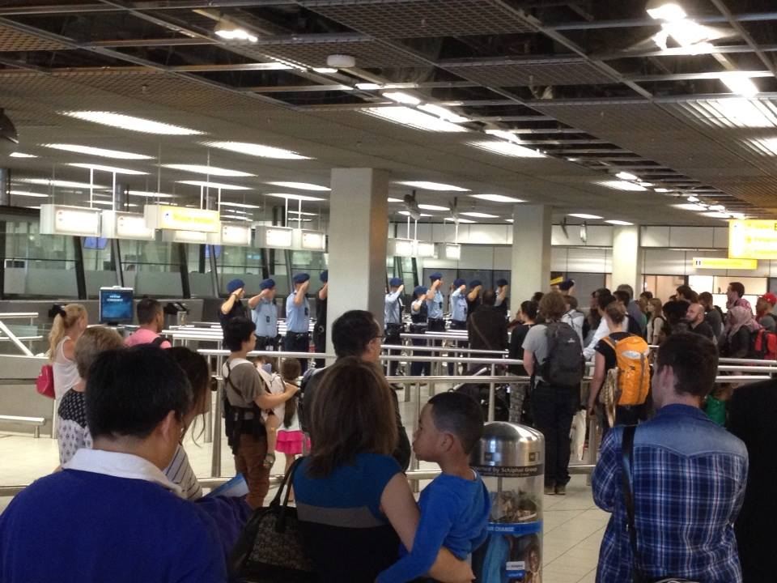

{.center}
*Minute de silence à Schiphol par James*

En illustration de ce post, deux photos de copains, prises au moment de la minute de silence observées dans le pays à 16 heures, heure supposée de l'arrivée à Eindhoven des corps des victimes la [catastrophe du vol MH17](http://fr.wikipedia.org/wiki/Vol_17_Malaysia_Airlines) survenu le 17 juillet.

### Nouveau mot : *Dag van de nationale rouw*

**Jour de deuil national**. C'était ce mercredi. Un pays entier est en deuil suite au décès de 193 de ses ressortissants lors de cet accident. Je tenais à associer *meinamsterdam* à ce deuil, en hommage aux victimes de la connerie humaine.

{.center}
*minute de silence sur le Dam par Menno*
