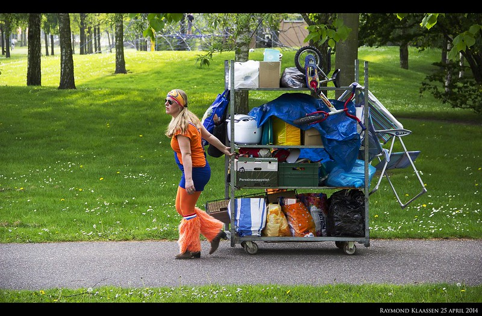

Aujourd'hui, c'est le premier *Koningsdag*, la **fête du roi**. Comme au [début de ce blog](/tag/koninginnedag/), la journée de fête a été avancée parce que l'anniversaire du roi tombait un dimanche. Au lieu d'être le 27 avril (date officielle) cette année la fête du roi a lieu le 26 avril. Dimanche, c'est repos.

[{.center}](https://www.flickr.com/photos/raymondklaassen/14028361783/in/pool-1-2-3nederland/){.center}

<!--excerpt-->

La reine est un roi, à part cela rien de nouveau sous le soleil d'avril. 

Il y a toujours une [parade sur les canaux](/pas-de-fete-du-travail/) et les gens se vêtent de [orange farfelu](/preparatifs-oranges/), boivent beaucoup et tentent de vendre leurs vieux trucs. Le *vrijmarkt* (**marché libre**) est toujours en vigueur et il est toujours de bon ton d'y aller en orange et surtout de [réserver sa place à l'avance](/nouveau-mot-bezet/).

<!-- post notes:
https://www.pinterest.com/ellekebelleke/koninginnedag-koningsdag/
--->
