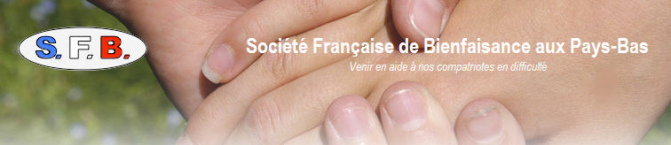

Avec les élections des conseillers consulaires qui ont lieu cette année, de nombreux français découvrent l'action des pouvoirs publics français à l'attention des compatriotes en difficulté. En effet, les consulats français dans le monde ont une cellule d'aide aux français en difficulté. Il n'y a pas toujours d'assistante sociale en poste mais une aide est apportée à ceux qui en ont le plus besoin.

Aux Pays-Bas, c'est particulier puisque depuis le 18 mai 1883[^1], une association[^2] vient en aide des français les plus démunis vivants aux Pays-Bas. Le consulat de France à Amsterdam reçoit les demandes d'aide sociale comme partout ailleurs dans le monde mais il s'appuie sur cette association pour assurer son action. 

[{.center}](http://sfb-paysbas.nl/)

Les liens entre les institutions françaises et l'association sont ténues puisque l'Ambassadeur de France à la Haye et le Consul Général de France à Amsterdam sont membres statutaires du comité d'honneur de l'association. Il n'en reste pas moins que ce sont sont les bénévoles de l'association qui mènent ces actions sociales et que cette dernière est réalisée grâce à la cotisation des membres et à des dons privés.

## Un anniversaire 

Voilà 130 ans que la **Société Française de Bienfaisance aux Pays-Bas** (SFB Pays-Bas) exerce son activité. et cela valait bien une fête d'anniversaire. Comme il n'est pas bien vu pour une société de bienfaisance de claquer du fric, l'anniversaire a pris la forme d'une exposition **Les sentiers de l'art 2013** avec la présence de deux mosaïques réalisées par [Françoise Millo](http://mosaiquementmillof.wordpress.com/solidarite-remerciements-un-autre-rendez-vous/) membres de l'association et le sculpteur  Jean-Luc E. MARCILLAUD qui a mis en vente deux sculptures au profit de la SFB Pays-Bas.

## Une année difficile

Cette année des 130 ans n'a pas été de tout repos pour l'association. Sa présidente, **Mme Chantal Ostwinkel-Krasnapolsky** l'a expliqué lors d'une interview. **2013 a vu doubler le nombre de demande d'aides**. L'association a du faire face à un nombre croissant de demandes, montrant que la crise touche encore les Pays-Bas. Les ressortissants français établis dans un autre pays de l'Union Européenne ont normalement accès à l'aide sociale locale mais l’administration locale se montre de moins en moins à l'écoute des problèmes sociaux des étrangers. La SFB essaye donc d'aider à finaliser des dossiers ou vient en aide directement selon les cas.

## Un nouveau statut

En reconnaissance des actions menées depuis plus d'un siècle par la SFB Pays-Bas, l'association a été reconnu d'utilité publique en novembre 2013. Cela lui donnera encore plus de crédit auprès des autorités locales comme auprès des donateurs. On ne peut pas réellement leur souhaiter de nombreux nouveaux dossier mais juste bon courage dans leurs actions de 2014 et au delà.

---
[^1]: Selon [les status](http://sfb-paysbas.nl/statuts-association/)
[^2]: Les associations françaises aux Pays-Bas sont souvent appelées **fondations** parce que la structure utilisée est souvent celle d'une *stichting* qui signifie fondation en néerlandais. **C'est un faux ami**, en français, une fondation est crée sur la base d'un leg ou d'une donation. S'il s’agit d'un groupement de personnes autour d'un même but, on doit dire **association**.
<!-- post notes:
http://www.un-monde-en-partage.com/?p=3201 
http://www.cafe-francophone.com/pour-feter-les-130-ans-de-la-societe-francaise-de-bienfaisance-aux-pays-bas-la-residence-de-france-a-la-haye-ouvrira-exceptionnellement-ses-portes-pour-les-sentiers-de-lart-2013/
--->
