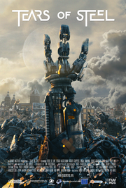

{.left} L'autre jour je suis allé au cinéma, voir une projection de films libres. Contrairement à ce qu'il se passe à la télé, les films libres sont des films qu'on a le droit de voir dans tous les pays et qu'on a le droit de télécharger et de téléverser à loisir parce que [la licence le prermet](http://mango.blender.org/about/). Il devrait y avoir plus de films de ce genre parce que c'est quand même pratique de pouvoir voir et partager ce qu'on veut où on veut.

L'un de ces films se passe à Amsterdam, c'est **Tears of steel**, de [Ian Hubert](http://www.imdb.com/name/nm1937843/). Dans ce monde futuriste, les robots dominent la ville et des humains résistants sont réfugiés dans la tour de *Oude kerk*. On y voit les magnifiques orgues de cette église, les maisons typiques au bord des canaux et aussi un pont piéton qui enjambe *Oudezijds Voorburgwal* (ou bien *Oudezijds Achterburgwal*). Ce pont est au cœur de l'histoire romantique à l'origine de la trame de ce film. Mais je ne préfère pas vous dévoiler l'intrigue alors que vous pouvez regarder ce film directement sur ce blog[^1].

<!-- HTML -->

<iframe src="//player.vimeo.com/video/60884787" width="500" height="281" webkitallowfullscreen mozallowfullscreen allowfullscreen></iframe>

<!-- / HTML -->

J'ai beaucoup aimé cette mise en scène de la ville d'Amsterdam dans un récit de science fiction. La ville devient un des personnage de l'histoire parce qu'elle nous est familière, une peu comme dans [SINT](/sinterklaas-sint) ou *Amsterdamned*.

Ce film a été réalisé apr une équipe talentueuse et financé par **la fondation Blender**[^2] (Elle aussi basée à Amsterdam). Cette fondation finance de jeunes réalisateurs qui font des films utilisant le logiciel **Blender**, un logiciel libre de modélisation 3D utilisé par de nombreux studios à travers le monde. 

## Le prochain film

Je profite donc de cet article pour vous présenter cette fondation ainsi que son dernier projet : [Gooseberry](https://cloud.blender.org/gooseberry/) par le réalisateur français **Mathieu Auvray**. Gooseberry a encore besoin de votre aide pour boucler son financement. Vous pouvez le faire directement en offrant votre aide dans le cadre du croudfounding ou d'achat d'espaces de sockage sur [la page du projet](https://cloud.blender.org/gooseberry/). Amsterdam ne devrait pas jouer dans ce film mais ça promet d'être bien quand même.

---
[^1]: la licence me permet de le diffuser
[^2]: Et peut-être aussi par du placement produit « Mango »
<!-- post notes:
<iframe width="640" height="360" src="//www.youtube.com/embed/R6MlUcmOul8" frameborder="0" allowfullscreen></iframe>
--->
