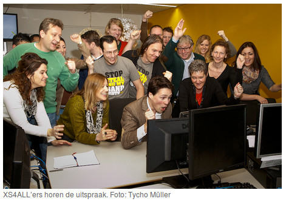

C'est par un **Victoire pour l'Internet libre !** (*Overwinning voor het vrije internet!*) que le fournisseur d'accès XS4ALL [a annoncé](https://blog.xs4all.nl/2014/01/28/internetblokkade-the-pirate-bay-opgeheven/) le verdict rendu aujourd'hui par le tribunal de la Haye sur l'affaire qui opposait **Ziggo** et **XS4ALL** à **BREIN** (le lobbie local des maisons de disque) sur le blocage du célèbre site de torrent **The Pirate Bay**. La cour a rendu son verdict aujourd'hui et les deux fournisseurs d'accès n'ont plus à en bloquer l'accès à leurs abonnés.

{.center}

Dans [le verdict|https://blog.xs4all.nl/wp-content/uploads/2014/01/Arrest-Hof-Den-Haag-20140128.pdf||verdict de l'appel en PDF] que le fournisseur d'accès a publié sur son blog, il est indiqué que le blocage en question est disproportionné (*onevenredig*), nuisible (*nadelige*) et inefficaces (*niet-effectieve*). Une étude dont j'avais parlé [dans un post précédent](/Pirate-Bay-pas-vraiment-bloque-aux-Pays-Bas) avait été présentée à l'audience. Le demandeur, avait contesté cette étude universitaire en avançant des mesures réalisées par Comscore et Alexa, des mesures qui sont réputées inexactes.

Un autre argument de la fondation de défense des maisons de disques, était que ces blocages n'étaient pas difficile à mettre en oeuvre. Il est vrai qu'il juste mobilisé plusieurs ingénieurs pendant des semaines. Ces coûts ont été supportés par les fournisseurs d'accès et le tribunal a relevé que ce n'était pas à eux de payer pour les infractions au droit d'auteur commises par leurs clients. En outre **la fondation BREIN a été condamnée à verser 326.000 euros de remboursement de frais de justice**.

**Niels Huijbregts**, le porte parole d'XS4ALL [a maintenant indiqué](https://blog.xs4all.nl/2014/01/28/internetblokkade-the-pirate-bay-opgeheven/) que sa compagnie travaillait à la levée du blocus. Ce dernier étant réalisé en utilisant le DNS, il prendra un certain temps à être effectif le temps que les nouvelles informations sur les noms de domaines incriminés se propagent sur Internet. Il a aussi commenté le jugement en ajoutant que « Nous sommes très heureux de cet arrêt de la Cour. La liberté d'accès à l'information est ainsi préservée. C'est une bonne chose pour les citoyens néerlandais, pour l'Internet et pour les fournisseurs d'accès pour qui il est important de pouvoir remplir leur fonction de manière neutre. »

L'article de mon fournisseur d'accès termine sur une note d'espoir en rappelant que l'**Internet est une chance pour les artistes et leurs éditeurs**, que de nouveaux services voient le jour pour diffuser leurs œuvres (iTunes , Spotify et Netflix sont cités). Les possibilités sont immenses et ne doivent pas être limités. Le piratage ne s'arrêtera pas avec la limitation des libertés mais avec l'ouverture de nouveaux libres accès à cette culture.

Déjà les commentaires sur le web célèbrent cette victoire contre la censure. « *brain vs Brein, brain wins* »

De son coté, **Tim Kuik**, le directeur exécutif de BREIN n'a pas fait de commentaires.

!### Résumé des épisodes précédents
* [Censure de l'Internet aux Pays-Bas](/censure-de-l-internet-aux-pays-bas)  
* [La neutralité d'Internet à la sauce hollandaise](/La-neutralite-Internet-sauce-hollandaise)  
* [Pirate Bay pas vraiment bloqué aux Pays-Bas](/Pirate-Bay-pas-vraiment-bloque-aux-Pays-Bas)  
---
<!-- post notes:
http://tweakers.net/nieuws/93949/ziggo-en-xs4all-hoeven-the-pirate-bay-niet-langer-te-blokkeren.html
--->
