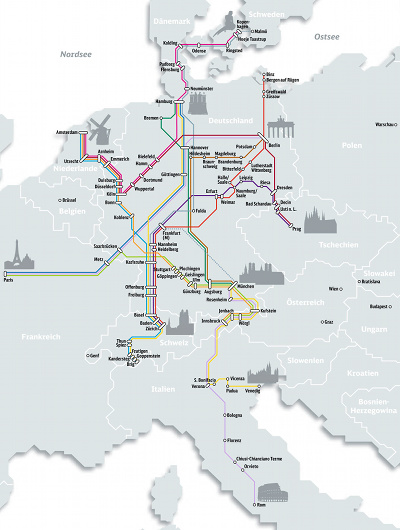
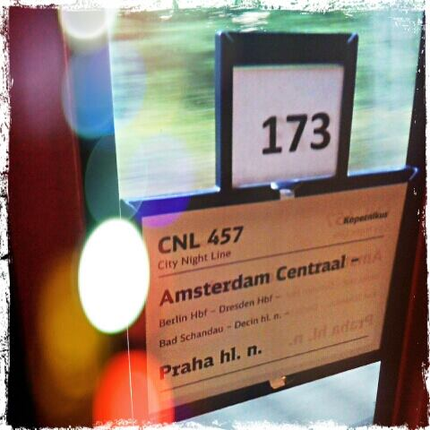

**J'essaye un service de train de nuit pratique et moins cher entre Prague et Amsterdam et hop, voilà que Deutsche Bahn annonce sa fermeture.**

## Nouveau mot : Slaaptrein
En 2010, Je devais me rendre à Prague [pour le boulot](http://ripe60.ripe.net/) fin avril. Mais les perturbations fumeuses du volcan islandais Eyjafjöll (j'espère l'avoir bien dit) m'a incité à chercher d'autres moyens de transport que [l'avion](/pas-hier-pas-en-fokker). C'est là que j'ai découvert l'option **train de nuit** (*slaaptrein*). Les néerlandais disent train où dormir même si le *nachttrein* qui veut dire train de nuit existe aussi. Tout le monde comprend, s'il est aussi possible de dormir dans un tain de jour même si c'est moins confortable...

<!--excerpt-->

## City Night Line
Le service de train de nuit est opéré par la **CNL**, **City Night Line**, filiale de la DB allemande très présente à Amsterdam Centraal avec ses ICE rouge et blancs. Les trains de CNL sont plus discrets le soir mais il y en a plusieurs partant entre 17 et 18 heures en direction de Prague, mais aussi de Varsovie  (le même train qui se sépare à Berlin), Copenhague ou Zurich. Les billets sont disponibles à partir de 29 euros (prix promo en siège inclinable) à presque 300 euros en coupé individuel de luxe.

Même si j'ai pris l'avion en 2010, j'ai pu noter que ce pourvait être une bonne option pour visiter l'Europe. Même si on passe 10 ou 12 heures dans le train, on ne perd pas de temps puisqu'on se couche dans un pays et on se réveille dans l'autre. Grâce au train de nuit, le transport et une nuit d'hébergement coute moins cher qu'un billet d'avion. Qu'il n'y a pas de changement pour rejoindre le entre ville en train. On évite aussi le scan de sa valise et la fouille au corps, les multiples contrôles et l'attente dans un supermarché, tout ce qui fait qu'on aime les aéroports. Plusieurs lignes partent d'Amsterdam et de nombreuses autres parcourent l'Europe. La carte des lignes de la CNL couvre bien plus que l'Allemagne.

[{.center}](https://nl.wikipedia.org/wiki/CityNightLine#mediaviewer/File:City_Night_Line_network_2010-2011.svg)

J'ai finalement testé ce train de nuit cette année entre Prague et Amsterdam.

Même si je continue à apprécier le principe, je pense qu'il y a des progrès à faire pour rendre le train vraiment attractif à commencer par le respect des horaires. Je suis effectivement arrivé en retard d'une heure à l'allée et de deux heures au retour. Suivant une vieille tradition de monopoles d'état, le train de nuit change de locomotive à chaque frontière et les compagnies partenaires n'ont pas l'air de refiler leurs meilleur matériel. Les locos sont soit vétustes soit en panne. La fraicheur des wagons rappelle d'ailleurs l'age des locomotives. Enfin, si le service était maintenu, je conseillerais de préparer un pic-nic parce qu'il n'y a pas de wagon restaurant ni même de bar. Le chef d'un seul wagon cantine des canettes et des paquets de chips pour ceux qui auraient oublié leur sandouiche.[^1]

{.center}

## La fin de la CNL à Amsterdam
Dans les toilettes, j'ai remarqué un tract noir en danois, allemand et néerlandais expliquant qu'il fallait lutter pour conserver ce service. Le tract annonce que la ligne de Copenhague sera supprimée le 14 décembre prochain. Les lignes consernées sont nombreuses et comme l'Allemagne est au centre de l'Europe, de nombreux pays sont touchés, supprimées ou raccourcies.

* Amsterdam- Copenhagen 
* Copenhagen-Prague
* Prague-Amsterdam
* Basel-Copenhagen
* Berlin-Paris
* Hamburg-Paris
* Paris-Munich

Amsterdam et Copenhague peuvent dire adieu aux trains CNL. Paris aussi puisque les liaisons avec la France sont toutes supprimées. La compagnie annonce que le nombre décroissant de clients ne permet pas de maintenir le service. [Comme l'écrit le Guardian](http://www.theguardian.com/world/2014/sep/12/europe-night-trains-sleeper-service), vu la ponctualité et la fraicheur des trains, cette décroissance du nombre de clients est une prophétie auto-réalisatrice. La compagnie DB espère rediriger la clientèle restante vers ses **ICE internationaux** qui assurent les liaisons entre les mêmes villes mais cette dernière ira surtout remplir les sièges des Easyjet [Transavia](/un-voyage-avec-transavia) et Ryanair. Tant pis pour tous.

## Les protestations
Bien sûr, il y a des inconditionnels du train. Tout le monde n'est pas abonné à «la vie du rail » mais certains son sensibles aux avantages listés ci-dessus, d'autres pensent à leur empreinte écologique quand ils voyagent et ils évitent l'avion. Il y a de nombreuses raisons de regretter ces trains de nuit. Plusieurs pétitions ont donc été lancées. Dans les pays concernés ([France](https://www.change.org/p/dr-r%C3%BCdiger-grube-nein-zur-streichung-der-nachtzugverbindung-non-%C3%A0-la-suppression-du-train-de-nuit-berlin-paris), [Pays-Bas](http://petities.nl/petitie/red-de-nachttrein-naar-kopenhagen-praag-en-warschau#signature_form), [Danemark](http://www.petitions24.com/save_the_night_train_from_denmark_to_europe) et [Allemagne](http://savethenighttrain.eu/take-action-tell-deutsche-bahn-to-save-europes-night-trains/)) ou par ligne comme celle d'Amsterdam-Prague qui va devenir Cologne-Prague. Un [site suédois](http://www.jordensvanner.se/trafik/save-the-european-night-trains), pays non desservit par la CNL, en appelle même à l'union européenne pour conserver ce mode de transport moins émetteur de CO2 que l'avion.

Puisque c'est vous et que j'ai le temps, je vous liste ici l'ensemble des pétitions pour le maintient des lignes CNL :

* [Pour le maintien des lignes Amsterdam - Prague, Copenhague, Varsovie](http://petities.nl/petitie/red-de-nachttrein-naar-kopenhagen-praag-en-warschau) (nl)
* [Pour le maintien des trains de nuit](http://www.jordensvanner.se/trafik/save-the-european-night-trains) (se) anglais
* [Contre la suppression des lignes CNL](http://www.nachtzug-bleibt.eu/) (de) multilingue
* [Pour le maintien de la ligne Paris - Berlin](https://www.change.org/p/dr-r%C3%BCdiger-grube-nein-zur-streichung-der-nachtzugverbindung-non-%C3%A0-la-suppression-du-train-de-nuit-berlin-paris) (fr,de) 
* [Pour le maintien des trains de nuit à Copenhague](http://www.petitions24.com/save_the_night_train_from_denmark_to_europe) (dk) anglais
* [Sauvez les trains de nuit de Copenhague](http://savethenighttrain.eu/) (dk) anglais

Chaque pétition rassemble plusieurs milliers de signatures mais ce n'est pas forcément ces signatures qui vont remplir les trains alors pour le moment, les compagnies ne changent pas d'avis. De plus les initiatives pétitionnaires sont diffuses et ne font pas le poids parce qu'elles se font concurrence. De l'autre coté DB n'a pas de concurrent sur ces lignes. C'est peut-être là que repose la solution, une compagnie concurrente orientée service, capable de reprendre le service avec une offre moderne et rentable. **Trenitalia** et **Transdev** sont en train de montrer en France que ce n'est pas impossible.

---
[^1]: Je n'ai fait que deux voyages et mon expérience n'est pas significative. Mais je la partage malgré tout d'autant que la fraicheur des wagons et l'absence de wagon-restaurant peut se vérifier sur tout autre trajet.

<!-- post notes:
http://carfree.fr/index.php/2013/12/19/la-grande-vitesse-est-en-train-de-tuer-le-reseau-ferroviaire-europeen/ 

image wikipedia
https://nl.wikipedia.org/wiki/CityNightLine#mediaviewer/File:City_Night_Line_network_2010-2011.svg
https://upload.wikimedia.org/wikipedia/commons/f/fe/SK-CNL-1011-de.jpg avec noms  
conseils pour le voyage de nuit 
http://www.seat61.com/citynightline.htm#.VF5hjYcuC2w 
Save the night trains
http://www.jordensvanner.se/trafik/save-the-european-night-trains (petitions + liste) 
petition NL
http://petities.nl/petitie/red-de-nachttrein-naar-kopenhagen-praag-en-warschau#signature_form 
review to Kopenague
http://www.treinreiziger.nl/internationaal/treinen/city_night_line_amsterdam_-_kopenhagen-144075
--->
