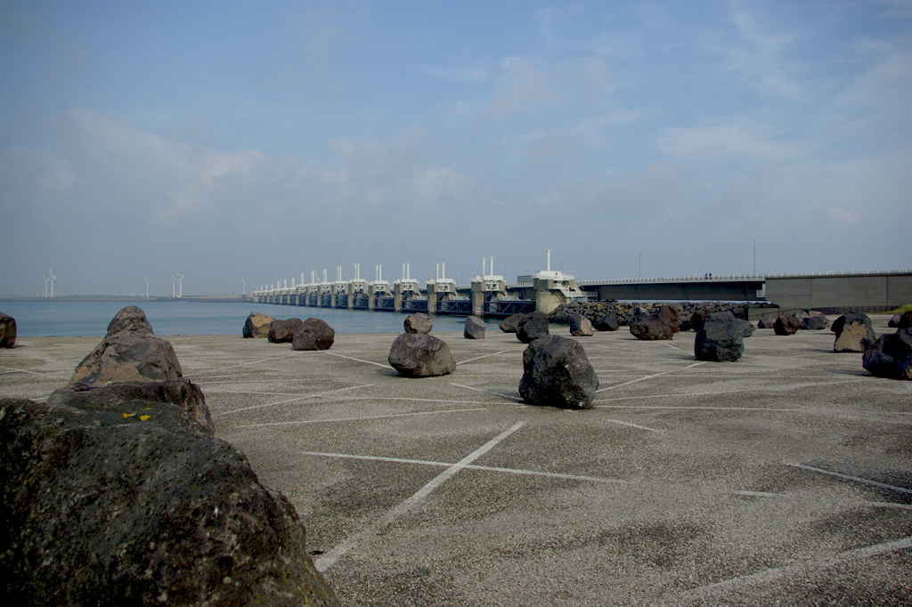
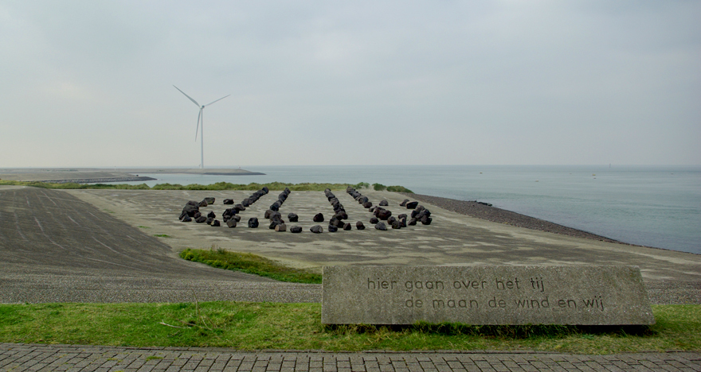

Il y a bien longtemps, je suis allé visiter **plan delta**, ce projet fou de plusieurs ouvrages ayant pour but de stopper la mer quand elle fait le gros dos (pas si fou que ça comme idée). Ceci pour éviter les inondations meurtrières comme celles de la [Sainte Elisabeth](http://meinamsterdam.nl/dimanche-a-biesbosch). Une des choses qui m'ont le plus marqué c'est ce plan de cathédrale, sur l'île artificielle de [Neeltje Jans](http://fr.wikipedia.org/wiki/Neeltje_Jans), au pied de l'*Oosterscheldekering*, à deux pas du musée qui présente le projet au public. Lorsqu'on gare sa voiture sur le parking à coté, ces rochers ressemblent à de simples rochers posés là pour éviter que des camping cars s'y garent mais y regarder de plus prêt (de plus loin en fait) on y découvre les plans d'une cathédrale.

J'avais posé une question [sur le forum](/le-forum-des-hollandais) pour découvrir ce que tout cela signifiait mais sans grand succès. J'ai trouvé la réponse tout seul, que je vous livre ici :

{.center}
<!-- gone: http://www.leforum.nl/phpBB/viewtopic.php?f=9&t=6204&p=340670 -->

<!-- gone: ){.center}  -->

<!--excerpt-->
Ces cailloux sont l'œuvre de **Marinus Boezem** qui reproduit ici les plans de **la cathédrale de Reims**. Les plans de cathédrales gothiques ont un graphisme bien équilibré et je trouve que Reims est un bon choix. L'histoire ne dit pas si c'est ce qui a inspiré Marinus Boezem.

Sur le chemin au dessus de la cathédrale, trône le message :

{.center}
> photos par Robert (cc-nc-by-sa)
<!-- https://www.flickr.com/photos/chogenbo/3946438087/ -->

<!-- HTML -->

<!-- / HTML -->
> Hier gaan over het tij  
> de maan, de wind en wij
<!-- HTML -->

<!-- / HTML -->

Ce qui veut dire : « **Ici, se tient au dessus de la marée, la lune, le vent et nous** » Ce qui se rapporte aux travaux du plan delta bien plus que de la cathédrale de Reims. En effet, grâce au plan delta, les néerlandais peuvent se vanter d'être les seuls, après la lune et le vent à contrôler les flots.

Cette cathédrale est visible sur place mais on la voit mieux [depuis le ciel](https://maps.google.nl/?ie=UTF8&ll=51.642045,3.712521&spn=0.004348,0.011319&t=h&z=17).

<!-- post notes:
lien cassé
Voir [d'autres photos sur Vulgare|http://www.vulgare.net/2011/01/cathedral-by-marinus-boezem-neeltje-jans-the-netherlands/]. 
http://vleeshal.nl/en/tentoonstellingen/a-volo-d-uccello 
http://maps.google.nl/?ie=UTF8&ll=52.323013,5.319003&spn=0.004466,0.011319&t=h&z=17 
http://www.hotspotholland.nl/fl_kathedralenbos.php 
Groene Kathedraal (1978-1996) van Marinus Boezem.  
http://www.skor.nl/artefact-353-nl.html 
 
hier gaan over het tij de maan de wind en wij
http://www.kerkbroekinwaterland.nl/artikelen/strijdmodel.htm
http://www.volkskrant.nl/archief_gratis/article659329.ece/Een_beetje_eb_en_vloed_voor_de_Biesbosch 

Ed Leeflang
http://www.lab4arch.com/s13.html 
http://www.vulgare.net/2009/11/green-cathedral-marinus-boezem-flevoland-netherlands/ 
http://www.depaviljoens.nl/page/286?lang=en
--->
