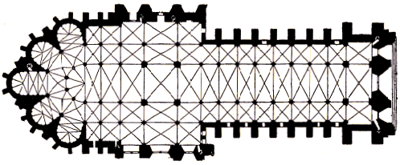
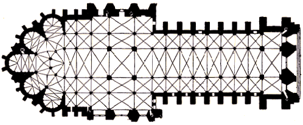

Super référence Gallixa, il y en a même des noirs et blanc disponibles en ligne. J'adore le design de ces plans, en noir et blanc ça en jette encore plus. On peut comprendre l'obsession de **Marinus Boezem** pour ce dessin à l'équilibre parfait. Tiens, en voilà un exemple pour la peine.

<!--  -->

