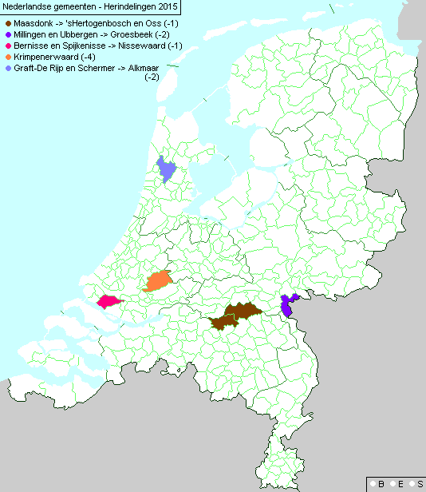
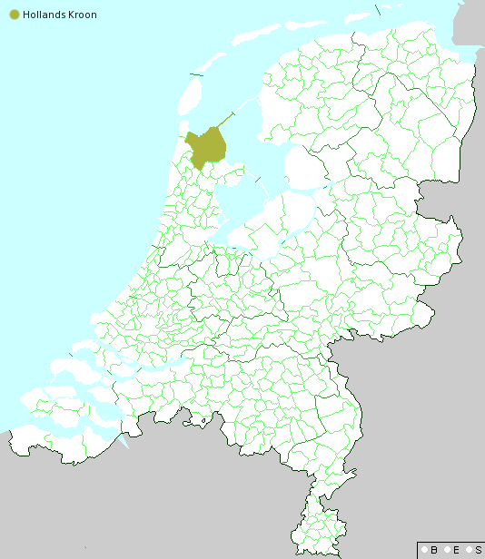
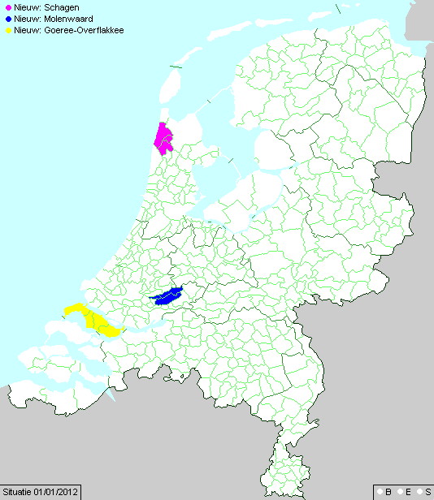
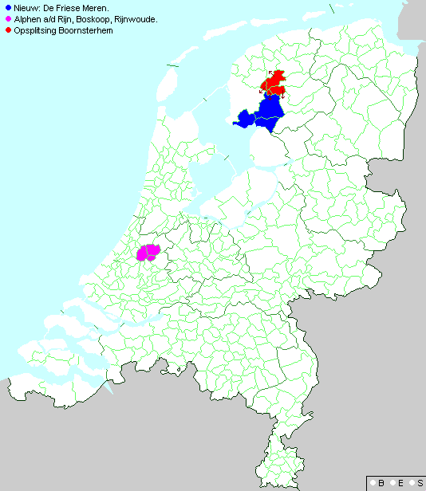

En 2010 ([Regroupement de communes](/regroupement-de-communes)) et en 2011 ([Les Pays-Bas perdent 3% de leurs communes](/les-pays-bas-perdent-de-leurs-communes)), je vous ai parlé des regroupements de communes néerlandaises avec cet objectif de ne pas avoir de communes de moins de 25.000 habitants. Je vous en est parlé en janvier quand les communes fusionnent officiellement mais ce que je n'ai pas dit c'est que cela ne se décide pas du jour au lendemain et que chaque fusion fait l'objet d'un projet de loi qui sont discutées à plusieurs niveaux et généralement votés dans les mois d'été.

Prenons par exemple le projet de loi qui institue la fusion de **Bergambacht**, **Nederlek**, **Ouderkerk**, **Schoonhoven** et **Vlist** en [Hollande Méridionale](/les-provinces-des-pays-bas). Le procésus a commencé avec un message du roi en **octobre 2013**. à partir de cette date, l'ensemble des procédures pour l'établissement d'une loi a lieu. Exposé des motifs, rapport préliminaire, études en commission, mémoires, études d'impact, discussions à la deuxième chambre, puis à la première chambre et enfin validation de la loi à la première chambre le 17 juin 2014. Le 1er jamvier prochain, les communes de Bergambacht, Nederlek, Ouderkerk, Schoonhoven et Vlist vont fusionner. Le nom de la nouvelle commune sera **Krimpenerwaard**. Hop, quatre communes de moins. Le résumé des documents et débats est [disponible sur le site de la première chambre](http://www.eerstekamer.nl/wetsvoorstel/33788_samenvoeging_gemeenten).

<!--excerpt-->

{.center}

La nouvelle commune est donc en orange sur la carte ci-dessus et fait partie des 5 regroupements de communes qui ont été décidés pour janvier 2015. Une fusion est à noter sur cette carte, celle de **Maasdonk** en Brabant Septentrional. Cette commune sera scindée en deux avant que chaque nouveau morceau soit intégré aux communes de **s'Hertogenbosch** (Bois le Duc) au sud et **Oss** au nord.

### Implication locale

Ce qui est important dans ce processus c'est qu'il se conclu à la première chambre. La chambre haute est élue, par les représentant des états généraux provinciaux. Les sénateurs sont donc, comme en France, élus au scrutin indirect par des représentants locaux ; ils sont donc les élus des territoires. À ce titre, il fant attention à consulter les élus locaux. Les états généraux de la province concernée doit emmêtre un avis et les élus locaux sont consultés. Il y a évidemment des résistances parce que certains perdent une parcelle de pouvoir mais dans l'ensemble, comme ce procesus est en place depuis des années, la fusion ne peut être remise en cause que quand il y a un réel problème relevé par les élus ou les habitants.

Dans le cas de Bergambacht, Nederlek, Ouderkerk, Schoonhoven et de Vlist, ce sont les autorités locales qui ont demandé le regroupement dans le cadre de la modernisation de l'administration locale et d'une meilleur efficacité des services communaux. Cette demande a été adressée en 2010 ce qui montre que ces regroupement ne sont pas pris à la légère et que le pouvoir se donne le temps pour les réaliser. 

### Les dernières fusions

Depuis mon dernier article sur les [fusions de communes en 2011](/les-pays-bas-perdent-de-leurs-communes), je vous ai laissé avec un pays qui comptait 421 communes mais ce n'est plus le cas aujourd'hui. Voici donc, en guise de rattrapage, la liste des regroupement de communes opérés depuis 2011 :

#### 2012 : 421 → 418

{.center}

* En Hollande Septentrionale, les communes de **Anna Paulowna**, **Niedorp**, **Wieringenen** et **Wieringermeer** fusionnent pour donner naissance à Hollands Kroon, la Couronne de Hollande.

#### 2013 : 418 → 411

{.center}
* En Frise, regroupement de **Harenkarspel**, **Schagen en Zijpe** en la nouvelle commune de **Schagen**
* En Frise, regroupement de **Graafstroom**, **Liesveld** en **Nieuw Lekkerland** en la nouvelle commune de **Molenwaard**
* En Hollande Méridionale, regroupement de **Dirksland**, **Goedereede**, **Middelharnis** en **Oostflakkee** dans la nouvelle commune de **Goeree-Overflakkee** qui est en fait la grande île au sud de la province.

#### 2014 : 411 → 406

{.center}

* En Frise, **Opheffen Boansterhiem** est partitionné et répartie sur les communes de **Leeuwarden**, **Heerenveen**, **Súdwest Fryslân** (2011) et **De Friese Meren** (2014).
* En Frise encore, **Gaasterland-Sloten**, **Lemsterland**, **Skarsterlân** et un petit bout de **Boarnsterhim** (voir ci-desssus) fusionnent pour donner la commune de De Friese Meren
* En Hollande Meridionale, **Alphen aan den Rijn** absorbe **Boskoop** et **Rijnwoude**.

#### 2015 : 406 → 396

{.center}

Pour les regroupements de 2015, voir la carte[^1] et les détails plus haut, au premier janvier les Pays-Bas ne compteront plus que 396 communes. 

À ce rhytme là, les Pays-Bas devraient former une seule et unique commune dans exactement 99 ans.

---
[^1]: Les cartes ont été faites par **jrnsndrs**, membre d'[eurobilltracker](http://forum.eurobilltracker.com/viewtopic.php?f=43&t=8227&start=1395#p1072127) qui suit de prêt cette actualité. Merci à lui.
<!-- post notes:
mon dernier post pour les billets : 2012
http://forum.eurobilltracker.com/viewtopic.php?f=43&t=8227&p=965641#p965641 
http://www.eerstekamer.nl/wetsvoorstel/33788_samenvoeging_gemeenten 
http://forum.eurobilltracker.com/viewtopic.php?f=43&t=8227&start=1335 
http://nl.wikipedia.org/wiki/Tabel_van_huidige_Nederlandse_gemeenten 
http://upload.wikimedia.org/wikipedia/commons/c/cb/2014-NL-Gemeenten-full-3400px.jpg
--->
