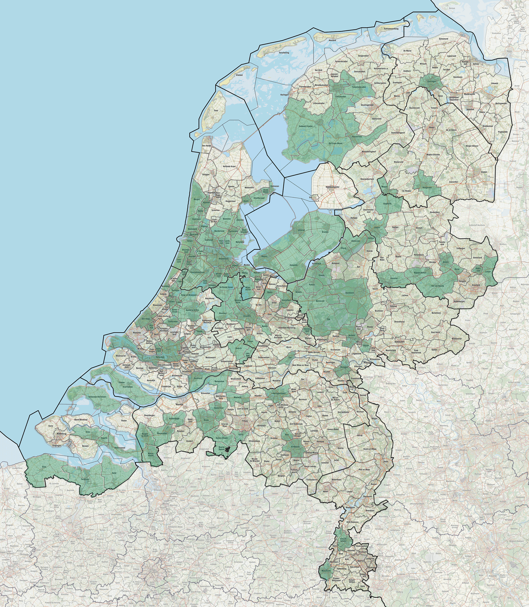

Grâce à ce nouvel article, j'ai pu mettre à jour ma carte des communes ou j'ai pécho des euros. J'ai mis la carte grand format sur le forum Eurobilltracker et ça fait quand même classe. <a title="Ma carte des euros aux Pays-Bas" hreflang="nl" href="http://forum.eurobilltracker.com/viewtopic.php?f=43&amp;t=8227&amp;p=1073164#p1073164">Voici mon post sur le forum</a>.

Pour savoir ce qu'est eurobilltracker, j'ai commis plusieurs articles sur le sujet sont le premier à l'occasion de <a title="Mon premier eurohit sur eurobilltracker" hreflang="fr" href="/mon-premier-eurohit-pays-bas">mon premier eurohit</a>. 

