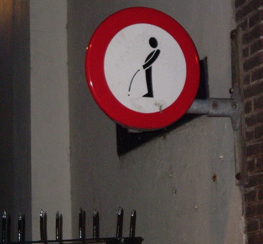

J'ai déjà passé en revue les différents moyens de **se soulager à Amsterdam**. C'est surtout qu'il y a des moyens qu'il ne faut pas utiliser. Pisser dans la rue par exemple ce n'est pas autorisé. Vu le nombre de touristes (et locaux) imbibés qui débarquent les vendredi soir, il est bon de le rappeler. C'est ce que fait la mairie en apposant ces panneaux dans les quartiers de sortie.

{.center}

Pour que les imbibés puissent se soulager, elle met à disposition [des bacs à pipi en plastique](/pour-se-soulager-3) qui sont évacués à la fin du week-end. Il y a aussi [quelques vespasiennes](/pour-se-soulager-2), qu'on appelle *krull*, dans la ville mais ces dernières tendent à être remplacées par des toilettes publiques plus modernes. Tout ça pour dire qu'**il ne faut pas pisser dans la rue**.

Parce que pisser par terre c'est sale et que ça pue, parce que l'urine est corrosive  et que ça abîme les murs qui soutiennent souvent des bâtiments historiques classés, parce que même les jours suivants ça pue, parce que c'est interdit par arrêté municipal, parce que c'était peut-être pas la peine d'accepter cette dernière bière, parce que la chaussée n'est pas en émail… Tout ça pour dire qu'**il ne faut pas pisser dans la rue**.

voir aussi  
* [Pour se soulager (1)](/pour-se-soulager-1)
* [Pour se soulager (2)](/pour-se-soulager-2)
* [Pour se soulager (3)](/pour-se-soulager-3)
* [Pour se soulager (4)](/pour-se-soulager-4)
---
<!-- post notes:
https://www.flickr.com/photos/slack13/147244988 
http://meinamsterdam.nl/admin/post.php?id=222
--->
