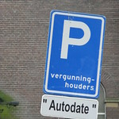
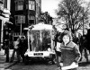
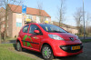
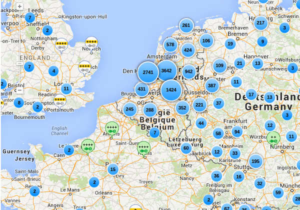

Alors que tout le monde semble **découvrir la voiture électrique** au salon (Mondial) de l'automobile de Paris, Amsterdam continue son petit bonhomme de chemin dans la diversification des modes de transports durables. Les voitures en partage y stationnent depuis les années 90 et la première borne de recharge électrique a été posée il y a cinq ans. Ici, le coût du stationnement et l’exiguïté de la ville ne favorise pas la possession d'un véhicule ce qui aide le développement des modes de circulation alternatifs. Petit historique :

<!--excerpt-->

## Nouveau mot : Autodate
[{.left}](https://www.flickr.com/photos/8180195@N07/3297653051)
*Date* a le même sens en néerlandais qu'en anglais. C'est en rendez-vous ou bien la personne avec qui on a rendez-vous. Ce rendez-vous n'étant pas forcément galant, il est possible de prendre rendez-vous avec une voiture. Les programmes d'autopartage nécessitent une inscription et la réservation du véhicule ce qui peut expliquer ce « rendez-vous ». En pratique, **autopartage** se dit *autodeelen*, traduction littérale qui est aussi utilisée. Il est cependant nécessaire de connaitre ce que veut dire **autodate** parce que c'est ce mot qui figure sur les emplacement réservés. *Vergunninghouders autodate* signifie que la place est réservée au voitures partagées autorisées. À Amsterdam tout véhicule contrevenant est immédiatement enlevé, même si son propriétaire est titulaire d'un [permis de stationner résidentiel](/la-parking-residentiel) (même s'il est lui même *Vergunning houder*).

## Une idée Provo
{.left}
**La première idée de voiture partagée vient d'Amsterdam** avec la **Witkar** née en 1974, une auto électrique blanche qui rappelle celles qui circulent sur les terrains de golf. Son inventeur n'est autre que **Luud Schimmelpennink**, le créateur du **witte fietsenplan**, un programme de vélos partagés lancé à la même époque à Amsterdam et promu par le mouvement Provo. L'idée, n'étant pas dans l'air du temps, n'a pas durée.

## Les autopartages rouges aux roues vertes
{.left}
L'autopartage c'est développé aux Pays-Bas a partir du milieu des années 90. L'entreprise **Greenwheels** est née en 1994 à Rotterdam et s'est rapidement étendue à d'autres villes du pays, dont Amsterdam. Greenwheels utilise des voitures classiques. Au temps où j'étais abonné, j'avais le choix entre une Peugeot 106 et une 207. Comme l'entreprise est présente dans plusieurs villes, cette location permet même de faire de l'interurbain mais la facturation en fait une solution plutôt **adaptée aux petits trajets urbains**.

Depuis 2002, les autos de **Connect Car** occupent elles aussi les places de parking d'Amsterdam. Cette entreprise offre des tarifs plus avantageux mais mois de voitures disponibles.

## Première borne électrique en 2009
C'est le [27 mai 2009](http://www.verkeersnet.nl/1492/amsterdam-neemt-eerste-oplaadpunt-en-eerste-elektrische-personenauto%E2%80%99s-in-gebruik/) que **la première borne de recharge électrique a été installé à Amsterdam**. À l'époque, la mairie annonçait que des centaines de bornes allaient suivre et qu'il était temps pour ceux qui aiment les voitures de commander leur **Tesla**. La mairie proposait même une prime à l'achat de véhicules électrique. L'année suivante, la ville [remportait le prix](http://www.mobilite-durable.org/innover-pour-demain/villes-durables/vehicule-electrique--amsterdam-recompensee.html) de la World Electric Vehicle Association (WEVA) pour son action en faveur des voitures électriques. Déjà quelques Tesla apparaissaient dans les rues.

Aujourd'hui, plus d'un millier de bornes électriques sont accessibles en ville et [s'y brancher est toujours gratuit](http://www.amsterdam.nl/parkeren-verkeer/amsterdam-elektrisch/opladen/oplaadpunten/). Mais Amsterdam n'est pas la seule ville des pays-bas à offrir ce service, Rotterdam veut doubler ces chiffres et d'autres villes, même de taille moyenne, ne sont pas en reste. Il suffit de voir les cartes de localisation des bornes de recharges[^1] pour voir qu'il y a un petit décalage entre la France et son petit voisin du nord...

{.center}

## Électrique et partagé
Avec l'arrivée de ces bornes, les sociétés de gestion de voitures partagées ont bien sûr adaptée leur offre. Greenwheels comme Connect car ont ajouté quelques véhicules électriques à leur flotte. Greenwheels a introduit des des **Peugeot Ion** et Connect car a [remis au gout du jour](http://www.witkar.nl/content/lokaties) la Witkar sous la forme d'une **Smart électrique**.

Mais le plus spectaculaire a été l'arrivée d'un troisième acteur avec une flotte conséquente et entièrement électrique : **Car2Go**. Cette société, filiale de Daimler (un bon moyen pour écouler les Smart du groupe) est arrivé sur la place en avril 2011 avec des centaines de voitures et un abonnement gratuit. En fait cette dernière étape est la même qu'un peu partout, à Paris, le groupe Bolloré écoule ses **Bluecar** dans **Autolib´** avec un parc encore plus important. De plus en plus de citadins adoptent ce mode de transport au point qu'il est utile de [rappeler que ce n'est pas un mode de déplacement écologique](http://www.lemonde.fr/planete/article/2014/06/26/publicite-la-voiture-electrique-n-est-pas-ecologique_4445251_3244.html).

---
[^1]: Il y a des cartes sur les services néerlandais [oplaadpalen](http://www.oplaadpalen.nl/) et [oplaadpunten](https://www.oplaadpunten.nl/) mais je peux aussi vous recommander [chargemap](http://chargemap.com/) disponible en français.

<!-- post notes:
gratis
http://www.amsterdam.nl/parkeren-verkeer/amsterdam-elektrisch/opladen/oplaadpunten/ 
http://www.verkeersnet.nl/1492/amsterdam-neemt-eerste-oplaadpunt-en-eerste-elektrische-personenauto%E2%80%99s-in-gebruik/ 
http://www.oplaadpalen.nl/ https://www.oplaadpunten.nl/ 
http://chargemap.com/ 
http://www.mobilite-durable.org/innover-pour-demain/villes-durables/vehicule-electrique--amsterdam-recompensee.html 
http://www.breezcar.com/actualites/article/4000-bornes-de-recharge-aux-Pays-Bas 
http://flickrhivemind.net/Tags/autodate/Interesting
--->
