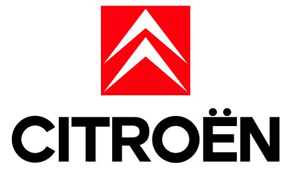
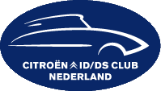
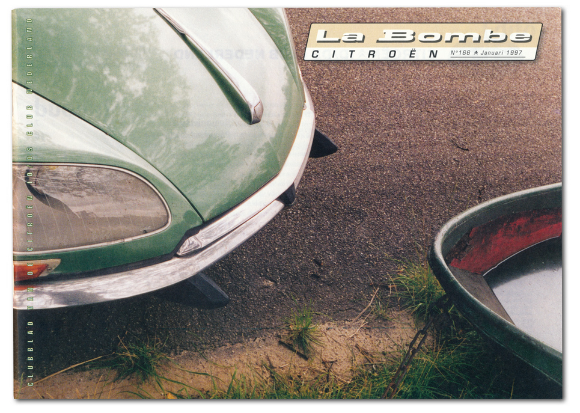
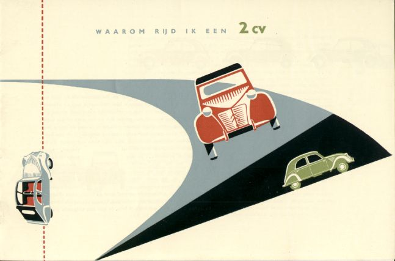

Tout le monde connait la marque de voiture **Citroën**, créatrice de plusieurs **légendes de l'automobile** comme [la deuche](/bon-anniversaire-la-2cv) ou [la traction avant](https://fr.wikipedia.org/wiki/Citro%C3%ABn_Traction_Avant). 

{.center}

Cette marque, fleuron de l'industrie automobile française est aussi une marque aux accents néerlandais. Ceci pour plusieurs raisons :

### Quand André Citroen devient André Citroën

André Gustave Citroën, plus communément appelé André Citroën, est souvent présenté comme un entrepreneur français, né à Paris en 1878 et mort en 1935 après avoir fait polytechnique et créé l'une des compagnie automobile des plus renommées au monde. Ce que l'on sait moins c'est qu'André Citroën est le fils d'un diamantaire néerlandais qui a émigré à Paris cinq ans avant la naissance de son fils André. Ce père s'appelle alors Lévie Citroen. 

Les juif des Pays-Bas ont commencé à porter des noms de famille à la suite de l'invasion napoléonienne. de ce pays. Tous les citoyens bataves (même les juifs donc) avaient alors accès à l'état civil. L’aïeul d'André Citroën ont choisit *Limoenman* qui signifie **homme-citron**, *limoen* étant une variété de citron. Le nom est ensuite devenu *Citroen* au fil des générations.

*Citroen* se prononce «citroune» en néerlandais mais lorsque la famille émigre en France, la prononciation devient différente et l'orthographe ne permet pas de savoir comment on appelait cette famille dans le quartier. C'est André lui même qui a ajouté le tréma sur son nom, lors de son inscription au lycée. Le problème de prononciation est tranché une fois pour toute, ce sera «cirtoêne».

L'avantage du choix du tréma est qu'il fonctionne aussi en néerlandais. En effet, les néerlandais utilisent les doubles consones pour former de nouveaux sons mais si mot comprend deux voyelles qui doivent se prononcer séparément, ils ajoutent un tréma sur la seconde. C'est le cas de nombreux mots d'origine étrangère comme *conciërge*, *egoïsme* ou *coördinatie* pour ne citer que les mots d'origine française[^1].

Du coup, **CITROËN** se prononce exactement de la même manière en France et aux Pays-Bas et ce malgré qu'il fut un mot néerlandais à l'origine.

### La Déesse des Pays-Bas

De 1955 à 1975, pendant les 20 ans qu'elle ont été produites la DS est sa petite sœur l'ID ont parcouru les routes du monde entier avec leur ligne unique et leur fameuse suspension hydraulique qui a fait la réputation de Citroën. Les néerlandais n'ont pas réellement adopté cette voiture hors norme. À l'époque c'était plutôt la voiture des stars et des présidents français, la voiture de Fantômas, du Samouraï et du Général de Gaulle. Ce n'est que par la suite, quand cette grande routière, n'était plus produite que les néerlandais ont commencé à la collectionner.

Le directeur de **Citroën Pays Bas** aime raconter que c'est en commençant à acheter des propriétés dans la campagne française que les hollandais ont découvert ces voitures, prenant la poussière dans une vieille grange à foin. Il aime ajouter qu'il y a aujourd'hui plus de DS roulantes aux Pays Bas qu'il ne s'en est vendu pendant la durée de vie du modèle. Ces allégations sont difficiles à vérifier[^2] mais elle ajoute à la légende qui lie cette voiture bombée et ce pays plat. La DS a reçu de nombre petits noms selon les pays les bataves ne dérogent pas à la règle avec des comparaisons qu'on n'utilisait pas en France. Ici, on parle de **brochet** (*snoek*) en référence au long bec à l'avant de la voiture ou de fer à repasser (*strijkijzer*) qui fait porter la comparaison sur la proximité de la caisse avec le sol quand la voiture est en stationnement.

<!-- [{.center}](http://drooderfiets.tumblr.com/post/217952665/citroen-ds)  TODO external images -->

Brochets ou fer à repasser, ce qui est certain c'est que les nombreuses DS encore garées dans la rue à Amsterdam étonnent plus d'un visiteur !

{.left} Les propriétaires de vieilles voiture doivent en prendre soin et il n'est pas toujours facile de trouver des pièces et des garages qui acceptent de les réparer. C'est pour cela que les clubs automobiles consacrés se sont créés. Ce n'est pas propre aux PaysBas, mais le Citroën ID/DS Club Nederland, celui qui regroupe les heureux propriétaires de cette automobile de légende revendique quand même 3500 membres. Le club a [son site](http://www.citroeniddsclub.nl/) et son magazine, un mensuel de 80 pages qui parait depuis 1978 et au nom français : La Bombe. La boucle est bouclée.

{.center}

### Et le petit canard

Comme la DS aux Pays-Bas, le succès de la **Citroën 2CV** s'est fait attendre. À son lancement en 1948, il s'en produisait seulement 4 par jours. Au Pays-Bas comme ailleurs dans le monde, cette voiture curieuse n'intéresse pas. À l'époque, elle est moche et dépassée. Pourtant le cahier des charges de conception de cette voiture correspond aux Pays-Bas de l'après guerre « être capable de transporter deux paysans, deux passagers et 50kg de patates ». C'est à l'occasion de de son relouquage de 1963 (le modèle AZA pour « le dernier A pour amélioré ») que la deuche séduit les masses. Dans les années 60 et 70, la 2cv, voiture parmi les moins coûteuses du moment, devient un symbole de la jeunesse qui refuse la société de consommation. Les Baba-cools allemands et néerlandais en particuliers sont content de se montrer avec leur vilain petit canard (*het lelijke eendje*). À la fin de la production de la deux-chevaux en 1991, le journal *Morgen* [titrait](http://www.citrobe.org/2cvdemorgen1991.htm) sur la « *deusjevoo* » et consacrait quatre pages en hommage à ce parapluie à roues (*Paraplu met wiellen*), référence à ce slogan des années soixantes : **Quatre roues sous un parapluie**.

{.center}

C'est ainsi que [ma première voiture](/bon-anniversaire-la-2cv) est devenue, elle aussi un objet prisé aux Pays-Bas. Les usagers bataves de deuches ont eux aussi leur club avec [2cv.nl](http://www.2cv.nl/) regroupant les fans de deuches mais aussi de [diane](http://www.citroendyane.nl/), d'ami et de mehari dont les modèles très bien conservés peuvent se voir dans les rues d'Amsterdam.

### Citroën aujourd'hui
Au Pays-Bas comme ailleurs Citroën est devenu un constructeur généraliste qui ne se démarque plus vraiment des autres. La marque aux chevrons bénéficie toujours d'une bonne image dans le pays d'origine de son inventeur mais rien de comarable à ce qui a existé avec des modèles de légende qui ont été produit sur plusieurs décénies. Aujourd'hui, un modèle chasse l'autre et il est difficile pour un constructeur de prendre le risque de révolutionner l'automobile. L'auto est devenu un objet utilitaire et de plus en plus d'usagers optent pour l'[autopartage](/Voiture-electrique-Amsterdam-en-avance). 

Mais quand je dois à nouveau acheter une nouvelle voiture c'est quand même vers la marque de ma première auto, la marque française la plus néerlandaise [que je me suis tourné](/acheter-une-voiture-aux-pays-bas).
---
[^1]: Les [mots sont voyageurs](/les-mots-migrateurs), je l'ai souvent dit.
[^2]: Bien que **Milan Van lange** s'est mis en tête de référencer toutes les DS du pays [sur son site](http://iddsregister.wordpress.com/). Il en dénombre 7000.
<!-- post notes:
http://www.nuancierds.fr/DT%20hollande.htm
http://www.citroeniddsclub.nl/ 
http://www.nuancierds.fr/immat%20NL.htm
http://iddsregister.wordpress.com/ 
http://www.oh-la-la.nl/?p=2167
https://www.flickr.com/photos/drooderfiets/4023973026/in/photostream/
--->
