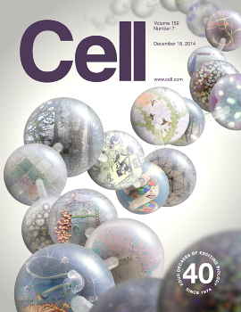

Le torchon brûle entre Elsevier et les universités. Il faut dire que ces dernières doivent se serrer la ceinture alors que la première réclame de plus en plus pour l'utilisation de ses revues scientifiques.

## Elsevier B.V.
L'entreprise fait partie de ces groupes néerlandais mondialement connus. [Elsevier](http://fr.wikipedia.org/wiki/Elsevier_%28%C3%A9diteur%29) est le premier éditeur scientifique au monde. Depuis 1993, l'éditeur fait parti du groupe [Reed Elsevier](http://fr.wikipedia.org/wiki/Reed_Elsevier), issue de la fusion d'Elsevier B.V. et de Reed International PLC, un éditeur spécialisé britanique. Le groupe dont le siège est à la fois à Londres et à Amsterdam (dans la tour millenium à Sloterdijk) est incontournable.

Selon le [site de l'entreprise](http://www.elsevier.com/about/at-a-glance), Elsevier publie plus de 250.000 articles par an dans 2.200 revues dont certaines prestigieuses comme *The Lancet* et fournit de nombreuses solution d'accès au savoir en ligne. Une entreprise néerlandaise performante.

<!-- HTML -->

<iframe src="//player.vimeo.com/video/67269365" width="500" height="281" frameborder="0" webkitallowfullscreen mozallowfullscreen allowfullscreen></iframe>

<!-- / HTML -->

Pourtant depuis plusieurs années, cette entreprise est la cible de nombreuses critiques pour le prix de ses publications et pour les abonnement groupés qu'elle vend aux bibliothèques, pour des profits élevés et pour le soutien aux projets de politiques restrictives en matière de copyright (SOPA, PIPA et autres gros mots). En 2012, une pétition ciblant directement Elsevier, [The cost of knowledge](http://en.wikipedia.org/wiki/The_Cost_of_Knowledge) a recueilli plus de 12.000 signatures de chercheurs. D'autres parodient le marketing de l'entreprise pour montrer son coté pas si philanthrope que ça.

<!-- HTML -->

<iframe src="//player.vimeo.com/video/42549003" width="500" height="281" frameborder="0" webkitallowfullscreen mozallowfullscreen allowfullscreen></iframe> 
<a href="http://vimeo.com/42549003">Open Access Now</a> from <a href="http://vimeo.com/user11804849">Fake Elsevier</a>.

<!-- / HTML -->
## Des droits pour consulter en plus des droits pour consulter
C'est dans ce contexte tendu que les négociations se sont tenues entre les universités néerlandaises et le groupe Elsevier autour des droits sur de nouveaux usages permis par les avancés technologiques. En effet depuis une quinzaine d'année, les scientifiques tirent partie d'Internet pour publier leurs travaux en les rendant accessibles par tous. Cela peut se faire directement via par exemple le site d'une université (Green road), soit en passant par un éditeur qui pratique ce genre de publication *Open Access* (Gold Road). Cette méthode de publication permet une plus grande partage des connaissances mais elle a un coût. L'auteur de la publication doit débourser une somme élevée pour faire évaluer son travail.

Les éditeurs traditionnels comme Elsevier demandent aussi une participation des auteurs à l'évaluation du travail par des pairs mais le gros des recettes provient des abonnements des instituts de recherches et universités aux revues scientifiques. Il faut aussi payer pour obtenir copie de l'article. Aujourd'hui chez Elsevier cette copie peut être obtenue en ligne, comme pour les revues en accès ouvert (*Open Access*).

Or le gouvernement Néerlandais a demandé a ses universités, par la voix de leur ministre **Sander Dekker**, de rendre accessible plus de travaux académiques en accès ouvert afin de rendre plus visibles et plus accessibles les recherches que l'état a financé. Elsevier veut bien rendre ses travaux en accès ouvert mais moyennant une redevance supplémentaire, en plus de l'abonnement déjà fort cher. 
## Les âpres négociations néerlando-néerlandaises
Pour **Gerard Meijer**, négociateur pour la VSNU, l'association des universités néerlandaises, ces conditions ne sont pas acceptables. Les universités payent déjà pour que Elsevier publie les travaux de leurs chercheurs et négocie ensuite l'abonnement à de nombreuses revues scientifiques dont les articles académiques déjà financés. Renégocier ce financement pour rendre les travaux en Open Access est une chose acceptable mais payer une redevance supplémentaire non !

Le 4 novembre dernier, VSNU [a annoncé](http://vsnu.nl/news/newsitem/11-negotiations-between-elsevier-and-universities-failed.html) rompre les négociations arguant que l'éditeur n'était pas près à passer à l'*Open Access*. Les négociations avec les autres éditeurs ont continuées. Par exemple, un accord a été trouvé [avec l'éditeur Allemand Springer](http://www.springer.com/gp/open-access/springer-open-choice/agreements/42388) le 20 novembre.

## Pendant ce temps en France...
<!-- HTML -->

<!-- / HTML -->
{.center}  
Cell, une revue phare du groupe
<!-- HTML -->

<!-- / HTML -->

Pendant ce temps, le gouvernement français a signé un accord d'un montant de 172.000 euros avec Elsevier uniquement pour abonner un certain nombre de centres de recherche et d'universités à une sélection (la *Complete Freedom Collection* sic) de revues scientifiques du groupe. [Un article de Rue89](http://rue89.nouvelobs.com/2014/11/10/france-prefere-payer-deux-fois-les-articles-chercheurs-255964) publie le contrat en question et expose toutes les aberrations qui y figurent à une période où tous les ministères doivent faire des économies. Le cas néerlandais y est même listé en fin d'article comme piste à suivre pour négocier intelligemment avec Ces trusts de l'édition scientifique. Le contrat n'oblige même pas Elsevier à publier les travaux des chercheurs français en accès ouvert.
<!-- HTML -->

<!-- / HTML -->
## Épilogue
L'épilogue ne semble pas être pour maintenant. Ni la VSNU ni Elsevier n'ont cédé. Sans accord les chercheurs ne devaient plus avoir accès aux revues Elsevier depuis le 1er janvier mais un accord a été trouvé pour [prolonger d'un an le contrat d'abonnements aux revues Elsevier](http://uba.uva.nl/en/news/news/content/2014/12/newsletter-open-access.html). Elsevier a aussi annoncé le lancement d'une revue multidisciplinaire en Open Access gold mais la communauté scientifique n'a pas été convaincue.

Le 13 janvier, Gerard Meijer a indiqué dans une interview au NRC Handelsblad, que les universités envisageaient de faire pression sur leur champion national en [commençant à boycotter l'éditeur](https://www.actualitte.com/education-international/pays-bas-les-universites-posent-un-ultimatum-a-elsevier-54736.htm). Cela pourra commencer par ne plus accepter de passer les articles en revue pour l'éditeur et bien sûr, ne plus soumettre d'articles. Le négociateur, par ailleurs recteur de l'université de Nimègue a indiqué être prèt à commencer ce boycott dès l'été.

Elsevier n'a pas encore réagit a cette annonce mais il faut espérer qu'ils ne vont pas essayer de se rembourser en renégociant avec les Français.
---
<!-- post notes:
https://www.actualitte.com/les-maisons/pays-bas-l-open-access-motif-de-discorde-entre-les-universites-et-elsevier-53603.htm 
https://www.actualitte.com/education-international/pays-bas-les-universites-posent-un-ultimatum-a-elsevier-54736.htm 
http://www.myscience.ch/fr/research/open_access
Elsevier publishes 250,000 articles a year in 2,200 journals.[1] Its archives contain seven million publications. Total yearly downloads amount to 240 million.[2] 
In 2010, Elsevier reported a profit margin of 36% on revenues of US$3.2 billion.[3] Elsevier's high profit margins and copyright practices have subjected it to much criticism. 

Entre Elsevier et les __universités__
--->
