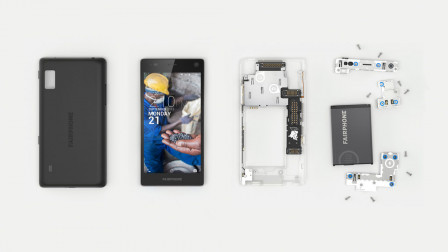
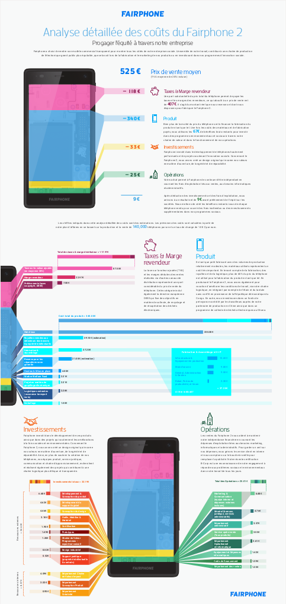

Beaucoup d'entre vous connaissent déjà le fairphone et j'en connais qui l'utilisent mais pour les autres, je pense que ce billet est bienvenu pour découvrir un téléphone qui se veut éthique au moment ou sa version 2  va bientôt se retrouver dans les poches des happy few qui font de la planète un critère d'achat (Non ce n'est pas encore un article à propos de la COP21).

{.center}

Bien qu'ayant une production confidentielle comparé aux géants du secteur (Apple[^1], Samsung[^2], LG, Nokia, Sony, HTC etc.) l'initiative rencontre un grand succès et comme elle est née et elle grandit à Amsterdam, elle a sa place ici.

<!--excerpt-->

## L'histoire 

**Fairphone** a déjà une longue histoire puisque le projet est né en 2009. à L'époque, une ONG [Action Aid](http://www.actionaid.org/nl/nederland) s'est adjointe le concours d'une entreprise de production de contenu ([Schrijf Schrijf](http://www.schrijf-schrijf.nl/)) pour réaliser une campagne sur les condition pitoyables d'extraction des minerais nécessaires à la fabrication des produits électroniques en Afrique. Schrijf Schrijf centre la campagne sur l'objet qui fait le plus partie de la vie des gens: **le téléphone portable**. Après la sortie du film *Blood in the mobile* (Du sang dans nos portables[^3]) l'idée d'un fairphone, un téléphone éthique est née.

<!-- HTML -->

<iframe width="560" height="315" src="https://www.youtube.com/embed/Tv-hE4Yx0LU" title="YouTube video player" frameborder="0" allow="accelerometer; autoplay; clipboard-write; encrypted-media; gyroscope; picture-in-picture" allowfullscreen></iframe>

<!-- / HTML -->

Les années suivantes ont été principalement été consacrée à la recherche et au développement. Recherche technique pour pourvoir **fabriquer un téléphone qui marche** mais aussi la **recherche d'approvisionnements éthiques** depuis les mines africaines qui n'allimentent pas les guerres, comme c'est trop souvent le cas dans la région des grands lacs, jusqu'à la fabrication. Pour ce dernier point, le fairphone est fabriqué en Chine comme tous les smartphones aujourd'hui mais le sous-traitant a accepté de traiter ses salariés selon les désirs de la jeune pousse. La société **Guohong** accepte d'être transparente sur sa gestion et par exemple [que ses salariés soient syndiqués](https://www.fairphone.com/2014/05/15/establishing-a-worker-welfare-fund-with-our-production-partner-guohong/).

Pour tenir ces trois ans sans rien vendre, la recherche de fonds était inportante aussi. Une campagne de crowdfounding en 2013 a connu un succès record auxquels s'ajoute les aides de fondations: 86.000 € de la part de **NCDO** en 2010, 150.000 € de la **fondation Doen** en 2011 et l'investissement de **Waag Products** (venture capital de la Waag society), porteuse du projet dès l'origine.

## Le succès au rendez-vous

Le nouveau téléphone pouvait être commandé en mai-juin 2013 pendant la campagne de croudfounding. L'objectif était d'en vendre 5000 et après un mois, [il y en avait déjà 17.000](
https://www.fairphone.com/2013/12/30/production-and-distribution-update/). La fabrication a donc commencé en Novembre de la même année alors que 25.000 clients avait déjà passé commande. **La demande pour un portable éthique est donc bien réelle !** Pendant que [les premiers clients sont livrés](https://www.fairphone.com/2013/12/24/we-are-fairphone-kicks-off/) pour noël 2013, les autres devront attendre mais une boutique en ligne le permet de commander un fairphone de la deuxième fournée: 35.000 exemplaires qui [seront écoulés](http://www.01net.com/fiche-produit/prise-main-14579/smartphones-fairphone-fairphone/) au mois de juillet 2014.

Le téléphone éthique est [passé en revue](http://www.01net.com/fiche-produit/prise-main-14579/smartphones-fairphone-fairphone/) et comparé aux grandes marques, son originalité n'en fait pas un téléphone au rabais Il est comparable à des téléphones au même prix mais surtout les utilisateurs sont enousiastes comme le montrent les [cinq étoiles](http://www.lesnumeriques.com/telephone-portable/fairphone-fairphone-p16466/test.html) que les utilisateurs lui ont atribué sur *les numériques*.

## La réflexion continue

Suite à ce succès, de nombreux clients contactent l'entreprise pour soumettre de nouvelles idées pour rendre le téléphone **encore plus éthique**. Du **système d'exploitation** au **recyclage des matériaux**, de la **durée de vie des pièces** au design, tout est passé en revue. L'année 2015 se passe donc à concevoir le fairphone 2, en capitalisant sur l'expérience du premier. Pour cette nouvelle génération l'accent est mis sur la durabilité du produit où chaque composant peut être remplacé aisément. Fairphone a repris ici l'idée de **Dave Hakkens**, un autre Néerlandais derrière le [Phoneblocks](https://en.wikipedia.org/wiki/Phonebloks) présenté en 2013.

<!-- HTML -->

<blockquote class="instagram-media" data-instgrm-version="6" style=" background:#FFF; border:0; border-radius:3px; box-shadow:0 0 1px 0 rgba(0,0,0,0.5),0 1px 10px 0 rgba(0,0,0,0.15); margin: 1px; max-width:658px; padding:0; width:99.375%; width:-webkit-calc(100% - 2px); width:calc(100% - 2px);">
 
 

<a href="https://www.instagram.com/p/88J5yeClIR/" style=" color:#c9c8cd; font-family:Arial,sans-serif; font-size:14px; font-style:normal; font-weight:normal; line-height:17px; text-decoration:none;" target="_blank">A photo posted by Fairphone (@wearefairphone)</a> on <time style=" font-family:Arial,sans-serif; font-size:14px; line-height:17px;" datetime="2015-10-17T13:11:38+00:00">Oct 17, 2015 at 6:11am PDT</time>

</blockquote>

<!-- / HTML -->

## Un modèle basé sur la souscription

Le modèle économique de Fairphone est de répondre à une demande précise avec un nombre d'exemplaires limité à la demande. Ce faisant, l'entreprise maîtrise les coûts de son produit et peut ainsi sourcer ses minéraux hors de zone de conflits et prévoir la charge de travail de ses sous-traitants pour ne pas avoir à les pressurer. Les premiers clients doivent donc souscrire à l’opération avant même de savoir si elle aura lieu. Une fois le nombre critique atteint, la production peut commencer et les clients suivants peuvent commander en connaissant la date de sortie. Mais attention, pour ces derniers clients, les stocks sont limité. Pour autant le fairphone 2 a très vite trouvé les premier clients, permettant de faire du Fairphone 2 une réalité. La compagnie compte en écouler 50.000 en 2015 et le double l'année prochaine.

<!-- HTML -->

<blockquote class="instagram-media" data-instgrm-version="6" style=" background:#FFF; border:0; border-radius:3px; box-shadow:0 0 1px 0 rgba(0,0,0,0.5),0 1px 10px 0 rgba(0,0,0,0.15); margin: 1px; max-width:658px; padding:0; width:99.375%; width:-webkit-calc(100% - 2px); width:calc(100% - 2px);">
 
 

<a href="https://www.instagram.com/p/6R6qI7ClAi/" style=" color:#c9c8cd; font-family:Arial,sans-serif; font-size:14px; font-style:normal; font-weight:normal; line-height:17px; text-decoration:none;" target="_blank">A photo posted by Fairphone (@wearefairphone)</a> on <time style=" font-family:Arial,sans-serif; font-size:14px; line-height:17px;" datetime="2015-08-12T10:27:32+00:00">Aug 12, 2015 at 3:27am PDT</time>

</blockquote>

<!-- / HTML -->

**Le Fairphone 2** est donc [maintenant en vente](http://shop.fairphone.com//fairphone2.html) au prix de 529,38 €, un bond dispendieux par rapport au Fairphone 1 qui se justifie par une montée en gamme. Après tout, tant qu'à acheter un smartphone qui dure, autant que ce soit un produit de bonne facture[^4]. L'écran est plus grand, l'appareil photo plus précis et les trippes du bouzin sont plus puissantes avec un processeur Quad-Core.

<!-- HTML Gone

<iframe src="https://player.vimeo.com/video/130781385" width="500" height="281" frameborder="0" webkitallowfullscreen mozallowfullscreen allowfullscreen></iframe>

<!-- / HTML -->

À part la batterie et des coques colorées, la boutique ne propose pas encore les modules pour ce Fairphone 2 mais [les pièces étant disponibles pour le fairphone 1](https://shop.fairphone.com/), il est permis d'espérer les trouver en ligne dès que la livraison des premiers combinés aura commencé. Normalement, les premiers clients recevront leur nouveau Fairphone 2 au début mois de janvier 2016. En espérant que les envois soient fait assez tôt pour qu'il reste un goût de [noël](http://meinamsterdam.nl/?q=no%C3%ABl) dans les paquets.

## Les coques ouvertes

Des coques sont aussi disponibles, bien cachées [au fin fond de la boutique en ligne](https://shop.fairphone.com/shop/category/accessories-5?category=5&filters=26-36-27-28-122-123_124_125).

La particularité de ces coques est qu'elles ne sont pas fabriquées de manière industrielle, au contraire, elles sont **imprimées en 3D** près de chez vous avant de vous être envoyée. Cela permet de [multiplier les designs](https://www.fairphone.com/projects/3d-printed-fairphone-cases/) et couleurs au gré envies. Il est même possible de **télécharger le fichier CAD pour imprimer la coque soit-même** et même si on veut y passer le temps, modifier le fichier pour imprimer une coque originale. Bref, du open de chez open pour enfermer votre précieux portable.

## Transparence

Les coques sont ouvertes mais ce n'est pas la seule chose ouverte chez Fairphone. L'entreprise Fairphone tient à son image et communique largement sur ses activités, maintenant en ce sens une certaine transparence[^5] (et un lien fort avec ses clients qui sont les meilleurs commerciaux de la marque). Elle tient à placer le social dans ses buts et a obtenu le label [B Corporation](https://en.wikipedia.org/wiki/B_Corporation_%28certification%29) réservé aux entreprises éthiques. Les bureaux reçoivent les visites de fans et le prix du téléphone est expliqué en détail jusqu'au détail de l'utilisation de la marge de 9 €. Cette ''analyse détaillée des coûts du Fairphone 2 est même disponible en français et comme c'est la langue de ce blog je vous la mets ci dessous:

[{.center}](/files/2015/Fairphone-2-Cost-Breakdown-French2.pdf)
---
[^1]: On a beaucoup parlé de [Foxconn](https://fr.wikipedia.org/wiki/Foxconn), le sous-traitant Taïwanais de Apple mais NXP, son fournisseur Philippin [semble faire pire](http://www.industriall-union.org/fr/les-violations-empirent-chez-nxp-fournisseur-de-apple-aux-philippines).
[^2]: Ce dernier c'est d'ailleurs illustré récement dans une tentative de dissimulation de son utilisation d'[esclavage des enfants](http://www.bastamag.net/Travail-des-enfants-Samsung-pris)
[^3]: Le film a été [diffusé sur Arte en août 2013](http://www.arte.tv/fr/Blood-in-the-mobile/3688482.html)
[^4]: Oui oui, la facture est élevée, c'est ce que je voulais dire mais aussi, il vaut son prix.
[^5]: Les étuits du Fairphone 2 sont [eux aussi transparents](http://shop.fairphone.com/catalog/category/view/id/15) mais c'est peut-être un simple effet de design, tentant de relancer la mode *[Bondi blue iMac](https://fr.wikipedia.org/wiki/IMac_G3)* de 1998.

<!-- post notes:
http://www.schrijf-schrijf.nl/index.php/projecten/detail/Fairphone-storytelling-en-participatiecommunicatie/71 - https://www.fairphone.com/history/ 
https://www.fairphone.com/wp-content/uploads/2015/06/150702-English-factsheet.pdf
https://www.fairphone.com/wp-content/uploads/2015/09/Fairphone-2-Cost-Breakdown-French2.pdf 
http://arstechnica.com/gadgets/2015/10/fairphone-2-hands-on-modular-phones-are-finally-here/ 
 
https://www.fairphone.com/press/
https://www.fairphone.com/resources/
https://www.instagram.com/wearefairphone/
--->
