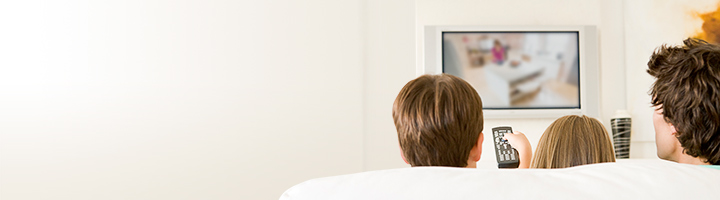
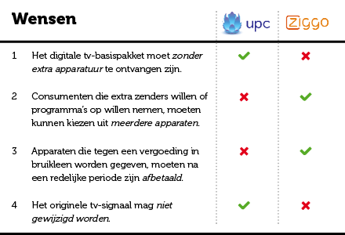
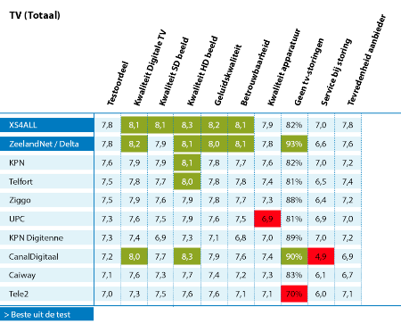

Pendant ce mois de la francophonie (le mois de mars), les Pays-Bas ont multiplié les mauvaises nouvelles concernant la langue de Molière et son rayonnement dans le monde. Aujourd'hui le cas **France 2 sur le câble** et la fin du bouquet Ziggo.

{.center}

## Le nouveau Ziggo

**Ziggo**, je vous en ai parlé, c'est un « petit » câblo-opérateur néerlandais, basé à Utrecht qui a été [attaqué par le lobby des marchands de disques](http://meinamsterdam.nl/The-Pirate-Bay-n-est-plus-bloque-aux-Pays-Bas) pour couper l'accès à *the Pirate Bay*. Cette société devait aussi faire de l'ombre à d'autres puisqu'elle a été rachetée par **UPC**, le géant, filiale de **Liberty Global** dont j'ai [déjà parlé](/?q=UPC) (en mode [pas content](/xs4all-suite-upc)) sur ce blog. La Commission Européenne [a donné son accord](http://www.nu.nl/beurs/3900053/fusie-ziggo-en-upc-mag-voorwaarden.html) pour ce rachat en octobre 2014. Rachat présenté comme une fusion puisque le groupe américain a décidé de garder le nom **Ziggo** pour l'ensemble de ses opérations aux Pays-Bas.

C'est un très bon choix parce que Ziggo a bien meilleure réputation qu'UPC et pas uniquement sur mon blog. Le problème est qu'à partir du 1er avril, le nouveau Ziggo proposera les bouquets d'UPC et les conditions UPC pour les 4 millions de clients aux Pays-Bas. Ce n'est pas forcément le meilleur choix pour les clients et l'union des consommateurs néerlandais (*consumentenbond*) est sur le coup avec [une campagne](http://www.consumentenbond.nl/campagnes/upc-ziggo/) qui vise à demander le meilleur des deux mondes. Ils [indiquent aux clients des deux entreprises](http://www.consumentenbond.nl/internetproviders/extra/upc-neemt-ziggo-over/) les  démarches à faire si on s'estime lésé par les changements dus à cette fusion.

{.center}

## La disparition de France 2

Le bouquet de base de Ziggo [proposait 54 chaines](https://www.ziggo.nl/televisie/standaard) pour moins de 19 euros par mois. Parmi ces chaînes, **arte**, **TV5 Monde** et **France 2** assuraient une bonne présence francophone. UPC ne propose pas France 2. Le géant n'a cure de l'exception culturelle et on se souvient qu'elle avait [retiré TV5 Monde de son bouquet de base en 2008](http://www.lelionbleu.nl/?p=31)... avant de le proposer en [produit d'appel HD en 2011](http://www.upc.nl/over-upc/nieuws/persberichten/2011/tv5-monde-en-bcc-hd-in-digitale-zenderaanbod-upc/).

**La disparition de France 2**, ainsi que celle de **RAI1** du bouquet de base en [déçoit beaucoup](https://community.ziggo.nl/off-topic-forum-19/france-2-verdwijnt-per-1-april-2015-2169) et en premier lieu ceux qui ont souscrit un forfait Ziggo pour pouvoir regarder cette chaîne. Les clients lésés ont [lancé une pétition](https://secure.avaaz.org/fr/petition/Ziggo_Non_a_larret_dela_diffusion_de_France_2_par_Ziggo_aux_PaysBas/) en ligne mais n'ont pas collecté les 7500 signatures avant la date fatidique du 1er avril.

### Les politiques entrent en scène

Même si ce choix concerne deux sociétés commerciales, le nombre d'utilisateurs a fait intervenir les politiques concernés par les français vivants aux Pays-Bas. Des conseillers consulaires ont écrit au directeur général de la nouvelle Ziggo pour leur demander un rendez-vous. Sans succès jusque là.

Un conseiller AFE a [posé la question au ministre des affaires étrangères français](http://www.assemblee-afe.fr/diffusion-de-france-2-aux-pays-bas.html). La réponse du ministre se borne à rappeler les faits et insiste froidement sur le caractère national de France 2 alors que le ministère consacre d'importants budgets pour des chaines françaises à caractère international (**TV5 Monde**, et **France 24**). France 2 leur ferait presque concurrence ? La fin de la réponse, soulignant le problème des droits de diffusion auxquels France 2 devraient faire face à l'international montre que l'enjeu n'a pas été compris. Le contrat traitant de ces droits a été rompu par Ziggo. Ce ne sont donc pas les droits de diffusion qui font obstacle.

Malgré cette ignorance du terrain, le représentant de la diplomatie française, notre [nouvel ambassadeur](/Un-ambassadeur-qui-tombe-a-point-nomme), a rencontré le président d'UPC/Ziggo pour lui faire part de sa préoccupation. Le diplomate ne peut pas faire plus mais cette démarche pourrait peser dans les décisions de l'entreprise.

Enfin le député français pour le Benelux s'est fendu d'[une lettre au président de France Télévision](http://philipcordery.fr/2015/03/mobilisation-aux-pays-bas-contre-larret-de-diffusion-de-france-2-par-le-premier-cablo-operateur-neerlandais-ziggo/) qui n'a pu que lui répondre que lui aussi est victime de la décision unilatérale de Ziggo. Un courrier a aussi été envoyé à René Obermann, le président de Ziggo mais il est resté sans réponse.

### UPC a toujours raison
Je ne sais pas si le choix d'abandonner France 2 et RAI1 a été bien pesée du coté d'UPC mais il semble que la grosse entreprise n'ait pas l'intention de changer d'y revenir.

C'est regrettable qu'UPC jette France 2 de son offre mais cette société fait souvent des choix qui mécontentent du monde. C'est surement pour cela qu'ils gardent leurs clients captifs. Ce n'est pas toujours facile de quitter cette boite mais les changements récents au sein de Ziggo sont peut-être l'occasion à saisir pour changer de boutique. Dans ce cas, c'est surtout le site du consumentenbond qui devrait proposer l'aide la plus efficace.

{.center}

### Les alternatives

En faisant [le point sur la situation](http://www.un-monde-en-partage.com/?p=4998) le site de la liste «Ensemble, mieux vivre aux Pays-Bas» ajoutent une courte note sur les alternatives à Ziggo pour continuer à recevoir France 2. Il y a bien sûr les offres concurrentes comme celle de [Delta](http://www.delta.nl/multimedia/televisie/tv_basis_voordelen/) qui est citée mais très souvent ces offres sont limitées à une région (La Zélande pour *Delta*) qui n'était pas couverte par Ziggo.

Le satellite peut aussi proposer une offre concurrente mais la seule offre aux Pays-Bas est **Canaldigitaal** qui ne propose pas de chaine nationale française. Il reste les offres en clair d'**Astra** et **Eutelsat**. France 2 est disponible sur [Astra 1M](http://www.telesatellite.com/satellites/astra-1m/#orientation) et [Eutelsat 5 West A](http://www.telesatellite.com/satellites/eutelsat-5-west-a/#orientation).

Les offres satellite françaises (**CANALSAT** ou **TNTSAT**) fonctionnent techniquement aux Pays-Bas mais les conditions générales **interdisent toute utilisations hors de France**. Si vous disposez d'une adresse et d'un compte en banque en France, il vous est possible d'y souscrire et d'installer votre parabole où vous voulez. Les ondes satellitaires ne s'arrêtent pas à la frontière.

Enfin la page web parle d'offres sur Internet en citant un site de diffusion de flux illégaux mais plus complet que les sites de rattrapage des chaines où la plupart des émissions sont géobloqués. Contre les géoblocages, plusieurs techniques de contournement existent[^1] mais elle ne sont pas toujours aussi simples d'utilisation qu'une télécommande de décodeur Ziggo. Mais une fois les techniques acquises, ce sont toutes les chaines françaises disponibles sur Internet qui s'offrent à vous. Un mieux qui nait d'un stupide moins. Encore merci à UPC.
---
[^1]: J'essayerais de faire le point sur les moyens de voir la télévision française en ligne un de ces quatre.