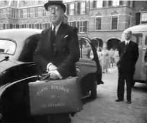

Le troisième mardi de septembre et le jour de la présentation du budget et de la politique générale du gouvernement lue à la presse et aux députés par le ministre des finances et roi. Ce jour, appellé Prinsjesdag a déjà été décrit sur ce blog.

## Troisième mardi de septembre

En [présentant ce jour en 2007](/encore-un-troisieme-mardi-de-septembre), j'expliquait que le ministre des finances se balladait dans les rues en portant une valise estampillée *Derde Dinsdag in September* qui signifie **Troisième mardi de septembre**. La photo de cette valise illustrait cet article.

## Nouveau mot : Miljoenennota

<!--excerpt-->

*Nota* c'est la **note** et *Miljoen* c'est **million**. Quand il y en a plusieurs, les nérlandais disent *Miljoenen*. Logiquement *Miljoenennota*, c'est la note des millions, le budget de l'année à venir, élaboré par le ministère des finances et présenté au Prinsjesdag, juste après le discours du trône prononcé par le roi. Cette note des millions est enfermée dans une valise avec le budget de l'état (*Rijksbegroting*). Le ministre des finances le porte donc son budget dans cette valise jusque la salle des chevaliers où il est présenté. La note des millions est une sorte de présentation de ce budget qui est lu lors de la présentation.

## Nouveau mot : Koffertje
{.left} *Koffer* signifie **valise**. c'est donc une **valisette** (*Koffertje*) que transporte le ministre des finances en ce jour protocolaire. Et comme le protocole est important, cette valise a même sa place [sur le site de la deuxième chambre](http://www.derdekamer.nl/prinsjesdag/het-koffertje) où il est expliqué ce qu'elle contient. Le site ne s'attarde pas sur le maroquin beige et le grainage de la valisette, juste une photo rappelle à quoi elle ressemble.

Cette valise a été offerte en 1964 à Johan Witteveen (photo ci-contre), ministre des finances de l'époque, par l'imprimerie d'État à l'occasion des 150 de l'établissement. Cette valise a été transporté par tous les ministres des finances depuis lors comme le montre cette [galerie de photos sur Wikimedia commons](https://commons.wikimedia.org/wiki/Category:Miljoenennota) La dernière photo de Jeroen Dijsselbloem, actuel ministre des finances:

{.center}

## Het koffertje van Lieftinck

Avant 1964, les ministre des finances portaient une autre valisette qui renfermait, elle aussi la note des millions. Elle était de facture plus classique, en cuir acajou et avec les coins renforcés. Les armes royales n'y figuraient pas mais le *Derde Dinsdag in September* y était imprimé en lettres dorées. Ce modèle est connu comme **la valisette de Lieftinck** (*Het koffertje van Lieftinck*). Pieter Lieftinck était le ministre des finances de l'après guerre. C'est lui qui a lancé la tradition de la note des millions en 1947, année du premier budget d'après élaboré par le gouvernement néerlandais. Le ministre a donc dépensé quelques florins pour acheter cette valise chez le maroquinier *Van de Broek* à la Haye. Les lettres de *Derde Dinsdag in September* y ont simplement été collées.

{.center}

<!-- source  [http://3.bp.blogspot.com/-8kDpxvD0VMU/UjlrqER36cI/AAAAAAAAEBg/II-0SmSE-uA/s1600/koffertjelieftinck1946.jpg -->

C'est une sorte de surprise que de voir cette ancienne valisette accompagant à nouveau le ministre des finances.

<!-- HTML -->

<iframe width="560" height="315" src="https://www.youtube.com/embed/ooxr1d9HsfI" frameborder="0" allowfullscreen></iframe>

<!-- / HTML -->

---
<!-- post notes:
!!Het koffertje van Lieftinck
http://historiek.net/het-koffertje-van-lieftinck/12770/ 
https://twitter.com/BNR/status/643727696271437824/photo/1
--->
