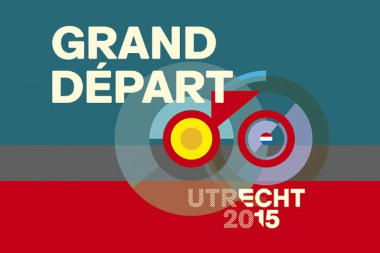
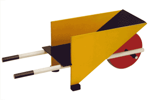

Comme [nous l'a promis notre ambassadeur](/Un-ambassadeur-qui-tombe-a-point-nomme), la quatrième ville des Pays-Bas[^1] est le point de départ du tour de France ce 5 juillet et déjà c'est effervescence dans la capitale ferroviaire du pays. Comme lors du passage du Giro en 2010 à Amsterdam de nombreuses animations sont proposées en amont de la course proprement dite. Depuis des mois les voitures surmontés des Nijntjes géants, [le petit lapin blanc est un enfant du pays](/les-nijntje-de-bruna), portant les maillots champions du tour, sillonnent la ville pendant que d'autres font leur [tour de Franz](https://utrecht2015.com/nl/evenement/tour-de-franz-1).

{.center}

Depuis le début de la semaine, la ville entière s'est parée de jaune (*Geel*) car le tour s'y est installé. Les équipes sont déjà là et ont été présentée officiellement à la presse le 2 juillet. L'habituel contre la montre du prologue aura lieu le 4, veille du grand départ le dimanche 5. Entre temps c'est la fête dans la ville avec de nombreuses activités autour du vélo. Le village de l'Avant Tour a élu ses quartiers dans la plus grande halle d'expo du pays, la Jaarbeurs[^2].

Parmi les manifestation en marge du tour, on peut noter une opération (pièces) jaunes (la couleur du maillot jaune) [portée par la fondation Vrienden WKS](https://wijkleurengeel.mijnjeugdsportfondsactie.nl/). Des jeunes réaliseront des exploits sportifs pour collecter des fonds qui iront aider à aménager des espaces pour les enfants dans les hopitaux.

Les Pays-Bas sont le pays du vélo et c'est sans doute pour cela que les villes s'y battent pour obtenir le passage du tour. **Les Pays-Bas sont le premier pays de départ du tour hors de France** avec pas moins de 6 départs depuis celui d'**Amsterdam en 1954**.

Cette année Utrecht, qui veut devenir la capitale européenne du vélo profite du tour pour faire sa promotion et tout ce qu'elle fait pour le tour vient d'enfant du pays. On a vu que les voitures étaient surmontés de lapins blancs Nijntje (ou Miffy), créé par l'Utrechtois **Dick Burna**. Le design de l'affiche du Grand Départ, quand à lui est inspiré de **Gerrit Rietveld**, architecte du mouvement **De Stijl** qui a produit la fameuse chaise bleue mais aussi une brouette qui ressemble au logo ci dessus. 

{.center}

Enfin, la chanson du tour «Bon voyage» est écrite et interprétée par **Blaudzun**, un Utrechtois barbu et le clip a été réalisé par les Utrechtois **Job, Joris & Marieke**. Oui, vous avez bien lu, ce sont eux qui ont gagné le prix du public au [festival des très court cette année](http://trescourt.com/fr/prix-du-public) avec un autre très court « *A single life* ». Voilà comment je termine ce billet sur le tour de France en rappelant les deux précédant billets dans une sorte d'épanadiplose vélocipèdique. [Bon voyage en Asie/Mes-vacances-en-Asie|] et le [Festival très court](/Le-retour-du-festival-Tres-Court) en un seul clip:

<!-- HTML -->

<iframe width="560" height="315" src="https://www.youtube.com/embed/llpcWJ2XeAs" frameborder="0" allowfullscreen></iframe>

<!-- / HTML -->

---
[^1]: Utrecht est la quatrième ville la plus peuplée des Pays-Bas après Amsterdam, Rotterdam et la Haye qui ont déjà accueilli le Grand Départ. Pour Rotterdam, c'était [en 2010 et j'en avait parlé](/le-grand-depart-2010)
[^2]: Dont je vous ai déjà parlé [à l'occasion de salons](/?q=Jaarbeurs)