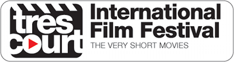
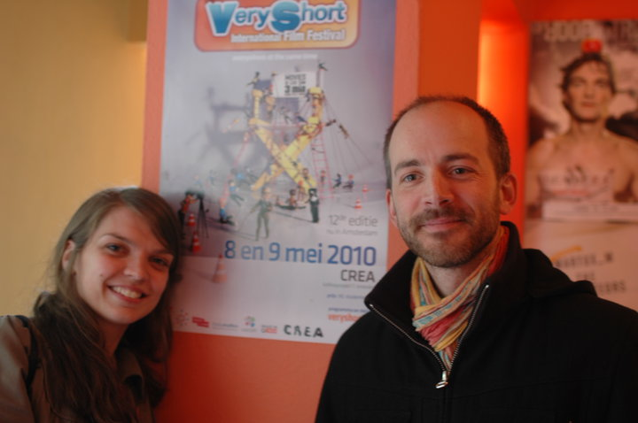

**Le festival très court continue aux Pays-Bas** et pas qu'un peu puisqu'il a lieu cette année dans deux villes au sud de la capitale : **Rotterdam** et **la Haye**. Deux sélections sont au programme, la **sélection internationale**, programme phare du festival où vous pourrez élire le meilleur très court de l'année et **Women's words**, une sélection de films très courts par des femmes et sur les femmes. Le programme détaillé est disponible ci-dessous avec liens pour réserver votre billet.

### Sélection internationale
* [07 juin - 16.00 - au WORM|http://www.worm.org/home/view/event/30822|] de Rotterdam
* [10 juin - 20.00 - à Het Nutshuis](http://nutshuis.nl/agenda/17th-tr%C3%A8s-court-international-film-festival#.VWyJSs-qqko) de la Haye
* [13 juin - 11.00 & 14.00 - à Het Nutshuis](http://nutshuis.nl/agenda/17th-tr%C3%A8s-court-international-film-festival#.VWyJSs-qqko)  de la Haye

### Women's words
* [17 juin - 20.00 - à Het Nutshuis](http://nutshuis.nl/node/1586?language=en#.VWyJuM-qqko) de la Haye
* [20 juin - 11.00 & 14.00 - à Het Nutshuis](http://nutshuis.nl/node/1586?language=en#.VWyJuM-qqko)  de la Haye

<!-- HTML -->

<iframe width="560" height="315" src="https://www.youtube.com/embed/X0NV8y0DU58" frameborder="0" allowfullscreen></iframe>

<!-- / HTML -->

## Un nouveau logo et une nouvelle chaine Youtube

L'année dernière Le festival faisait peau neuve avec un nouveau logo plus cinématographique et une marque qui met les mots français «très court» en avant. Exit le «Very Short» des premières années, le festival est né à Paris, et à quelques années de sa majorité, il s'assume complètement. Le nouveau logo est venu avec un [nouveau site web](http://trescourt.com/fr), déjà disponible en 4 langues (mais pas le néerlandais) et surtout [une chaine Youtube](https://www.youtube.com/user/trescourttv) où l'on peut revoir les films des  précédentes éditions.

{.center}

### Cinq ans déjà

{.center}

<!-- (https://www.facebook.com/veryshort.nl/photos/pb.105529349569946.-2207520000.1433242449./152998441489703/?type=3&theater) -->

''Quand j'étais à Paris, j'allais presque tous les ans au forum des images pour le festival des très court. Un amusant programme éclectique de films très courts dont le seul point commun est de ne pas durer plus que 3 minutes.'' Voilà comment j’introduisais en 2010 l'arrivée du festival très court aux Pays-Bas, je titrais même [Festival des très court enfin à Amsterdam](http://meinamsterdam.nl/festival-des-tres-court-enfin-a-amsterdam), très fier d'être à l'origine de cette première Batave, [avec Mélanie](http://trescourt.com/fr/equipe). 2010 a été un très bon cru avec la victoire d'un cinéaste local pour cette première à Amsterdam.

Les années suivantes, nous avons renouvelé l'expérience avec des succès comme l'[arrivée du festival à la Haye](http://meinamsterdam.nl/deux-nouveaux-sites-web) ou des déboires comme le désistement de dernière minute d'[un cinéma](http://meinamsterdam.nl/en-vrac-d-avril). Depuis mon départ, **le festival Très court continue aux Pays-Bas**. Mélanie se charge seule de l'organisation mais elle ne chôme pas, deux villes sont au programme cette année: **la Haye** avec un retour à [la Nutshuis](http://www.nutshuis.nl/) et **Rotterdam** avec un nouveau lieu à découvrir : [le Worm](http://www.worm.org/). Les cinémas d'Amsterdam semblent plus dûrs à convaincre mais cela donnera à ses habitants l'occasion de sortir hors des murs de la capitale.

De mon coté, j'ai pu introduire le festival [à Prague](http://veryshort.cz/en/), mais ça, c'est une histoire qui n'est plus *me in Amsterdam*...
---